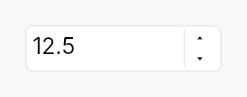
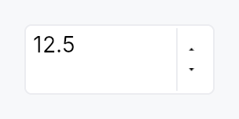

<!-- SPDX-License-Identifier: MPL-2.0 -->
<!-- SPDX-FileCopyrightText: 2026 FernTech -->

# SpinBox



`SpinBox` — numeric input with increment/decrement buttons.

## Public types

| Kind | Name |
| ---: | :--- |
| `enum` | [`WrapMode`](#wrapmode) — Out-of-range behavior when stepping past `min` or `max` |
| `enum` | [`StepType`](#steptype) — Step-size policy for each key/button press |
| `enum` | [`WheelMode`](#wheelmode) — When the mouse wheel is allowed to adjust the value |
| `enum` | [`WidthPolicy`](#widthpolicy) — How the SpinBox decides its horizontal size envelope |
| `const` | [`SPIN_BOX_STEP_BUTTON_WIDTH`](#spin_box_step_button_width) — Minimum total width |
| `const` | [`SPIN_BOX_STEP_BUTTON_HEIGHT`](#spin_box_step_button_height) — Painted height of one stacked step button, in dp |
| `struct` | [`SpinBox`](#spinbox) — Numeric input with step buttons |
| `trait` | [`SpinValue`](#spinvalue) — Numeric primitive that a `SpinBox` can hold |

## Public functions

### `SpinBox`

| Returns | Function |
| ---: | :--- |
| | **Constructors** |
| `Self` | [`new(value: Signal<T>, min: T, max: T)`](#spinbox-new) |
| | **Builder methods** |
| `Self` | [`style(style: impl teksilo_core::styles::SpinBoxStyle)`](#spinbox-style) |
| `Self` | [`single_step(step: T)`](#spinbox-single_step) |
| `Self` | [`page_step(step: T)`](#spinbox-page_step) |
| `Self` | [`decimals(decimals: u8)`](#spinbox-decimals) |
| `Self` | [`localized(on: bool)`](#spinbox-localized) |
| `Self` | [`use_grouping(on: bool)`](#spinbox-use_grouping) |
| `Self` | [`suffix(text: impl Into<String>)`](#spinbox-suffix) |
| `Self` | [`special_value_text(text: impl Into<LocalizedString>)`](#spinbox-special_value_text) |
| `Self` | [`wrap_mode(mode: WrapMode)`](#spinbox-wrap_mode) |
| `Self` | [`step_type(step_type: StepType)`](#spinbox-step_type) |
| `Self` | [`button_layout(layout: ButtonLayout)`](#spinbox-button_layout) |
| `Self` | [`show_buttons(show: bool)`](#spinbox-show_buttons) |
| `Self` | [`wheel_mode(mode: WheelMode)`](#spinbox-wheel_mode) |
| `Self` | [`width(width: f32)`](#spinbox-width) |
| `Self` | [`width_chars(chars: u32)`](#spinbox-width_chars) |
| `Self` | [`fill_width()`](#spinbox-fill_width) |
| `Self` | [`label(label: impl Into<LocalizedString>)`](#spinbox-label) |
| `Self` | [`placeholder(text: impl Into<LocalizedString>)`](#spinbox-placeholder) |
| `Self` | [`enabled(enabled: impl Into<Prop<bool>>)`](#spinbox-enabled) |
| `Self` | [`read_only(read_only: bool)`](#spinbox-read_only) |
| `Self` | [`text_from_value(f: impl Fn(T) -> LocalizedString + 'static)`](#spinbox-text_from_value) |
| `Self` | [`value_from_text(f: impl Fn(&str) -> Option<T> + 'static)`](#spinbox-value_from_text) |
| `Self` | [`on_value_changed(f: impl Fn(T, &mut EventContext) + 'static)`](#spinbox-on_value_changed) |
| `Self` | [`tooltip(text: impl Into<LocalizedString>)`](#spinbox-tooltip) |
| `Self` | [`rich_tooltip(key: impl Into<String>)`](#spinbox-rich_tooltip) |
| `Self` | [`rich_tooltip_content(content: crate::tooltip::TooltipContent)`](#spinbox-rich_tooltip_content) |
| `Self` | [`composite_tooltip(content: impl Widget + 'static)`](#spinbox-composite_tooltip) |
| | **Methods** |
| `Signal<T>` | [`value()`](#spinbox-value) |

### `SpinValue`

| Returns | Function |
| ---: | :--- |
| | **Constructors** |
| `Self` | [`from_f64_saturating(v: f64)`](#spinvalue-from_f64_saturating) |
| `Option<Self>` | [`parse(s: &str)`](#spinvalue-parse) |
| | **Builder methods** |
| `Self` | [`saturating_add(rhs: Self)`](#spinvalue-saturating_add) |
| `Self` | [`saturating_sub(rhs: Self)`](#spinvalue-saturating_sub) |
| `Self` | [`saturating_mul_u32(rhs: u32)`](#spinvalue-saturating_mul_u32) |
| | **Methods** |
| `f64` | [`to_f64()`](#spinvalue-to_f64) |
| `String` | [`format(decimals: u8)`](#spinvalue-format) |
| `Self { /* default implementation */ }` | [`clamp_value(min: Self, max: Self)`](#spinvalue-clamp_value) |
| | **Associated functions** |
| `bool` | [`is_integer()`](#spinvalue-is_integer) |
| `bool` | [`is_valid_input_char(c: char)`](#spinvalue-is_valid_input_char) |

## Detailed description

A generic composite over `SpinValue`
(integer and floating-point primitives), pairing the
`TextInputField` editing
primitive with a stacked pair of up/down step buttons. Semantics
are a synthesis of Qt's `QSpinBox` / `QDoubleSpinBox`, WinUI 3's
`NumberBox`, GTK's `GtkSpinButton`, and the W3C ARIA
`spinbutton` role.

### Behaviour

- **Value binding**: a `Signal<T>` is the single source of truth.
  Typing and stepping update it; external writes re-format the
  editable text.
- **Commit model**: the user can type freely (subject to the
  per-character input filter, which only the default parser has:
  a custom `value_from_text` is handed
  every character). The value is *committed* on
  `Enter` or on focus loss —
  at commit time the text is parsed, clamped into `[min, max]`
  (or wrapped, per `WrapMode`), and reformatted. Invalid input
  reverts to the last known good value.
- **Stepping over typed text**: every step (key, wheel, button,
  assistive `Increment` / `Decrement`) starts from what the field
  shows. Text typed and not yet committed is read first, exactly as
  `Enter` would read it, and the step moves on from there: type 35,
  press `Up` with a step of 5, and the value is 40, reported once.
  Text that cannot be read steps nothing; the value goes back into
  the field, and the next press steps from it. This is
  `QAbstractSpinBox::stepBy`.
- **Keyboard**:
  - `Up` / `Down` → ±`single_step`
  - `PageUp` / `PageDown` → ±`page_step`
    (default: `10 × single_step`)
  - `Enter` → commit (stays focused)
  - `Home` / `End` stay bound to the text cursor. `QAbstractSpinBox`
    routes both to its inner `QLineEdit`, and WinUI's `NumberBox`,
    Blink, Avalonia and jQuery UI bind neither; typing the number
    reaches min and max anyway. See `docs/range-keyboard.md`.
  - A chord holding `Ctrl`, `Alt` or `Super` is not the spin box's
    and falls through to the application; `Shift` does not change
    the step.
- **Mouse wheel**: adjusts by `single_step` — wheel **down**
  decreases, wheel **up** increases, matching `QAbstractSpinBox`,
  `GtkSpinButton` and WinUI's `NumberBox`. Gated by
  `wheel_mode` (default: only when
  focused, to avoid accidental scroll changes).
- **Buttons**: up/down buttons stack to the right of the field
  by default; can be hidden with
  `button_layout`.
- **Special value text**: when the current value equals `min`
  and `special_value_text` is
  set, the field shows that string instead of the formatted
  number (Qt's "Auto" / "None" / "Unlimited" affordance). It
  stays while the field has focus, as in Qt: keyboard focus
  selects it, so a number typed replaces it.
- **Adaptive step**: with
  `StepType::Adaptive`, the effective step
  tracks the decimal magnitude of the current value (Qt's
  `AdaptiveDecimalStepType`). Useful for values that span many
  orders of magnitude in the same control.
- **Locale**: the number follows the active locale's decimal
  separator, digits and minus sign
  (`localized`, on by default); thousands
  separators are opt-in
  (`use_grouping`, off by default, as in
  Qt). Display, commit parse, stepping and the per-character
  input filter all read one `NumberPresentation`, which a live
  language switch replaces, so they cannot disagree about which
  separator the field is using: a French user sees `12,5`,
  types `12,5`, and the numeric keypad's `.` still works.
  Rendering is a string transform over the value's
  own `Display`, never an `f64` round-trip, so a `SpinBox<i64>`
  stays exact past 2^53. Turn it off for a number that is an
  *identifier* rather than a quantity (port, version component,
  database id). With no `I18nManager` installed the active locale
  is the C locale and this is a no-op.
- **Custom formatter / parser**: full override via
  `text_from_value` and
  `value_from_text`; together they
  let you implement currency, percentages with stored fraction,
  hex, duration, anything. A custom formatter/parser owns the
  whole convention — it is not re-punctuated by the locale layer.

### Accessibility

The editing field is the spin button: one AccessKit node with
`Role::SpinButton`,
the `label` as its name, the numeric value, min,
max, step and jump, the field's text as its value and its text
runs, and the
`Increment`,
`Decrement`,
`SetValue`, and
`Focus` actions. It is
the node that holds focus, so a focus change reports the field's
name and value once, and a step moves the number a screen reader
is following. The composite's own node is structure and collapses;
it names the field as its
`accessibility_proxy`,
so an `access_label`, a `FormLayout` label, an
`access_described_by` or a tooltip given to the spin box lands on
the field. The `suffix` is painted and not part
of the text, so it is not announced.

`SetValue` accepts either payload shape, because both are sent in
the field: a number (macOS `setAccessibilityValue:` with an
`NSNumber`, AT-SPI's `Value.SetCurrentValue`) is clamped and
published as sent; a string (an `NSString`, the automation
`set_value` tool) takes the same parse `Enter` takes, so a custom
`value_from_text` and the locale's
decimal separator are honoured, and an unparseable one reverts the
display and is reported unhandled. A
`read_only` spin box advertises and services
none of the three mutating actions. The step buttons are
structurally part of the SpinBox and publish no separate a11y
nodes; stepping is the spin button's `Increment` and `Decrement`.

### Example

```ignore
use teksilo::widgets::{SpinBox, WrapMode};

let font_size = ctx.signal(12_i32);
ctx.add(
    SpinBox::new(font_size, 4, 72)
        .single_step(1)
        .page_step(10)
        .suffix(" pt"),
);

let gain_db = ctx.signal(0.0_f32);
ctx.add(
    SpinBox::new(gain_db, -60.0, 12.0)
        .single_step(0.5)
        .decimals(1)
        .suffix(" dB")
        .wrap_mode(WrapMode::Clamp),
);
```

#### Touch and pen

The step buttons are the controls sweep's one **unreachable target**, and
the reason is recorded rather than papered over. Each is 18 x 13 dp inside a
trailing column exactly its own width and exactly two buttons tall, so a
`Widget::hit_outset` has nowhere to grow (an outset never escapes its
parent); the field beside them takes presses of its own, so the miss-only
slop pass has an eligible bubble owner at distance zero; and two conforming
targets stacked need 88 dp of column, which no density projection of the
field produces. Reaching the floor here is a *layout* change — the desktop
stacked pair replaced by a side-by-side −/+ at coarse densities, as Material
does — and that is a design decision, not a targeting one. The value stays
fully reachable by keyboard (Up/Down, PageUp/PageDown) and by the
`Increment` / `Decrement` assistive actions.

One thing the sweep did fix. A step still fires on the *press* and arms
hold-to-repeat from it (Qt's `QAbstractSpinBox` convention — there is no
release to start a repeat from), but the repeat now stops on a
`PointerCancel`: a pan claimant winning the press used to leave the box
stepping for the rest of the session, because a cancel is terminal and no
`PointerUp` follows it.

What the box does about panning, it does by omission. It declares no
`touch_action` and makes no pan claim, so its subtree keeps the default
`TouchAction::AUTO` and a finger that comes to rest on it and then drags
is won by the enclosing scroller rather than changing the value. The
`on_scroll` handler below is a *wheel* handler and not a pan; it never sees
a finger.

Two tests in `spin_box/tests.rs` cover that, and only one of them can see
the second half of it. `a_finger_pan_over_the_spin_box_scrolls_its_container`
shows the pan reaching the scroller, but its box has the default
`WheelMode::Focused` and its fixture never focuses the field, so the
`on_scroll` below declines before the pan question is reached — a pan that
DID arrive would leave the value unchanged there anyway.
`a_finger_pan_over_a_hover_wheel_spin_box_scrolls_its_container` is the one
that can observe the claim: with `WheelMode::Hover` the handler runs for
every scroll that reaches the box, so a claim would step the value once per
synthesised sample.

P22, the scrollables migration, looked at the explicit
`touch_action(PAN_Y)` this file was asked for and **decided against it**.
It is a *narrowing* on top of the behaviour above rather than a restatement
of it: it would additionally forbid a horizontal pan and a pinch through
the field — a real cost to a spin box in a horizontally-scrolling toolbar,
or on a pinch-zoomable page — and it would buy nothing the omission does
not already give, because the claimant chain visits only the pan candidates
and never the generic bubble, so a boundary pan cannot reach the `on_scroll`
below however far it travels. The omission is the decision; the
hover-wheel test named above is what can witness it. P24 owns
`spin_box/step_button.rs`.


## Density

The picture above is the widget at `TargetDensity::Compact`, the mouse-and-keyboard ladder. Below is the same subject on the same canvas with only the ladder changed, so what moves is the density and nothing else — where the subject no longer fits, that is what the denser targets cost it at that size. See `docs/density-and-targets.md`.

**Touch**



## API reference

📖 [Full rustdoc API for this module](https://docs.rs/teksilo-widgets/latest/teksilo_widgets/spin_box/index.html)

<a id="wrapmode"></a>

## `pub enum WrapMode`

Out-of-range behavior when stepping past `min` or `max`.

Set via `SpinBox::wrap_mode`.

```rust
pub enum WrapMode { /* variants */ }
```

### Variants

- **`Clamp`** — Clamp to `min` / `max` (default).
- **`Wrap`** — Wrap around: past `max` jumps to `min`, past `min` jumps to `max`. Matches Qt's `QAbstractSpinBox::wrapping`.

<a id="steptype"></a>

## `pub enum StepType`

Step-size policy for each key/button press.

Set via `SpinBox::step_type`.

```rust
pub enum StepType { /* variants */ }
```

### Variants

- **`Fixed`** — Always step by `single_step` (default).
- **`Adaptive`** — Step by the decimal power-of-ten immediately below the current value's magnitude — e.g. values 1–9 step by 1, 10–99 by 10, 100–999 by 100. Matches Qt's `AdaptiveDecimalStepType`. Integer types honor the same rule using the magnitude of the absolute value.

<a id="wheelmode"></a>

## `pub enum WheelMode`

When the mouse wheel is allowed to adjust the value.

Set via `SpinBox::wheel_mode`.

```rust
pub enum WheelMode { /* variants */ }
```

### Variants

- **`Focused`** — Wheel adjusts only when the field is focused. Default — prevents accidental changes when the user is scrolling a larger surrounding view.
- **`Hover`** — Wheel adjusts whenever the pointer is over the widget.
- **`Disabled`** — Wheel never adjusts the value; events bubble to the surrounding scroll container.

<a id="widthpolicy"></a>

## `pub enum WidthPolicy`

How the SpinBox decides its horizontal size envelope.

Chosen via the `width`,
`width_chars`, and
`fill_width` builder methods — the enum
itself is the storage, not a separate public configuration
API.

```rust
pub enum WidthPolicy { /* variants */ }
```

### Variants

- **`Pixels`** — Cap the widget at a fixed logical-pixel width. Default is `DEFAULT_PREFERRED_WIDTH` (120 dp), matching Qt's `QSpinBox` sizeHint.
- **`Chars`** — Size the widget to fit this many reference digits (`'0'`) plus the configured suffix, padding, and step buttons. Measurement uses the theme font at build time.
- **`Fill`** — Let the widget expand horizontally to fill whatever space the parent offers. Equivalent to an infinite pixel cap.

<a id="spin_box_step_button_width"></a>

## `pub const SPIN_BOX_STEP_BUTTON_WIDTH`

Minimum total width. Below this the stacked step buttons stop
fitting next to the field. Widgets narrower than this are
enforced to the minimum at layout time via `MinSize`.
Painted width of one stacked step button, in dp.

Below the 24 dp WCAG floor, and **no hit mechanism reaches it** — see the
"Touch and pen" section of this module and `StepButton::children` for the
measurement. The two steps are separate nodes stacked in a trailing column
exactly one button wide, so there is nothing for `Widget::hit_outset` to
grow into and nothing for `partition_targets` to carve; growing the paint
instead would widen every numeric field on a form. Named here so the hit
mechanisms and the `chrome` arithmetic below read the same number.

```rust
pub const SPIN_BOX_STEP_BUTTON_WIDTH: f32 = 18.0;
```

<a id="spin_box_step_button_height"></a>

## `pub const SPIN_BOX_STEP_BUTTON_HEIGHT`

Painted height of one stacked step button, in dp. Only a fallback — the
real height is half the field's inner height (see `build_step_buttons`).

```rust
pub const SPIN_BOX_STEP_BUTTON_HEIGHT: f32 = 12.0;
```

<a id="spinbox"></a>

## `pub struct SpinBox`

Numeric input with step buttons. Generic over
`SpinValue` — pre-implemented for `i32`, `i64`, `u32`, `u64`,
`usize`, `f32`, and `f64`.

```rust
pub struct SpinBox<T: SpinValue> { /* fields */ }
```

### Methods

<a id="spinbox-new"></a>

#### `pub fn new(value: Signal<T>, min: T, max: T) -> Self`

Construct a new SpinBox bound to `value` with the given
inclusive range. `min` must be ≤ `max`.

<a id="spinbox-style"></a>

#### `pub fn style(mut self, style: impl teksilo_core::styles::SpinBoxStyle) -> Self`

Per-call style override. Higher precedence than the theme-wide
`style_slots.spin_box` slot.

<a id="spinbox-single_step"></a>

#### `pub fn single_step(mut self, step: T) -> Self`

Set the step size for `Up` / `Down` / single wheel tick /
button tap.

<a id="spinbox-page_step"></a>

#### `pub fn page_step(mut self, step: T) -> Self`

Set the step size for `PageUp` / `PageDown`. When unset,
defaults to `10 × single_step` at build time.

<a id="spinbox-decimals"></a>

#### `pub fn decimals(mut self, decimals: u8) -> Self`

Number of decimal places shown for floating-point types.
Ignored for integer types.

<a id="spinbox-localized"></a>

#### `pub fn localized(mut self, on: bool) -> Self`

Whether the number follows the active locale's conventions —
decimal separator, digits, and minus sign. **On by default.**

A French user sees `12,5`, not `12.5`, and can type either: the
commit path de-localizes before parsing, and the input filter
accepts both the locale's separator and the ASCII one, so a
numeric keypad still works.

Turn it **off** for a number that is an identifier rather than a
quantity — a port number, a version component, a database id, a
pixel offset in a file format. Those read wrong grouped or
re-punctuated, and their conventional form is the C-locale one.

Localization is a string transform over the value's own
`Display`, not a round-trip through `f64`, so a `SpinBox<i64>`
keeps full precision past 2^53.

With no `I18nManager` installed the active locale resolves to the
C locale, so this is a no-op in tests and in apps that have not
opted into i18n.

<a id="spinbox-use_grouping"></a>

#### `pub fn use_grouping(mut self, on: bool) -> Self`

Whether the displayed number carries thousands separators.
**Off by default**, matching Qt (`QAbstractSpinBox::
isGroupSeparatorShown` is false unless asked for).

Separators help a large read-only quantity and get in the way of
a field being typed into, so this is opt-in per SpinBox rather
than a locale-wide default. Grouping follows the locale's own
group sizes, including the Indic lakh system (`12,34,567`).

Has no effect when `localized` is off.

<a id="spinbox-suffix"></a>

#### `pub fn suffix(mut self, text: impl Into<String>) -> Self`

Qt-style non-editable trailing unit (e.g. `" %"`, `" px"`,
`" dB"`). Rendered flush-right inside the field's border;
the caret cannot enter it.

<a id="spinbox-special_value_text"></a>

#### `pub fn special_value_text(mut self, text: impl Into<LocalizedString>) -> Self`

Text shown in place of the formatted value when the current
value equals `min`. Use for "Auto", "None", "Off",
"Unlimited" affordances where the minimum has special
semantics. The text stays while the field has focus, as
Qt's `specialValueText` does: keyboard focus selects it, so a
number typed replaces it, and a step moves off it.

<a id="spinbox-wrap_mode"></a>

#### `pub fn wrap_mode(mut self, mode: WrapMode) -> Self`

Set the out-of-range behavior when stepping past `min` or `max`
(default: `Clamp`).

<a id="spinbox-step_type"></a>

#### `pub fn step_type(mut self, step_type: StepType) -> Self`

Set the step-size policy (default: `Fixed`). Use
`StepType::Adaptive` for values that span many orders of magnitude.

<a id="spinbox-button_layout"></a>

#### `pub fn button_layout(mut self, layout: ButtonLayout) -> Self`

Override the step-button layout (default: `Stacked` — stacked
up/down buttons to the right of the field).

<a id="spinbox-show_buttons"></a>

#### `pub fn show_buttons(mut self, show: bool) -> Self`

Convenience wrapper over `button_layout`:
`true` → `ButtonLayout::Stacked`, `false` → `ButtonLayout::Hidden`.
Matches the Int UI guideline that SpinBoxes in dense forms
often hide the step buttons to reduce visual noise and let
keyboard / wheel carry the affordance — pass
`.show_buttons(false)` on those call sites.

<a id="spinbox-wheel_mode"></a>

#### `pub fn wheel_mode(mut self, mode: WheelMode) -> Self`

Set when the mouse wheel adjusts the value (default: `Focused` —
only when the inner field holds focus).

<a id="spinbox-width"></a>

#### `pub fn width(mut self, width: f32) -> Self`

Cap the widget's horizontal size at a fixed logical-pixel
width. If the parent offers less, the SpinBox shrinks (down
to the internal 72 dp / 48 dp floor that keeps the buttons
and field from overlapping). Default: 120 dp, matching Qt
`QSpinBox` sizeHint and Int UI form density.

```rust
# use teksilo_widgets::SpinBox;
# use teksilo_core::signal::Signal;
# let v = Signal::new(0_i32);
let _w = SpinBox::new(v.clone(), 0, 9999).width(80.0);        // narrow
let _w = SpinBox::new(v.clone(), 0, 9999).width(200.0);       // wider
let _w = SpinBox::new(v.clone(), 0, 9999).fill_width();       // stretch to parent
let _w = SpinBox::new(v.clone(), 0, 9999).width_chars(5);     // "fits 5 digits"
```

<a id="spinbox-width_chars"></a>

#### `pub fn width_chars(mut self, chars: u32) -> Self`

Size the widget to fit exactly `chars` reference digits plus
the configured suffix, padding, and step buttons. The
measurement uses the actual theme font at build time (same
`SharedTypesetter` the field draws with), so values stay
right under runtime theme switches and HiDPI scale changes.

```rust
# use teksilo_widgets::SpinBox;
# use teksilo_core::signal::Signal;
# let port = Signal::new(8080_i32);
# let pct = Signal::new(0_i32);
let _w = SpinBox::new(port, 0, 65_535).width_chars(5);           // 5 digits
let _w = SpinBox::new(pct, 0, 100).suffix(" %").width_chars(3);  // 3 + " %"
```

<a id="spinbox-fill_width"></a>

#### `pub fn fill_width(mut self) -> Self`

Let the widget expand to fill the horizontal space offered
by its parent, instead of capping at `width`.
Use inside toolbars, inspector panels, or an
`Expand::horizontal` column that should stretch with the
surrounding layout.

<a id="spinbox-label"></a>

#### `pub fn label(mut self, label: impl Into<LocalizedString>) -> Self`

Set the accessible name announced by screen readers as the
control's label. ARIA requires spin buttons to have a label;
when none is set here the caller is responsible for labelling
via a `FormLayout` line, `access_labelled_by` or `access_label`
on the spin box, which all reach the editing field that holds
focus and publishes the spin button.

<a id="spinbox-placeholder"></a>

#### `pub fn placeholder(mut self, text: impl Into<LocalizedString>) -> Self`

Set the placeholder text shown in the field when it is empty.

<a id="spinbox-enabled"></a>

#### `pub fn enabled(mut self, enabled: impl Into<Prop<bool>>) -> Self`

Set the enabled state, statically or reactively. Forwarded to
the arena at build time via
`ctx.enabled_when(spinbox_id, self.enabled.clone())`.

<a id="spinbox-read_only"></a>

#### `pub fn read_only(mut self, read_only: bool) -> Self`

Make the value uneditable: no typing, no keyboard or wheel stepping,
no step buttons, and no assistive-technology `Increment` / `Decrement`
/ `SetValue`. Matches `QAbstractSpinBox::readOnly`, which likewise
stops `stepBy`. The field keeps focus and selection, so the value can
still be read and copied.

<a id="spinbox-text_from_value"></a>

#### `pub fn text_from_value(mut self, f: impl Fn(T) -> LocalizedString + 'static) -> Self`

Override the value → display-string conversion. Receives the
raw value; returns whatever string should appear in the
field. Suffix and `special_value_text` still apply on top of
the returned string.

<a id="spinbox-value_from_text"></a>

#### `pub fn value_from_text(mut self, f: impl Fn(&str) -> Option<T> + 'static) -> Self`

Override the parse step. Receives the field's raw text
(without the suffix, which is never part of the editable
content); returns `Some(value)` to accept or `None` to
reject. Invalid input reverts to the last good value on
commit.

Installing a parser also lifts the per-character input filter,
which admits only what the default numeric parse can read. The
parser owns the text convention, so a month field reading
`"march"` as 3 can be typed by name: every character reaches the
field, and whatever the parser refuses is reverted at commit.

<a id="spinbox-on_value_changed"></a>

#### `pub fn on_value_changed(mut self, f: impl Fn(T, &mut EventContext) + 'static) -> Self`

Closure fired each time the value is committed (keyboard
step, button tap, wheel tick, Enter, blur). Bound observers
on the value signal also see every change; use this hook
when the caller needs an `EventContext` (e.g. to fire an
intent).

<a id="spinbox-tooltip"></a>

#### `pub fn tooltip(mut self, text: impl Into<LocalizedString>) -> Self`

Attach a plain single-line tooltip shown after a hover delay.

Mutually exclusive with `rich_tooltip`,
`rich_tooltip_content`, and
`composite_tooltip` — each setter
clears the other two so the last call wins.

<a id="spinbox-rich_tooltip"></a>

#### `pub fn rich_tooltip(mut self, key: impl Into<String>) -> Self`

Attach a rich tooltip looked up by registry key.

The key must match a `TooltipContent`
registered in the application's tooltip registry. Mutually
exclusive with `tooltip`,
`rich_tooltip_content`, and
`composite_tooltip`.

<a id="spinbox-rich_tooltip_content"></a>

#### `pub fn rich_tooltip_content(mut self, content: crate::tooltip::TooltipContent) -> Self`

Attach a rich tooltip with inline content (no registry key
required). Mutually exclusive with `tooltip`,
`rich_tooltip`, and
`composite_tooltip`.

<a id="spinbox-composite_tooltip"></a>

#### `pub fn composite_tooltip(mut self, content: impl Widget + 'static) -> Self`

Attach a composite tooltip whose body is an arbitrary widget
tree. Mutually exclusive with `tooltip`,
`rich_tooltip`, and
`rich_tooltip_content`.

<a id="spinbox-value"></a>

#### `pub fn value(&self) -> Signal<T>`

The bound numeric value signal.

<a id="spinvalue"></a>

## `pub trait SpinValue`

Numeric primitive that a `SpinBox` can hold.

Sealed: only the primitive integer and floating-point types
implement this. See the module docs for the rationale.

Implementations must provide lossless parsing and round-trip
formatting (`parse(format(v, d)) == Some(v)` for any finite value
`v` and decimals `d`). Arithmetic is saturating so clamping into
`[min, max]` after a step cannot overflow.

```rust
pub trait SpinValue: sealed::Sealed + Copy + PartialOrd + Debug + 'static { /* associated items below */ }
```

### Associated items

<a id="spinvalue-to_f64"></a>

#### `fn to_f64(self) -> f64;`

Lossless widening to `f64`. Used for AccessKit's numeric
value / min / max / step properties and for
`StepType::Adaptive` decimal
analysis.

<a id="spinvalue-from_f64_saturating"></a>

#### `fn from_f64_saturating(v: f64) -> Self;`

Narrowing from `f64` with saturation at the type's full
range. For integers the conversion truncates toward zero,
matching Rust's `as` conversion semantics.

<a id="spinvalue-parse"></a>

#### `fn parse(s: &str) -> Option<Self>;`

Parse a user-entered string. Leading/trailing whitespace is
ignored. Returns `None` for syntactically invalid input
(but NOT for out-of-range values — the SpinBox clamps
separately so users can type past the bound and see the
reformatted clamped result after blur).

<a id="spinvalue-format"></a>

#### `fn format(self, decimals: u8) -> String;`

Format for display.

For integer types, `decimals` is ignored. For floats, the
value is rendered with exactly `decimals` digits after the
decimal point — no scientific notation, no thousands
separator. Formatter closures on `SpinBox`
(`text_from_value`)
override this.

<a id="spinvalue-saturating_add"></a>

#### `fn saturating_add(self, rhs: Self) -> Self;`

Saturating addition. Out-of-type-range results clamp at
`MAX` (or `MIN` for negative overflow on signed types).

<a id="spinvalue-saturating_sub"></a>

#### `fn saturating_sub(self, rhs: Self) -> Self;`

Saturating subtraction. See `saturating_add`.

<a id="spinvalue-saturating_mul_u32"></a>

#### `fn saturating_mul_u32(self, rhs: u32) -> Self;`

Saturating multiplication by a positive integer. Used for
`page_step = multiplier × single_step` when the caller
omits a page step.

<a id="spinvalue-is_integer"></a>

#### `fn is_integer() -> bool;`

Whether this type has integer semantics (no fractional
component, no decimal separator in the default
`format` path). Controls the default
character filter and whether `decimals` has any effect.

<a id="spinvalue-is_valid_input_char"></a>

#### `fn is_valid_input_char(c: char) -> bool;`

Default per-character input filter for the editable field.
Admits digits and, for signed types, `-`; float types also
admit `.`, `+`, `e`, `E`. Callers can override the whole
filter on the `SpinBox` builder.

<a id="spinvalue-clamp_value"></a>

#### `fn clamp_value(self, min: Self, max: Self) -> Self { /* default implementation */ }`

Clamp into an inclusive range. Falls through to
`PartialOrd`.
