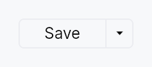

<!-- SPDX-License-Identifier: MPL-2.0 -->
<!-- SPDX-FileCopyrightText: 2026 FernTech -->

# SplitButton



SplitButton — a button split into two regions sharing a single frame.

The left region is the **default action**: it shows the label of the
currently-selected item and, on click, fires that item's command
(behaving like a regular `Button`). The right
region is a narrow chevron zone that, on click, opens a
`MenuList` of related actions. Picking an
action from the dropdown fires it and promotes its index to become the
new default for the session (IntelliJ's "remember last used"
convention).

SplitButton reuses `MenuItem` verbatim
for the dropdown rows — the caller passes real `MenuItem` values via
`.item(...)`, so icons, shortcut labels, enabled flags, and separators
all come for free.

```rust
# use teksilo_widgets::{SplitButton, MenuItem, ButtonVariant};
# use teksilo_i18n::lit;
# use teksilo_core::Intent;
let _w = SplitButton::new()
    .item(MenuItem::new(lit!("Run")).on_activate_fn(|ctx| ctx.send_intent(Intent::new("app.run"))))
    .item(MenuItem::new(lit!("Run Tests")).on_activate_fn(|ctx| ctx.send_intent(Intent::new("app.run-tests"))))
    .separator()
    .item(MenuItem::new(lit!("Debug")).on_activate_fn(|ctx| ctx.send_intent(Intent::new("app.debug"))))
    .variant(ButtonVariant::Plain);
```

## Builder methods at a glance

`new_static`, `item`, `separator`, `variant`, `icon`, `style`, `text_style`, `text_role`, `enabled`, `initial_selected`, `tooltip`, `rich_tooltip`, `rich_tooltip_content`, `composite_tooltip`, `chevron_tooltip`, `chevron_rich_tooltip`, `chevron_rich_tooltip_content`, `chevron_composite_tooltip`

## API reference

📖 [Full rustdoc API for this module](../api/teksilo_widgets/split_button/index.html)

## `pub const SPLIT_BUTTON_HEIGHT`

SplitButton design tokens.

```rust
pub const SPLIT_BUTTON_HEIGHT: f32 = 24.0;
```

## `pub const SPLIT_BUTTON_MIN_WIDTH`

```rust
pub const SPLIT_BUTTON_MIN_WIDTH: f32 = 72.0;
```

## `pub const SPLIT_BUTTON_PADDING_HORIZONTAL`

```rust
pub const SPLIT_BUTTON_PADDING_HORIZONTAL: f32 = 14.0;
```

## `pub const SPLIT_BUTTON_PADDING_VERTICAL`

```rust
pub const SPLIT_BUTTON_PADDING_VERTICAL: f32 = 0.0;
```

## `pub const SPLIT_BUTTON_CORNER_RADIUS`

```rust
pub const SPLIT_BUTTON_CORNER_RADIUS: f32 = 4.0;
```

## `pub const SPLIT_BUTTON_BORDER_WIDTH`

```rust
pub const SPLIT_BUTTON_BORDER_WIDTH: f32 = 1.0;
```

## `pub const SPLIT_BUTTON_CHEVRON_WIDTH`

```rust
pub const SPLIT_BUTTON_CHEVRON_WIDTH: f32 = 22.0;
```

## `pub const SPLIT_BUTTON_DIVIDER_WIDTH`

```rust
pub const SPLIT_BUTTON_DIVIDER_WIDTH: f32 = 1.0;
```

## `pub const SPLIT_BUTTON_CHEVRON_ICON_SIZE`

```rust
pub const SPLIT_BUTTON_CHEVRON_ICON_SIZE: f32 = 12.0;
```

## `pub const SPLIT_BUTTON_ICON_LABEL_GAP`

Gap between an optional main-region leading icon and the label.

```rust
pub const SPLIT_BUTTON_ICON_LABEL_GAP: f32 = 6.0;
```

## `pub struct SplitButton`

A button split into a default-action region and a chevron dropdown region.

See the `module-level documentation` for a usage overview.

```rust
pub struct SplitButton { /* fields */ }
```

### Methods

#### `pub fn new() -> Self`

Standard SplitButton: picking an item from the dropdown both
**fires** the item's action and **promotes** it to become the new
default for the session. The main region's label and click action
update to match the most recently picked item.

#### `pub fn new_static() -> Self`

Static-default SplitButton: the main region is pinned to
`initial_selected` (default 0) and **never** changes after the
user picks something from the dropdown. Picking an item still
fires that item's action — only the promotion is skipped.

Use this when the main region represents a semantically fixed
primary action (e.g. "Commit") and the dropdown offers related
variants ("Commit and Push", "Commit and Push to…") that should
not displace the primary.

#### `pub fn item(mut self, item: MenuItem) -> Self`

Add a menu item. The item is reused verbatim as a row of the
dropdown, and its label + action are also used to drive the main
region (when its index is the current default).

#### `pub fn separator(mut self) -> Self`

Add a separator row in the dropdown. Separators are skipped when
computing item indices for `initial_selected`.

#### `pub fn variant(mut self, variant: ButtonVariant) -> Self`

Set the visual style variant (filled, plain, ghost, …) for the entire
button frame. Mirrors the same variants as
`Button::variant`.

#### `pub fn icon(mut self, icon: IconWidget) -> Self`

Set a leading icon for the main (default-action) region, rendered before
the label (mirrors `Button::icon` with
`IconLocation::Leading`). Unlike the per-row `MenuItem::icon`s, this glyph
is fixed regardless of which item is the current default — use it for a
stable action affordance (e.g. a "＋" add glyph).

The icon's tint follows the main-region label (the variant/interaction
cascade, or `text_role` when overridden), so any
colour set on the passed `IconWidget` is replaced — same contract as
`Button`. Its size is left alone, so `.icon_size(..)` on the caller's
widget is honoured.

#### `pub fn style(mut self, style: impl SplitButtonStyle) -> Self`

Override the Tier-3 frame chrome for this instance. Takes precedence
over `theme.style_slots.split_button` and the built-in
`RecipeSplitButtonStyle`.

#### `pub fn text_style(mut self, style: impl Into<teksilo_core::color_prop::TextStyleProp>) -> Self`

Override the main-region label text style (font, size, weight).
Accepts a `TextStyleRole`, a `TextStyle`, or a `Signal` of either.
Default (unset) is the inner `TextWidget` default — e.g. pass
`TextStyleRole::BodyBold` for a bold default action.

#### `pub fn text_role(mut self, color: impl Into<teksilo_core::color_prop::ColorProp>) -> Self`

Override the control's text colour — the main-region label, its
leading `icon`, and the chevron, which the
variant/interaction cascade tints together. Accepts `Color`, a role,
or a `Signal` of either. Default (unset) is that cascade; setting this
replaces it wholesale (loses hover/disabled tint).

#### `pub fn enabled(mut self, enabled: impl Into<Prop<bool>>) -> Self`

Set the enabled state, statically or reactively. Forwarded to the
arena at build time.

#### `pub fn initial_selected(mut self, index: usize) -> Self`

Which item index (counting only items, not separators) should be
the initial default. Defaults to 0.

#### `pub fn tooltip(mut self, text: impl Into<LocalizedString>) -> Self`

Attach a tooltip to the main (default-action) region. Same hover
delay as `Button::tooltip`.

#### `pub fn rich_tooltip(mut self, key: impl Into<String>) -> Self`

Attach a rich tooltip to the main region.

#### `pub fn rich_tooltip_content(mut self, content: crate::tooltip::TooltipContent) -> Self`

Attach a rich tooltip to the main region driven by inline `TooltipContent`.

#### `pub fn composite_tooltip( mut self, content: impl teksilo_core::widget::Widget + 'static, ) -> Self`

Attach a composite tooltip to the main region.

#### `pub fn chevron_tooltip(mut self, text: impl Into<LocalizedString>) -> Self`

Override the tooltip shown on hover over the trailing chevron
region. When unset, the chevron gets a default "Show dropdown
menu" tooltip so its affordance isn't silent.

#### `pub fn chevron_rich_tooltip(mut self, key: impl Into<String>) -> Self`

Attach a rich tooltip to the chevron region.

#### `pub fn chevron_rich_tooltip_content(mut self, content: crate::tooltip::TooltipContent) -> Self`

Attach a rich tooltip to the chevron region driven by inline `TooltipContent`.

#### `pub fn chevron_composite_tooltip( mut self, content: impl teksilo_core::widget::Widget + 'static, ) -> Self`

Attach a composite tooltip to the chevron region.
