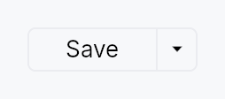

<!-- SPDX-License-Identifier: MPL-2.0 -->
<!-- SPDX-FileCopyrightText: 2026 FernTech -->

# SplitButton



SplitButton — a button split into two regions sharing a single frame.

## Public types

| Kind | Name |
| ---: | :--- |
| `const` | [`SPLIT_BUTTON_HEIGHT`](#split_button_height) — SplitButton design tokens |
| `fn` | [`split_button_height`](#split_button_height-2) — `SPLIT_BUTTON_HEIGHT` raised to the density's `target_size` (24 / 32 / 44 dp) |
| `const` | [`SPLIT_BUTTON_MIN_WIDTH`](#split_button_min_width) |
| `fn` | [`split_button_min_width`](#split_button_min_width-2) — `SPLIT_BUTTON_MIN_WIDTH` raised to the density's `target_size` (24 / 32 / 44 dp) |
| `const` | [`SPLIT_BUTTON_PADDING_HORIZONTAL`](#split_button_padding_horizontal) |
| `fn` | [`split_button_padding_horizontal`](#split_button_padding_horizontal-2) — `SPLIT_BUTTON_PADDING_HORIZONTAL` scaled by the density's `spacing_factor` (1.00 / 1.15 / 1.30) |
| `const` | [`SPLIT_BUTTON_PADDING_VERTICAL`](#split_button_padding_vertical) |
| `fn` | [`split_button_padding_vertical`](#split_button_padding_vertical-2) — `SPLIT_BUTTON_PADDING_VERTICAL` scaled by the density's `spacing_factor` (1.00 / 1.15 / 1.30) |
| `const` | [`SPLIT_BUTTON_CORNER_RADIUS`](#split_button_corner_radius) |
| `const` | [`SPLIT_BUTTON_BORDER_WIDTH`](#split_button_border_width) |
| `const` | [`SPLIT_BUTTON_CHEVRON_WIDTH`](#split_button_chevron_width) |
| `const` | [`SPLIT_BUTTON_DIVIDER_WIDTH`](#split_button_divider_width) |
| `const` | [`SPLIT_BUTTON_CHEVRON_ICON_SIZE`](#split_button_chevron_icon_size) |
| `const` | [`SPLIT_BUTTON_ICON_LABEL_GAP`](#split_button_icon_label_gap) — Gap between an optional main-region leading icon and the label |
| `fn` | [`split_button_icon_label_gap`](#split_button_icon_label_gap-2) — `SPLIT_BUTTON_ICON_LABEL_GAP` scaled by the density's `spacing_factor` (1.00 / 1.15 / 1.30) |
| `struct` | [`SplitButton`](#splitbutton) — A button split into a default-action region and a chevron dropdown region |

## Public functions

### `SplitButton`

| Returns | Function |
| ---: | :--- |
| | **Constructors** |
| `Self` | [`new()`](#splitbutton-new) |
| `Self` | [`new_static()`](#splitbutton-new_static) |
| | **Builder methods** |
| `Self` | [`item(item: MenuItem)`](#splitbutton-item) |
| `Self` | [`items(items: impl IntoIterator<Item = MenuItem>)`](#splitbutton-items) |
| `Self` | [`separator()`](#splitbutton-separator) |
| `Self` | [`variant(variant: ButtonVariant)`](#splitbutton-variant) |
| `Self` | [`icon(icon: IconWidget)`](#splitbutton-icon) |
| `Self` | [`style(style: impl SplitButtonStyle)`](#splitbutton-style) |
| `Self` | [`text_style(style: impl Into<teksilo_core::color_prop::TextStyleProp>)`](#splitbutton-text_style) |
| `Self` | [`text_role(color: impl Into<teksilo_core::color_prop::ColorProp>)`](#splitbutton-text_role) |
| `Self` | [`enabled(enabled: impl Into<Prop<bool>>)`](#splitbutton-enabled) |
| `Self` | [`initial_selected(index: usize)`](#splitbutton-initial_selected) |
| `Self` | [`tooltip(text: impl Into<LocalizedString>)`](#splitbutton-tooltip) |
| `Self` | [`rich_tooltip(key: impl Into<String>)`](#splitbutton-rich_tooltip) |
| `Self` | [`rich_tooltip_content(content: crate::tooltip::TooltipContent)`](#splitbutton-rich_tooltip_content) |
| `Self` | [`composite_tooltip(content: impl teksilo_core::widget::Widget + 'static)`](#splitbutton-composite_tooltip) |
| `Self` | [`chevron_tooltip(text: impl Into<LocalizedString>)`](#splitbutton-chevron_tooltip) |
| `Self` | [`chevron_rich_tooltip(key: impl Into<String>)`](#splitbutton-chevron_rich_tooltip) |
| `Self` | [`chevron_rich_tooltip_content(content: crate::tooltip::TooltipContent)`](#splitbutton-chevron_rich_tooltip_content) |
| `Self` | [`chevron_composite_tooltip(content: impl teksilo_core::widget::Widget + 'static)`](#splitbutton-chevron_composite_tooltip) |

## Detailed description

The left region is the **default action**: it shows the label of the
currently-selected item and, on click, fires that item's command
(behaving like a regular `Button`). The right
region is a narrow chevron zone that, on click, opens a
`MenuList` of related actions. Picking an
action from the dropdown fires it and promotes its index to become the
new default for the session (IntelliJ's "remember last used"
convention).

SplitButton reuses `MenuItem` verbatim
for the dropdown rows — the caller passes real `MenuItem` values via
`.item(...)`, so icons, shortcut labels, enabled flags, and separators
all come for free.

```rust
# use teksilo_widgets::{SplitButton, MenuItem, ButtonVariant};
# use teksilo_i18n::lit;
# use teksilo_core::Intent;
let _w = SplitButton::new()
    .item(MenuItem::new(lit!("Run")).on_activate_fn(|ctx| ctx.send_intent(Intent::new("app.run"))))
    .item(MenuItem::new(lit!("Run Tests")).on_activate_fn(|ctx| ctx.send_intent(Intent::new("app.run-tests"))))
    .separator()
    .item(MenuItem::new(lit!("Debug")).on_activate_fn(|ctx| ctx.send_intent(Intent::new("app.debug"))))
    .variant(ButtonVariant::Plain);
```

#### Touch and pen

The action half is a target in its own right and needs nothing. The chevron
half is 22 dp wide at every density — a dimension below the conformance floor
cannot be routed through `dp`, which is a floor and would widen the paint at
Compact — so it declares a `Widget::hit_outset` instead, with the whole
shortfall on its **leading** edge: the trailing edge is the control's own
frame, and an outset never escapes its parent.

That means a direct pointer aiming between the halves gets the chevron, and a
precise pointer gets exactly what is painted (`hit_outset` is zero for one).
Of the two halves the action half is the wider, so it is the one that lends
the dp — and the press it loses at its trailing edge is a press aimed at the
chevron.


## Density

The picture above is the widget at `TargetDensity::Compact`, the mouse-and-keyboard ladder. Below is the same subject on the same canvas with only the ladder changed, so what moves is the density and nothing else — where the subject no longer fits, that is what the denser targets cost it at that size. See `docs/density-and-targets.md`.

**Touch**


## API reference

📖 [Full rustdoc API for this module](https://docs.rs/teksilo-widgets/latest/teksilo_widgets/split_button/index.html)

<a id="split_button_height"></a>

## `pub const SPLIT_BUTTON_HEIGHT`

SplitButton design tokens.

```rust
pub const SPLIT_BUTTON_HEIGHT: f32 = 24.0;
```

<a id="split_button_height-2"></a>

## `pub fn split_button_height(...)`

`SPLIT_BUTTON_HEIGHT` raised to the density's `target_size`
(24 / 32 / 44 dp). The identity at Compact.

```rust
pub fn split_button_height(tokens: &InputTokens) -> f32;
```

<a id="split_button_min_width"></a>

## `pub const SPLIT_BUTTON_MIN_WIDTH`

```rust
pub const SPLIT_BUTTON_MIN_WIDTH: f32 = 72.0;
```

<a id="split_button_min_width-2"></a>

## `pub fn split_button_min_width(...)`

`SPLIT_BUTTON_MIN_WIDTH` raised to the density's `target_size`
(24 / 32 / 44 dp). The identity at Compact.

```rust
pub fn split_button_min_width(tokens: &InputTokens) -> f32;
```

<a id="split_button_padding_horizontal"></a>

## `pub const SPLIT_BUTTON_PADDING_HORIZONTAL`

```rust
pub const SPLIT_BUTTON_PADDING_HORIZONTAL: f32 = 14.0;
```

<a id="split_button_padding_horizontal-2"></a>

## `pub fn split_button_padding_horizontal(...)`

`SPLIT_BUTTON_PADDING_HORIZONTAL` scaled by the density's `spacing_factor`
(1.00 / 1.15 / 1.30).

```rust
pub fn split_button_padding_horizontal(tokens: &InputTokens) -> f32;
```

<a id="split_button_padding_vertical"></a>

## `pub const SPLIT_BUTTON_PADDING_VERTICAL`

```rust
pub const SPLIT_BUTTON_PADDING_VERTICAL: f32 = 0.0;
```

<a id="split_button_padding_vertical-2"></a>

## `pub fn split_button_padding_vertical(...)`

`SPLIT_BUTTON_PADDING_VERTICAL` scaled by the density's `spacing_factor`
(1.00 / 1.15 / 1.30).

```rust
pub fn split_button_padding_vertical(tokens: &InputTokens) -> f32;
```

<a id="split_button_corner_radius"></a>

## `pub const SPLIT_BUTTON_CORNER_RADIUS`

```rust
pub const SPLIT_BUTTON_CORNER_RADIUS: f32 = 4.0;
```

<a id="split_button_border_width"></a>

## `pub const SPLIT_BUTTON_BORDER_WIDTH`

```rust
pub const SPLIT_BUTTON_BORDER_WIDTH: f32 = 1.0;
```

<a id="split_button_chevron_width"></a>

## `pub const SPLIT_BUTTON_CHEVRON_WIDTH`

```rust
pub const SPLIT_BUTTON_CHEVRON_WIDTH: f32 = 22.0;
```

<a id="split_button_divider_width"></a>

## `pub const SPLIT_BUTTON_DIVIDER_WIDTH`

```rust
pub const SPLIT_BUTTON_DIVIDER_WIDTH: f32 = 1.0;
```

<a id="split_button_chevron_icon_size"></a>

## `pub const SPLIT_BUTTON_CHEVRON_ICON_SIZE`

```rust
pub const SPLIT_BUTTON_CHEVRON_ICON_SIZE: f32 = 12.0;
```

<a id="split_button_icon_label_gap"></a>

## `pub const SPLIT_BUTTON_ICON_LABEL_GAP`

Gap between an optional main-region leading icon and the label.

```rust
pub const SPLIT_BUTTON_ICON_LABEL_GAP: f32 = 6.0;
```

<a id="split_button_icon_label_gap-2"></a>

## `pub fn split_button_icon_label_gap(...)`

`SPLIT_BUTTON_ICON_LABEL_GAP` scaled by the density's `spacing_factor`
(1.00 / 1.15 / 1.30).

```rust
pub fn split_button_icon_label_gap(tokens: &InputTokens) -> f32;
```

<a id="splitbutton"></a>

## `pub struct SplitButton`

A button split into a default-action region and a chevron dropdown region.

See the `module-level documentation` for a usage overview.

```rust
pub struct SplitButton { /* fields */ }
```

### Methods

<a id="splitbutton-new"></a>

#### `pub fn new() -> Self`

Standard SplitButton: picking an item from the dropdown both
**fires** the item's action and **promotes** it to become the new
default for the session. The main region's label and click action
update to match the most recently picked item.

<a id="splitbutton-new_static"></a>

#### `pub fn new_static() -> Self`

Static-default SplitButton: the main region is pinned to
`initial_selected` (default 0) and **never** changes after the
user picks something from the dropdown. Picking an item still
fires that item's action — only the promotion is skipped.

Use this when the main region represents a semantically fixed
primary action (e.g. "Commit") and the dropdown offers related
variants ("Commit and Push", "Commit and Push to…") that should
not displace the primary.

<a id="splitbutton-item"></a>

#### `pub fn item(mut self, item: MenuItem) -> Self`

Add a menu item. The item is reused verbatim as a row of the
dropdown, and its label + action are also used to drive the main
region (when its index is the current default).

<a id="splitbutton-items"></a>

#### `pub fn items(self, items: impl IntoIterator<Item = MenuItem>) -> Self`

Add several menu items from an iterator, in order.

The loop form of `item`, and the usual one: a split
button's dropdown is normally built from a list of commands.

<a id="splitbutton-separator"></a>

#### `pub fn separator(mut self) -> Self`

Add a separator row in the dropdown. Separators are skipped when
computing item indices for `initial_selected`.

<a id="splitbutton-variant"></a>

#### `pub fn variant(mut self, variant: ButtonVariant) -> Self`

Set the visual style variant (filled, plain, ghost, …) for the entire
button frame. Mirrors the same variants as
`Button::variant`.

<a id="splitbutton-icon"></a>

#### `pub fn icon(mut self, icon: IconWidget) -> Self`

Set a leading icon for the main (default-action) region, rendered before
the label (mirrors `Button::icon` with
`IconLocation::Leading`). Unlike the per-row `MenuItem::icon`s, this glyph
is fixed regardless of which item is the current default — use it for a
stable action affordance (e.g. a "＋" add glyph).

The icon's tint follows the main-region label (the variant/interaction
cascade, or `text_role` when overridden), so any
colour set on the passed `IconWidget` is replaced — same contract as
`Button`. Its size is left alone, so `.icon_size(..)` on the caller's
widget is honoured.

<a id="splitbutton-style"></a>

#### `pub fn style(mut self, style: impl SplitButtonStyle) -> Self`

Override the Tier-3 frame chrome for this instance. Takes precedence
over `theme.style_slots.split_button` and the built-in
`RecipeSplitButtonStyle`.

<a id="splitbutton-text_style"></a>

#### `pub fn text_style(mut self, style: impl Into<teksilo_core::color_prop::TextStyleProp>) -> Self`

Override the main-region label text style (font, size, weight).
Accepts a `TextStyleRole`, a `TextStyle`, or a `Signal` of either.
Default (unset) is the inner `TextWidget` default — e.g. pass
`TextStyleRole::BodyBold` for a bold default action.

<a id="splitbutton-text_role"></a>

#### `pub fn text_role(mut self, color: impl Into<teksilo_core::color_prop::ColorProp>) -> Self`

Override the control's text colour — the main-region label, its
leading `icon`, and the chevron, which the
variant/interaction cascade tints together. Accepts `Color`, a role,
or a `Signal` of either. Default (unset) is that cascade; setting this
replaces it wholesale (loses hover/disabled tint).

<a id="splitbutton-enabled"></a>

#### `pub fn enabled(mut self, enabled: impl Into<Prop<bool>>) -> Self`

Set the enabled state, statically or reactively. Forwarded to the
arena at build time.

<a id="splitbutton-initial_selected"></a>

#### `pub fn initial_selected(mut self, index: usize) -> Self`

Which item index (counting only items, not separators) should be
the initial default. Defaults to 0.

<a id="splitbutton-tooltip"></a>

#### `pub fn tooltip(mut self, text: impl Into<LocalizedString>) -> Self`

Attach a tooltip to the main (default-action) region. Same hover
delay as `Button::tooltip`.

<a id="splitbutton-rich_tooltip"></a>

#### `pub fn rich_tooltip(mut self, key: impl Into<String>) -> Self`

Attach a rich tooltip to the main region.

<a id="splitbutton-rich_tooltip_content"></a>

#### `pub fn rich_tooltip_content(mut self, content: crate::tooltip::TooltipContent) -> Self`

Attach a rich tooltip to the main region driven by inline `TooltipContent`.

<a id="splitbutton-composite_tooltip"></a>

#### `pub fn composite_tooltip( mut self, content: impl teksilo_core::widget::Widget + 'static, ) -> Self`

Attach a composite tooltip to the main region.

<a id="splitbutton-chevron_tooltip"></a>

#### `pub fn chevron_tooltip(mut self, text: impl Into<LocalizedString>) -> Self`

Override the tooltip shown on hover over the trailing chevron
region. When unset, the chevron gets a default "Show dropdown
menu" tooltip so its affordance isn't silent.

<a id="splitbutton-chevron_rich_tooltip"></a>

#### `pub fn chevron_rich_tooltip(mut self, key: impl Into<String>) -> Self`

Attach a rich tooltip to the chevron region.

<a id="splitbutton-chevron_rich_tooltip_content"></a>

#### `pub fn chevron_rich_tooltip_content(mut self, content: crate::tooltip::TooltipContent) -> Self`

Attach a rich tooltip to the chevron region driven by inline `TooltipContent`.

<a id="splitbutton-chevron_composite_tooltip"></a>

#### `pub fn chevron_composite_tooltip( mut self, content: impl teksilo_core::widget::Widget + 'static, ) -> Self`

Attach a composite tooltip to the chevron region.
