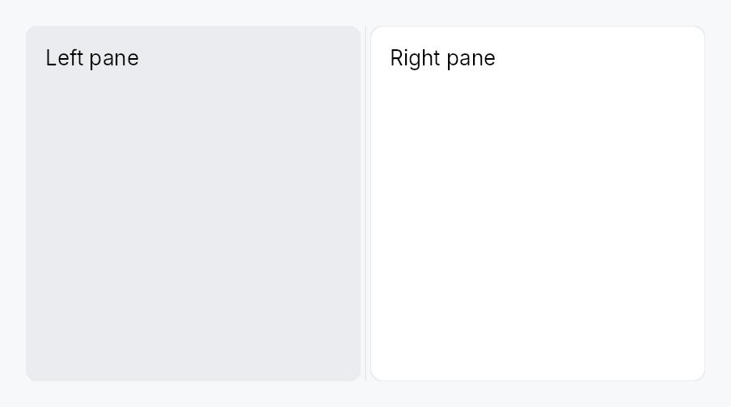

<!-- SPDX-License-Identifier: MPL-2.0 -->
<!-- SPDX-FileCopyrightText: 2026 FernTech -->

# Splitter



N-pane split container with draggable, collapsible dividers.

`Splitter` arranges `N ≥ 2` panes along one axis (per `Orientation`)
with `N − 1` grabbable handles between them — the Qt `QSplitter`
model. All layout state (per-pane size / min / max / stretch /
collapsed) lives in a shared, cloneable `SplitterModel`; the app
holds a clone to read, mutate, persist, and import/export, while the
widget renders it and reacts to the model's `version` signal.

Strengths carried over from the old two-pane `SplitView`: anti-jump
drag, keyboard resize, `Role::Splitter` accessibility, per-pane content
clipping, RTL-correct horizontal layout. New: N panes, per-pane
stretch (container-resize policy), animated collapse with four triggers
(programmatic / double-click / drag-past-min snap / keyboard), a Tier-3
`SplitterStyle`, and serializable import/export. Intended as the
building block for a future `DockingLayout`.

```ignore
let model = SplitterModel::from_panes(vec![
    PaneDescriptor::new().size(220.0).min_size(160.0).stretch(0.0).collapsible(true),
    PaneDescriptor::new().stretch(1.0).min_size(320.0),
    PaneDescriptor::new().size(280.0).stretch(0.0).collapsible(true),
], Orientation::Horizontal);

Splitter::new(model.clone())
    .pane(sidebar).pane(editor).pane(inspector)
    .pane_label(0, tr!(sidebar()));
```

## Builder methods at a glance

`pane`, `pane_id`, `child`, `pane_label`, `style`, `enabled`

## API reference

📖 [Full rustdoc API for this module](../api/teksilo_widgets/splitter/index.html)

## `pub struct Splitter`

An N-pane resizable split container driven by a `SplitterModel`.

See the `module-level documentation` for a usage overview and
constructor patterns.

```rust
pub struct Splitter { /* fields */ }
```

### Methods

#### `pub fn new(model: SplitterModel) -> Self`

Create a `Splitter` bound to the given model. Panes must be appended
with `pane` in model order.

#### `pub fn pane(mut self, widget: impl Widget + 'static) -> Self`

Append a content pane (model order). Call once per pane; the count
must match `model.pane_count()`.

#### `pub fn pane_id(mut self, id: WidgetId) -> Self`

Append a pre-registered content pane by id.

#### `pub fn child(self, widget: impl Widget + 'static) -> Self`

`teksu!` ergonomic alias for `pane`: a bare child in a
`Splitter { ... }` block lowers to `.child(...)`.

#### `pub fn pane_label(mut self, index: usize, label: impl Into<Prop<String>>) -> Self`

Set an accessible region name for pane `index` (locale-reactive).
Labeled panes become a named `Role::Group`; unlabeled panes stay
AT-transparent (their content represents itself).

#### `pub fn style(mut self, style: impl SplitterStyle) -> Self`

Override the active `SplitterStyle` for this instance only.

#### `pub fn enabled(mut self, enabled: impl Into<Prop<bool>>) -> Self`

Enable or disable handle dragging, statically or reactively. When
`false`, divider handles are rendered inert — the pane layout is
still valid but the user cannot resize panes.

## `pub struct PaneDescriptor`

Per-pane configuration passed to `SplitterModel::from_panes` /
`SplitterModel::insert_pane`. Public fields + `Default` so it can
be built with struct-literal `..Default::default()` syntax, or via the
fluent setters.

```rust
pub struct PaneDescriptor { /* fields */ }
```

### Methods

#### `pub fn new() -> Self`

#### `pub fn size(mut self, size: f32) -> Self`

#### `pub fn min_size(mut self, min: f32) -> Self`

#### `pub fn max_size(mut self, max: f32) -> Self`

#### `pub fn stretch(mut self, stretch: f32) -> Self`

#### `pub fn collapsible(mut self, collapsible: bool) -> Self`

#### `pub fn collapsed(mut self, collapsed: bool) -> Self`

#### `pub fn collapsed_size(mut self, px: f32) -> Self`

Size a collapsed pane folds down to (default `0`). See
`collapsed_size`.

#### `pub fn visible(mut self, visible: bool) -> Self`

## `pub struct PaneSnapshot`

Immutable per-pane view handed to the pure `distribute` sizing
function (the internal `splitter::distribute` engine).

```rust
pub struct PaneSnapshot { /* fields */ }
```

## `pub struct PaneState`

Persistable per-pane layout state. Captures the user-controllable
values (size + collapsed); structural config (min/max/stretch/
collapsible) is app-declared and not serialized — Qt `saveState`
parity.

```rust
pub struct PaneState { /* fields */ }
```

## `pub struct SplitterState`

Full serializable snapshot of a `SplitterModel`'s sizes + collapsed
flags. Round-trips through `SplitterModel::export_state` /
`import_state` and implements
`Versioned` so apps persist it through
`SettingsFile<SplitterState>` + `Migrator` (TOML).

```rust
pub struct SplitterState { /* fields */ }
```

## `pub struct SplitterModel`

A shared, cloneable handle to a splitter's layout state. `Clone` =
share-by-handle (cheap `Rc` bump).

```rust
pub struct SplitterModel(Rc<RefCell<SplitterModelInner>>);
```

### Methods

#### `pub fn new(n: usize, orientation: Orientation) -> Self`

`n` equal-share panes (each `stretch = 1`, `min = SPLITTER_MIN_PANE_SIZE`).

#### `pub fn from_panes(panes: Vec<PaneDescriptor>, orientation: Orientation) -> Self`

Build from explicit per-pane descriptors.

#### `pub fn handle_count(&self) -> usize`

Number of distinct handles to this model (1 = unshared).

#### `pub fn set_stored_size(&self, index: usize, size: f32)`

#### `pub fn set_stored_size_silent(&self, index: usize, size: f32)`

Like `set_stored_size` but **without** a version
bump — for writes made from inside a layout/effect pass that is already
relaying out (e.g. capturing the displayed size as the collapse
reference), where a bump would re-enter the effect.

#### `pub fn set_pair_sizes(&self, index: usize, size_a: f32, size_b: f32)`

Set both sides of handle `index` (panes `index` and `index+1`) in
one mutation — a single version bump, so a drag produces exactly
one relayout per move.

#### `pub fn set_min_size(&self, index: usize, min: f32)`

#### `pub fn set_max_size(&self, index: usize, max: Option<f32>)`

#### `pub fn set_stretch(&self, index: usize, stretch: f32)`

#### `pub fn set_collapsible(&self, index: usize, collapsible: bool)`

#### `pub fn set_collapsed(&self, index: usize, collapsed: bool)`

Programmatically collapse/expand pane `index`, *animated*. Ignores
the `collapsible` flag (that flag only gates interactive triggers).

#### `pub fn set_collapsed_immediate(&self, index: usize, collapsed: bool)`

Collapse/expand pane `index` *instantly* (no tween). Used by the
drag handlers — the pointer is already the motion.

#### `pub fn toggle_collapsed(&self, index: usize)`

Toggle pane `index`'s collapsed state, animated.

#### `pub fn set_collapsed_size(&self, index: usize, px: f32)`

Set the size pane `index` folds down to when collapsed (default `0`).
See `PaneDescriptor::collapsed_size`. No version bump on its own — it
only affects the next collapse.

#### `pub fn set_pane_visible(&self, index: usize, visible: bool)`

Show or hide pane `index` (animated). A hidden pane removes both the
pane and an adjacent gutter from the layout — it reads as absent,
unlike a collapsed pane (which keeps its grabbable gutter). The pane
must be pre-mounted in the `Splitter`; this is the reactive "add /
remove a pane from a fixed set" trick (no rebuild).

#### `pub fn is_pane_visible(&self, index: usize) -> bool`

#### `pub fn consume_animate_flag(&self) -> bool`

Read-and-reset the "animate the next collapse change?" latch. The
widget's collapse effect calls this once per version bump; it
resets to `true` so the default (programmatic) path animates.

#### `pub fn insert_pane(&self, index: usize, desc: PaneDescriptor)`

Insert a pane at `index` (clamped to `[0, len]`). A `None`
`initial_size` takes the average of the existing panes' sizes; the
next layout rebalances. The app must rebuild the `Splitter` widget
to supply the new pane's content (retained-mode: changing a
container's child *set* is a rebuild; the model keeps the
persistent size/collapse state across it).

#### `pub fn remove_pane(&self, index: usize)`

Remove the pane at `index` (no-op if out of range). The app must
rebuild the `Splitter` widget to drop the corresponding content.

#### `pub fn replace_pane_desc(&self, index: usize, desc: PaneDescriptor)`

Replace the metadata of pane `index` (keeps its current size unless
the descriptor specifies one).

#### `pub fn set_gutter_thickness(&self, thickness: f32)`

#### `pub fn set_snap_offset(&self, offset: f32)`

#### `pub fn set_keyboard_step_px(&self, step: f32)`

#### `pub fn set_orientation(&self, orientation: Orientation)`

#### `pub fn pane_count(&self) -> usize`

#### `pub fn stored_size(&self, index: usize) -> f32`

#### `pub fn min_size(&self, index: usize) -> f32`

#### `pub fn max_size(&self, index: usize) -> Option<f32>`

#### `pub fn stretch(&self, index: usize) -> f32`

#### `pub fn is_collapsible(&self, index: usize) -> bool`

#### `pub fn collapsed_size(&self, index: usize) -> f32`

The size pane `index` folds to when collapsed (default `0`). See
`PaneDescriptor::collapsed_size`.

#### `pub fn is_collapsed(&self, index: usize) -> bool`

#### `pub fn orientation(&self) -> Orientation`

#### `pub fn gutter_thickness(&self) -> f32`

#### `pub fn snap_offset(&self) -> f32`

#### `pub fn keyboard_step_px(&self) -> f32`

#### `pub fn version(&self) -> Signal<u64>`

The reactive version signal. The `Splitter` widget binds this at
`BindingLevel::Relayout`.

#### `pub fn pane_snapshots(&self) -> Vec<PaneSnapshot>`

Immutable per-pane snapshot for the pure sizing engine.

#### `pub fn export_state(&self) -> SplitterState`

Snapshot the per-pane sizes + collapsed flags into a serializable
`SplitterState`.

#### `pub fn import_state(&self, state: &SplitterState) -> bool`

Restore sizes + collapsed flags from a `SplitterState`. Returns
`false` (and changes nothing) if the pane count doesn't match — the
structural config must be reconstructed first. Restoration is
instant (collapsed panes don't animate open on load).
