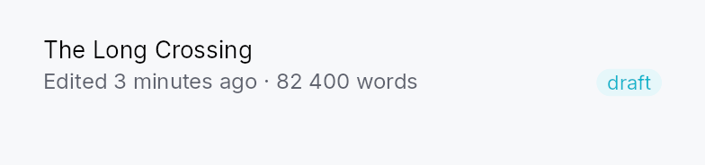
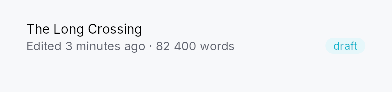

<!-- SPDX-License-Identifier: MPL-2.0 -->
<!-- SPDX-FileCopyrightText: 2026 FernTech -->

# StandardListItem



Canonical row layout for `ListView` / `TreeView` delegates.

Two widgets:
- `StandardListItem` — primary line `[checkbox?] [leading_slot?]
  [center_slot?] [label] [Spacer] [trailing_slot?]` with optional
  subtitle line `[subtitle_leading_slot?] [subtitle] [Spacer]
  [subtitle_trailing_slot?]`.
- `StandardTreeItem` — same plus depth-driven indent + chevron
  column (always reserved, even for leaves, so labels at the same
  depth align).

Selection / hover / pressed background mirrors `MenuItem` /
`ComboBox`: rounded `RectWidget` (`item_corner_radius: 8.0`),
horizontally inset so corners are visible, theme-driven via
`SurfaceRole` so light/dark/custom themes propagate without
rebuild.

## Canonical TreeView wiring

```ignore
use teksilo::data::{TreeCheckedModel, TreeModel};
use teksilo::widgets::{StandardTreeItem, TreeView};

let tree: TreeModel<Item> = ...;
let checks = TreeCheckedModel::new(tree.clone());

TreeView::new_with_context(tree, move |item, entry, selected, ctx| {
    let mut row = StandardTreeItem::new(lit!(item.title.clone()))
        .from_entry(entry)
        .selected(selected)
        .leading_slot(IconWidget::from_svg(FOLDER_ICON).icon_size(16.0))
        .on_chevron_toggle_rc(ctx.toggle_callback());
    if entry.has_children {
        row = row.tristate_checkbox(checks.signal_for(entry.node_id));
    } else {
        row = row.checkbox(checks.bool_signal_for(entry.node_id));
    }
    Box::new(row)
})
.row_click_expands(false)   // chevron is the only toggle target
```

Wiring rules:
- `TreeView::new_with_context` exposes a `TreeRowContext` that
  yields `toggle_callback()` for chevron clicks. Pair with
  `.row_click_expands(false)` so body clicks don't also toggle.
- For tristate parent rows, bind to `signal_for(node)`. For
  leaves, prefer `bool_signal_for(node)` — the model's bool ↔
  tristate bridge runs ancestor recompute on writes either way.
- `from_entry(&FlatEntry)` is shorthand for
  `.depth(entry.depth).has_children(entry.has_children)
  .is_expanded(entry.is_expanded)`.

## Accessibility

`StandardListItem.accessibility()` sets the row's `name` (label
only) and `description` (subtitle, if any) — structural role +
position/level/expanded/selected come from the parent's
`ListItemWrapper` / `TreeItemWrapper` wrapper. The embedded `Checkbox`
receives an `access_label*` override carrying the row label so
screen readers announce "checkbox, checked, `[label]`" rather than
a nameless `Role::CheckBox`. The chevron's `TwistArrow` is
decorative (`set_hidden`); the row's expanded state is owned by
the wrapper.

## Touch and pen

A row's **height** is a target floor and follows the density ladder: the row
projects the raw module constants through `density::dp` at layout time. It does
**not** read `StandardItemRecipe::min_height_single_line` /
`min_height_two_line`, which have carried the same projected values since the
density sweep and have no reader — so retuning either of those two recipe
fields in a preset moves nothing. `layout_response` says the same thing at the
site; `docs/touch-and-pen.md` §10.1 carries it as an open finding.

A row's **press** is not the row's. Inside a `ListView` or a `TreeView` the
body pane owns the tap, the double tap and the reorder drag, and resolves which
row they mean by coordinate; the framework press belongs to the node whose
gesture arena took it, so a row's own `pressed_signal` is structurally always
false. The `Pressed` chrome the recipe paints is therefore reachable only
through a caller-supplied `interaction_signal`. Changing that means ruling on
which node owns a press when a data view is wrapped in something tappable,
which is an open design question rather than a widget change.

Hover is decoration plus the reveal policy: at a density that reveals every
affordance the row pins its `reveal` signal on, so trailing actions do not
depend on a hover a contact never produces.

## Density

The picture above is the widget at `TargetDensity::Compact`, the mouse-and-keyboard ladder. Below is the same subject on the same canvas with only the ladder changed, so what moves is the density and nothing else — where the subject no longer fits, that is what the denser targets cost it at that size. See `docs/density-and-targets.md`.

**Touch**



## Builder methods at a glance

`style`, `subtitle`, `leading_slot`, `leading_slot_boxed`, `center_slot`, `center_slot_boxed`, `trailing_slot`, `trailing_slot_boxed`, `subtitle_leading_slot`, `subtitle_leading_slot_boxed`, `subtitle_trailing_slot`, `subtitle_trailing_slot_boxed`, `checkbox`, `tristate_checkbox`, `on_checkbox_toggle`, `selected`, `enabled`, `label_style`, `subtitle_style`, `label_color`, `subtitle_color`, `interaction_signal`, `reveal_signal`, `label_slot`, `label_overflow`, `subtitle_overflow`, `tooltip`, `rich_tooltip`, `rich_tooltip_content`, `composite_tooltip`

## API reference

📖 [Full rustdoc API for this module](https://docs.rs/teksilo-widgets/latest/teksilo_widgets/standard_item/index.html)

## `pub struct StandardListItem`

Canonical single-line or two-line row layout for use in a `ListView`.

See the `module-level documentation` for the full slot layout and
wiring rules.

```rust
pub struct StandardListItem { /* fields */ }
```

### Methods

#### `pub fn new(label: impl Into<LocalizedString>) -> Self`

Create a list item with the given primary label.

#### `pub fn style(mut self, style: impl teksilo_core::styles::StandardItemStyle) -> Self`

Per-call style override. Replaces the theme-wide default
`StandardItemStyle` for just this row instance.

#### `pub fn subtitle(mut self, text: impl Into<LocalizedString>) -> Self`

Set an optional secondary line below the primary label.

#### `pub fn leading_slot(mut self, widget: impl Widget + 'static) -> Self`

Leading slot — placed AFTER the optional checkbox, BEFORE the
center slot. Typical: `IconWidget`, avatar, color swatch.

#### `pub fn leading_slot_boxed(mut self, widget: Box<dyn Widget>) -> Self`

`Box<dyn Widget>` variant of `leading_slot`.

#### `pub fn center_slot(mut self, widget: impl Widget + 'static) -> Self`

Center slot — placed BETWEEN the leading slot and the label.
Typical: status dot, colored category bar, drag-handle gripper,
key-binding chip. Distinct from `leading_slot`: leading is the
row's icon identity, center is label-adjacent decoration.

#### `pub fn center_slot_boxed(mut self, widget: Box<dyn Widget>) -> Self`

`Box<dyn Widget>` variant of `center_slot`.

#### `pub fn trailing_slot(mut self, widget: impl Widget + 'static) -> Self`

Trailing slot — placed AFTER the flex Spacer on the primary
line. Typical: badge, count, status pill, secondary IconButton.

#### `pub fn trailing_slot_boxed(mut self, widget: Box<dyn Widget>) -> Self`

`Box<dyn Widget>` variant of `trailing_slot`.

#### `pub fn subtitle_leading_slot(mut self, widget: impl Widget + 'static) -> Self`

Leading slot for the subtitle line. No-op without `subtitle(...)`.

#### `pub fn subtitle_leading_slot_boxed(mut self, widget: Box<dyn Widget>) -> Self`

`Box<dyn Widget>` variant of `subtitle_leading_slot`.

#### `pub fn subtitle_trailing_slot(mut self, widget: impl Widget + 'static) -> Self`

Trailing slot for the subtitle line. No-op without `subtitle(...)`.

#### `pub fn subtitle_trailing_slot_boxed(mut self, widget: Box<dyn Widget>) -> Self`

`Box<dyn Widget>` variant of `subtitle_trailing_slot`.

#### `pub fn checkbox(mut self, checked: Signal<bool>) -> Self`

Optional two-state checkbox at the start of the row.
Mutually exclusive with `tristate_checkbox` — last call wins.

#### `pub fn tristate_checkbox(mut self, state: Signal<CheckState>) -> Self`

Optional tri-state checkbox bound to `Signal<CheckState>`.
User clicks toggle `Checked` ↔ `Unchecked` (clicking from
`Indeterminate` checks the whole); `Indeterminate` is reserved for
external sources such as `TreeCheckedModel` aggregation. Mutually
exclusive with `checkbox` — last call wins.

#### `pub fn on_checkbox_toggle( mut self, f: impl Fn(bool, &mut teksilo_core::widget::EventContext) + 'static, ) -> Self`

Run `f` when the **user** flips this row's checkbox, forwarded to the
embedded `Checkbox::on_change`:
same contract, same four paths, including `Space` on the focused row.

Reach for it only when flipping the box has to touch the ambient
context (`ctx.send_intent(..)`, opening a dialog). To *read* or react to
check state, bind the row's box to a `CheckedModel` and use that:
`is_checked` / `checked_indices` / `checked_count`, or
`checked_signal()` for the reactive view. The model is the source of
truth and it survives the row being recycled by virtualization, which a
per-row callback does not.

#### `pub fn selected(mut self, selected: impl Into<Prop<bool>>) -> Self`

Set the selection state, statically or reactively via a bound
`Signal<bool>`.

#### `pub fn enabled(mut self, enabled: impl Into<Prop<bool>>) -> Self`

Set the enabled state, statically or reactively via a bound
`Signal<bool>` / `Prop<bool>`.

#### `pub fn label_style( mut self, style: impl Into<teksilo_core::color_prop::TextStyleProp>, ) -> Self`

Override the label's text style (font, size, weight). Accepts a
`TextStyleRole`, a `TextStyle`, or a `Signal` of either. Default is
`TextStyleRole::Body`.

#### `pub fn subtitle_style( mut self, style: impl Into<teksilo_core::color_prop::TextStyleProp>, ) -> Self`

Override the subtitle's text style. Default is `TextStyleRole::Small`.

#### `pub fn label_color(mut self, color: impl Into<teksilo_core::color_prop::ColorProp>) -> Self`

Override the label's text color. Accepts `Color`, a role, or a
`Signal` of either. Default (unset) is enabled-derived
(`Primary` / `Disabled`); setting this replaces that cascade.

#### `pub fn subtitle_color(mut self, color: impl Into<teksilo_core::color_prop::ColorProp>) -> Self`

Override the subtitle's text color. Default (unset) is
`TextRole::Secondary`.

#### `pub fn interaction_signal(mut self, signal: Signal<InteractionState>) -> Self`

**Share the row's interaction state** — idle, hovered, pressed.

A row that shows its actions only while the pointer is over it is a standard
pattern — a search result offering *replace* and *dismiss*, a list offering
*remove* — and it cannot be built from outside without knowing when the row
is hovered. The row already tracks that; this is the handle on it.

The signal is written by the row, not read: pass one in and watch it.

**To gate revealed controls, use `reveal_signal`
instead.** This one reports hover, and hover is a mouse's alone — a
trailing slot gated on `Hovered` is a slot a finger can never reach.

#### `pub fn reveal_signal(mut self, signal: Signal<bool>) -> Self`

**Whether this row's revealed controls should be reachable**, which is
not the same question as whether the row is hovered.

`interaction_signal` reports the row's
interaction state, and a caller gating a trailing slot on `Hovered` has
built something a finger can never reach: a contact produces no hover,
ever, so the controls never appear. This signal is the same intent
stated as intent, and the row answers it per density — hover while the
density reveals on hover, and **permanently `true`** at a density whose
`RevealPolicy` is `Always`, where nothing is going to hover.

Gate the slot on this, not on the interaction state, and reserve the
space the controls take — the row reflows otherwise, under the pointer
trying to hit them.

#### `pub fn label_slot(mut self, widget: impl Widget + 'static) -> Self`

**Draw this instead of the label's text**, keeping the label as the row's
accessible name.

For a row whose label is not plain text: a search result with the matched
run picked out of its excerpt, a diff line, anything built from runs rather
than from a string. The label passed to `new` is still what
`accessibility` reports, so the row keeps a name a screen reader can read —
which is the whole reason this is a *replacement for the drawing* and not a
replacement for the label.

The widget is laid out where the text would have been, so it inherits the
row's spacing and its place beside the leading and trailing slots.
`label_style`, `label_color` and
`label_overflow` do not reach it: it draws itself.

#### `pub fn label_overflow(mut self, overflow: TextOverflow) -> Self`

#### `pub fn subtitle_overflow(mut self, overflow: TextOverflow) -> Self`

Truncate the subtitle instead of wrapping it. Default (unset) is
`TextOverflow::Wrap`.

Same rationale as `label_overflow` — and the
usual culprit, since subtitles carry long secondary text (file paths,
URLs). `TextOverflow::Ellipsis(EllipsisMode::Middle)` suits a path: it
keeps both the root and the file name legible.

#### `pub fn tooltip(mut self, text: impl Into<LocalizedString>) -> Self`

Attach a plain tooltip shown after the standard hover delay.

Mutually exclusive with `rich_tooltip`,
`rich_tooltip_content`, and
`composite_tooltip` — the last setter called
wins and clears the other slots.

#### `pub fn rich_tooltip(mut self, key: impl Into<String>) -> Self`

Attach a rich tooltip looked up from the global tooltip registry by key.

Mutually exclusive with `tooltip`,
`rich_tooltip_content`, and
`composite_tooltip` — the last setter called
wins and clears the other slots.

#### `pub fn rich_tooltip_content(mut self, content: crate::tooltip::TooltipContent) -> Self`

Attach a rich tooltip from an inline `TooltipContent`
value (no registry lookup required).

Mutually exclusive with `tooltip`,
`rich_tooltip`, and
`composite_tooltip` — the last setter called
wins and clears the other slots.

#### `pub fn composite_tooltip(mut self, content: impl Widget + 'static) -> Self`

Attach a composite tooltip whose body is an arbitrary widget tree.

Mutually exclusive with `tooltip`,
`rich_tooltip`, and
`rich_tooltip_content` — the last setter
called wins and clears the other slots.

## `pub struct StandardTreeItem`

Canonical row layout for a `TreeView` — `StandardListItem` plus
a depth-driven indent column and an always-reserved chevron column.

See the `module-level documentation` for the canonical `TreeView`
wiring pattern and wiring rules.

```rust
pub struct StandardTreeItem { /* fields */ }
```

### Methods

#### `pub fn new(label: impl Into<LocalizedString>) -> Self`

Create a tree item with the given primary label.

#### `pub fn interaction_signal(mut self, signal: Signal<InteractionState>) -> Self`

See [`StandardListItem::interaction_signal`]: the row's own hover/press
state. To gate revealed controls use
`reveal_signal`.

#### `pub fn reveal_signal(mut self, signal: Signal<bool>) -> Self`

See [`StandardListItem::reveal_signal`]: whether this row's revealed
controls should be reachable, answered per density.

#### `pub fn label_slot(mut self, widget: impl Widget + 'static) -> Self`

See [`StandardListItem::label_slot`]: draw this instead of the label's
text, keeping the label as the row's accessible name.

#### `pub fn subtitle(mut self, text: impl Into<LocalizedString>) -> Self`

#### `pub fn leading_slot(mut self, widget: impl Widget + 'static) -> Self`

Forwarded to the inner `StandardListItem` — see its
`leading_slot`.

#### `pub fn leading_slot_boxed(mut self, widget: Box<dyn Widget>) -> Self`

`Box<dyn Widget>` variant of `leading_slot`.

#### `pub fn center_slot(mut self, widget: impl Widget + 'static) -> Self`

Forwarded to the inner `StandardListItem` — see its
`center_slot`.

#### `pub fn center_slot_boxed(mut self, widget: Box<dyn Widget>) -> Self`

`Box<dyn Widget>` variant of `center_slot`.

#### `pub fn trailing_slot(mut self, widget: impl Widget + 'static) -> Self`

Forwarded to the inner `StandardListItem` — see its
`trailing_slot`.

#### `pub fn trailing_slot_boxed(mut self, widget: Box<dyn Widget>) -> Self`

`Box<dyn Widget>` variant of `trailing_slot`.

#### `pub fn subtitle_leading_slot(mut self, widget: impl Widget + 'static) -> Self`

Forwarded to the inner `StandardListItem` — see its
`subtitle_leading_slot`.

#### `pub fn subtitle_leading_slot_boxed(mut self, widget: Box<dyn Widget>) -> Self`

`Box<dyn Widget>` variant of
`subtitle_leading_slot`.

#### `pub fn subtitle_trailing_slot(mut self, widget: impl Widget + 'static) -> Self`

Forwarded to the inner `StandardListItem` — see its
`subtitle_trailing_slot`.

#### `pub fn subtitle_trailing_slot_boxed(mut self, widget: Box<dyn Widget>) -> Self`

`Box<dyn Widget>` variant of
`subtitle_trailing_slot`.

#### `pub fn checkbox(mut self, checked: Signal<bool>) -> Self`

Forwarded to the inner `StandardListItem` — see its
`checkbox`.

#### `pub fn on_checkbox_toggle( mut self, f: impl Fn(bool, &mut teksilo_core::widget::EventContext) + 'static, ) -> Self`

Forwarded to the inner `StandardListItem` — see its
`on_checkbox_toggle`. Distinct
from `on_chevron_toggle`, which is the
expand / collapse control.

#### `pub fn tristate_checkbox(mut self, state: Signal<CheckState>) -> Self`

Forwarded to the inner `StandardListItem` — see its
`tristate_checkbox`.

#### `pub fn selected(mut self, selected: impl Into<Prop<bool>>) -> Self`

Set the selection state, statically or reactively via a bound
`Signal<bool>`. Forwarded to the inner `StandardListItem` — see
its `selected`.

#### `pub fn enabled(mut self, enabled: impl Into<Prop<bool>>) -> Self`

Set the enabled state, statically or reactively via a bound
`Signal<bool>` / `Prop<bool>`. Forwarded to the inner
`StandardListItem`.

#### `pub fn label_style( mut self, style: impl Into<teksilo_core::color_prop::TextStyleProp>, ) -> Self`

Override the label's text style. Forwarded to the inner
`StandardListItem` — see its
`label_style`.

#### `pub fn subtitle_style( mut self, style: impl Into<teksilo_core::color_prop::TextStyleProp>, ) -> Self`

Override the subtitle's text style. Forwarded to the inner
`StandardListItem` — see its
`subtitle_style`.

#### `pub fn label_color(mut self, color: impl Into<teksilo_core::color_prop::ColorProp>) -> Self`

Override the label's text color. Forwarded to the inner
`StandardListItem` — see its `label_color(...)`.

#### `pub fn subtitle_color(mut self, color: impl Into<teksilo_core::color_prop::ColorProp>) -> Self`

Override the subtitle's text color. Forwarded to the inner
`StandardListItem` — see its `subtitle_color(...)`.

#### `pub fn label_overflow(mut self, overflow: TextOverflow) -> Self`

Truncate the primary label instead of wrapping it. Forwarded to the
inner `StandardListItem` — see its
`label_overflow`.

#### `pub fn subtitle_overflow(mut self, overflow: TextOverflow) -> Self`

Truncate the subtitle instead of wrapping it. Forwarded to the inner
`StandardListItem` — see its
`subtitle_overflow`.

#### `pub fn style(mut self, style: impl teksilo_core::styles::StandardItemStyle) -> Self`

Per-call style override for the row chrome. Forwarded to the
inner `StandardListItem` — see its `style(...)` for the
precedence rules (per-call > theme.style_slots.standard_item >
`RecipeStandardItemStyle`).

#### `pub fn tooltip(mut self, text: impl Into<LocalizedString>) -> Self`

Attach a plain tooltip shown after the standard hover delay.
Forwarded to the inner `StandardListItem` — see its
`tooltip`.

#### `pub fn rich_tooltip(mut self, key: impl Into<String>) -> Self`

Attach a rich tooltip looked up from the global tooltip registry by key.
Forwarded to the inner `StandardListItem` — see its
`rich_tooltip`.

#### `pub fn rich_tooltip_content(mut self, content: crate::tooltip::TooltipContent) -> Self`

Attach a rich tooltip from an inline
`TooltipContent` value.
Forwarded to the inner `StandardListItem` — see its
`rich_tooltip_content`.

#### `pub fn composite_tooltip(mut self, content: impl Widget + 'static) -> Self`

Attach a composite tooltip whose body is an arbitrary widget tree.
Forwarded to the inner `StandardListItem` — see its
`composite_tooltip`.

#### `pub fn depth(mut self, depth: usize) -> Self`

Set the indent depth (0 = root level). Each level adds one
`STANDARD_ITEM_TREE_INDENT_STEP` of leading whitespace.

#### `pub fn has_children(mut self, has: bool) -> Self`

Declare whether the node has children, which determines whether the
chevron column is interactive or decorative-only.

#### `pub fn is_expanded(mut self, expanded: impl Into<Prop<bool>>) -> Self`

Set the expanded state, statically or reactively via a bound
`Signal<bool>`.

#### `pub fn from_entry(self, entry: &FlatEntry) -> Self`

Convenience for the TreeView delegate path:
`.from_entry(entry)` sets depth + has_children + is_expanded.

#### `pub fn on_chevron_toggle( mut self, f: impl Fn(&mut teksilo_core::widget::EventContext) + 'static, ) -> Self`

Click handler for the **chevron** — the expand / collapse control, not
the row's checkbox, which is `on_checkbox_toggle`
on the inner item. Wired only when `has_children` is true. Typical use:
`.on_chevron_toggle(ctx.toggle_callback())` from a `TreeRowContext`
(see `TreeView::new_with_context`).

The callback receives the firing `EventContext` so apps can
dispatch an intent (e.g. lazy-load children on expand), open
a dialog, or otherwise route the toggle through the framework
before mutating model state.

#### `pub fn on_chevron_toggle_rc( mut self, f: Rc<dyn Fn(&mut teksilo_core::widget::EventContext)>, ) -> Self`

Variant accepting an already-`Rc`'d callback. Useful when the
same callback is shared across multiple call sites without an
extra clone — e.g. `TreeRowContext::toggle_callback()` returns
this shape directly.
