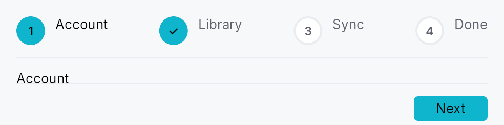

<!-- SPDX-License-Identifier: MPL-2.0 -->
<!-- SPDX-FileCopyrightText: 2026 FernTech -->

# Stepper



`Stepper` — a modern, embeddable step-flow widget (Material/Ant/Flutter
"stepper"), and `Wizard`, a thin modal launcher built on it.

A stepper shows a **visible step-indicator strip** above (or beside) a
content area driven by a `Switcher`, with a
footer of Back / Skip / Help / Next / Finish controls. It supports linear
and **non-linear** (clickable) navigation, optional + skippable steps, per
step validation gating, a generic chrome slot, and a
`StepperController` handle for programmatic reset / jump / introspection.

# Data flow

The application owns its form state as `Signal`s. A step's content factory
captures clones of those signals (write side); `Step::complete_when`
derives the Next gate from the same signals; and
`Stepper::on_finish` reads them back — plus the `StepperController` for
per-step introspection (`visited` / `skipped`) — to branch on the choices
made. There is no `QVariant` field registry: plain shared signals are the
cross-step channel.

```ignore
#[derive(Clone)]
struct Form { name: Signal<String>, plan: Signal<Plan> }
let form = Form { name: Signal::new(String::new()), plan: Signal::new(Plan::Free) };

Stepper::new()
    .step(Step::new(lit!("Account"))
        .content({ let f = form.clone(); move || TextInput::new().text(f.name.clone()) })
        .complete_when(form.name.map(|n| !n.is_empty())))
    .step(Step::new(lit!("Plan"))
        .content({ let f = form.clone(); move || plan_picker(f.plan.clone()) }))
    .on_finish({ let f = form.clone(); move |_ctx, ctrl| {
        match f.plan.get() { Plan::Free => {/* … */} Plan::Pro => {/* … */} }
        let _ = ctrl.skipped(1);
    }});
```

## Builder methods at a glance

`step`, `steps`, `controller`, `orientation`, `vertical`, `non_linear`, `circle_size`, `chrome`, `chrome_position`, `back_label`, `next_label`, `finish_label`, `skip_label`, `help`, `cancel`, `on_finish`, `enter_advances`, `tooltip`, `rich_tooltip`, `rich_tooltip_content`, `composite_tooltip`

## API reference

📖 [Full rustdoc API for this module](https://docs.rs/teksilo-widgets/latest/teksilo_widgets/stepper/index.html)

## `pub enum StepperOrientation`

Indicator-strip orientation for a `Stepper`.

```rust
pub enum StepperOrientation { /* variants */ }
```

### Variants

- **`Horizontal`** — Markers in a row, content below (default).
- **`Vertical`** — Markers in a column on the leading side, content beside.

## `pub enum ChromePosition`

Where the optional chrome slot (banner / sidebar) sits relative to the
stepper body.

```rust
pub enum ChromePosition { /* variants */ }
```

### Variants

- **`Leading`** — Leading column (left in LTR). Forced to `Top` in vertical orientation.
- **`Top`** — Banner above the stepper body.

## `pub struct Stepper`

An embeddable multi-step flow widget. See the `module docs` for the
data-flow pattern and a usage example.

```rust
pub struct Stepper { /* fields */ }
```

### Methods

#### `pub fn new() -> Self`

Create an empty `Stepper`. Append steps with `step` or
`steps` and provide a finish callback with
`on_finish`.

#### `pub fn step(mut self, step: Step) -> Self`

Append a single `Step` definition.

#### `pub fn steps(mut self, steps: impl IntoIterator<Item = Step>) -> Self`

Append multiple `Step` definitions from an iterator.

#### `pub fn controller(mut self, controller: StepperController) -> Self`

Drive the stepper with an externally-held controller (for programmatic
reset / jump / introspection). If omitted, the stepper creates its own.

#### `pub fn orientation(mut self, orientation: StepperOrientation) -> Self`

Set the indicator-strip orientation (horizontal or vertical).

#### `pub fn vertical(mut self) -> Self`

Shorthand for `.orientation(StepperOrientation::Vertical)`.

#### `pub fn non_linear(mut self, non_linear: bool) -> Self`

Allow jumping between steps by clicking their indicators (the markers
become `Role::Tab`). Linear (default) markers are `Role::ListItem`.

#### `pub fn circle_size(mut self, size: f32) -> Self`

Override the marker circle diameter (logical px).

#### `pub fn chrome(mut self, chrome: impl Widget + 'static) -> Self`

A generic chrome widget (banner / sidebar) — the modern replacement for
QWizard's watermark pixmap.

**It lands in the leading column by default**
(`ChromePosition::Leading`, QWizard's watermark slot), i.e. a full
height sidebar. For a *title banner* pair it with
`.chrome_position(ChromePosition::Top)`, or the chrome renders as a
wide sidebar holding a few words.

#### `pub fn chrome_position(mut self, position: ChromePosition) -> Self`

Choose where the optional chrome widget sits relative to the stepper
body. Forced to `ChromePosition::Top` when
`orientation` is `Vertical`.

#### `pub fn back_label(mut self, label: impl Into<LocalizedString>) -> Self`

Override the "Back" button label. Default: "Back".

#### `pub fn next_label(mut self, label: impl Into<LocalizedString>) -> Self`

Override the "Next" button label. Default: "Next".

#### `pub fn finish_label(mut self, label: impl Into<LocalizedString>) -> Self`

Override the "Finish" button label. Default: "Finish".

#### `pub fn skip_label(mut self, label: impl Into<LocalizedString>) -> Self`

Override the "Skip" button label. Default: "Skip".

#### `pub fn help( mut self, label: impl Into<LocalizedString>, action: impl Fn(&mut EventContext, &StepperController) + 'static, ) -> Self`

Add a Help button + callback to the footer.

#### `pub fn cancel( mut self, label: impl Into<LocalizedString>, action: impl Fn(&mut EventContext, &StepperController) + 'static, ) -> Self`

Add a Cancel button + callback to the footer.

#### `pub fn on_finish<R: IntoFinishOutcome>( mut self, action: impl Fn(&mut EventContext, &StepperController) -> R + 'static, ) -> Self`

Called when Finish is activated on the last step. Receives the event
context and the controller (for `skipped` / `visited` introspection);
read collected values from the form signals your steps wrote.

**The callback may refuse.** Its return value goes through the
`IntoFinishOutcome` bridge — `()` always succeeds, while `false`,
`Err(_)`, or `FinishOutcome::Rejected` keep the stepper on the last
step and mark it `StepStatus::Error` (a `Wizard` modal stays
open). This is the
Finish counterpart of `Step::validate_on_next` — for the case where
the commit itself can fail (disk full, name taken, server refused):

```ignore
.on_finish(move |ctx, _ctrl| match create_project(&name.get()) {
    Ok(()) => true,
    Err(e) => { status.set(e.to_string()); false }
})
```

#### `pub fn enter_advances(mut self, enter_advances: bool) -> Self`

Whether pressing <kbd>Enter</kbd> activates the footer's primary button
(Next, or Finish on the last step). Default: `true`.

The key is handled on the **bubble** pass at the stepper root, so a
focused control that wants Enter for itself — a Button, a multi-line
editor, a list row — consumes it first and the stepper never sees it.
A single-line form field lets it through, which is where the "Enter
means Next" contract is expected. Gates apply exactly as they do to a
click: a blocked `complete_when` / `validate_on_next` refuses the same
way.

Turn it off for a step whose body treats Enter as content in a way the
framework cannot see.

#### `pub fn tooltip(mut self, text: impl Into<LocalizedString>) -> Self`

Attach a plain single-line tooltip to this stepper. Clears any
previously set rich or composite tooltip.

#### `pub fn rich_tooltip(mut self, key: impl Into<String>) -> Self`

Attach a rich tooltip identified by a registry key. Clears any
previously set plain or composite tooltip.

#### `pub fn rich_tooltip_content(mut self, content: crate::tooltip::TooltipContent) -> Self`

Attach a rich tooltip with inline content. Clears any previously set
plain or composite tooltip.

#### `pub fn composite_tooltip(mut self, content: impl Widget + 'static) -> Self`

Attach a composite tooltip (arbitrary widget body). Clears any
previously set plain or rich tooltip.

## `pub struct StepperController`

Shared handle controlling a `Stepper`.

```rust
pub struct StepperController { /* fields */ }
```

### Methods

#### `pub fn new(step_count: usize) -> Self`

A controller for a stepper with `step_count` steps, starting at step 0.

#### `pub fn next(&self)`

Advance to the next **reachable** step, recording the current one on
the back-stack. Invisible (`Step::visible_when`)
and `StepStatus::Disabled` steps are stepped over; a no-op when none
remains.

#### `pub fn skip(&self)`

Mark the current (optional) step skipped, then advance like
`next`.

#### `pub fn back(&self)`

Return to the most recently visited **reachable** step (the back-stack
top). Entries that became unreachable meanwhile are popped and skipped.
No-op on an empty stack.

#### `pub fn go_to(&self, idx: usize)`

Jump to step `idx` (non-linear), recording the current step on the
back-stack so `back` returns here. A no-op when `idx` is
out of range or not `reachable`.

#### `pub fn reset(&self)`

Reset to the first reachable step: clears the back-stack, restores the
statuses the stepper was declared with (so a `Disabled` / `Optional`
step keeps its character), and clears visited/skipped flags. Per-step
visibility is app-owned and left untouched.

#### `pub fn set_status(&self, idx: usize, status: StepStatus)`

Override a step's `StepStatus` (e.g. mark it `Error` after async
validation). Setting `StepStatus::Disabled` takes the step out of the
flow — `next` / `go_to` skip it — but does
**not** move off it if it is the active step.

#### `pub fn set_visible(&self, idx: usize, visible: bool)`

Show or hide step `idx`. A hidden step is skipped by
`next` / `back` / `go_to`
and drops out of the indicator strip — the branching-wizard shape
("this step only if you chose X") without maintaining two step lists.

Usually driven declaratively by
`Step::visible_when`; this is the
imperative twin. Hiding the *active* step does not navigate away from
it — hide steps the user has not reached yet.

#### `pub fn current(&self) -> usize`

#### `pub fn status(&self, idx: usize) -> StepStatus`

#### `pub fn visited(&self, idx: usize) -> bool`

`true` if step `idx` has ever been the active step.

#### `pub fn skipped(&self, idx: usize) -> bool`

`true` if step `idx` was skipped via `skip`.

#### `pub fn is_visible(&self, idx: usize) -> bool`

`true` if step `idx` is visible (see `set_visible`).

#### `pub fn is_reachable(&self, idx: usize) -> bool`

`true` if step `idx` participates in the flow — visible **and** not
`StepStatus::Disabled`.

#### `pub fn next_reachable(&self, from: usize) -> Option<usize>`

The next reachable step after `from`, if any.

#### `pub fn has_next(&self) -> bool`

`true` if `next` would move — i.e. the active step is not
the last reachable one. The footer shows Next when this holds and
Finish when it does not.

#### `pub fn step_count(&self) -> usize`

#### `pub fn can_back(&self) -> bool`

`true` if there is a previously-visited, still-reachable step to
return to.

#### `pub fn current_step_signal(&self) -> Signal<usize>`

The active-step signal — the stepper's `Switcher` and indicators bind
to it.

#### `pub fn version_signal(&self) -> Signal<u64>`

Bumped on every structural mutation; bind at `BindingLevel::Rebuild`.

## `pub enum StepStatus`

Lifecycle state of a single step, surfaced in the indicator strip and
(for the active step) as `aria-current="step"`.

Mirrors the modern stepper status model (Ant `wait/process/finish/error`,
Flutter `StepState`): `Upcoming` = not yet reached, `Active` = currently
shown, `Complete` = validated, `Error` = failed validation, `Disabled` =
unreachable, `Optional` = reachable but skippable, `Skipped` = an optional
step the user bypassed.

```rust
pub enum StepStatus { /* variants */ }
```

### Variants

- **`Upcoming`**
- **`Active`**
- **`Complete`**
- **`Error`**
- **`Disabled`**
- **`Optional`**
- **`Skipped`**

### Methods

#### `pub fn is_optional(self) -> bool`

`true` for `Optional` — the only status that surfaces a Skip button.

## `pub struct Step`

One page in a `Stepper`.

A step carries a localized `title`, optional `supporting_text`, a content
factory (the body shown when the step is active), and an optional
completion gate. The recommended data-flow pattern: the application owns
its form state as `Signal`s, the content factory binds widgets to those
signals (write side), and `complete_when` derives
the Next gate from the same signals.

```rust
pub struct Step { /* fields */ }
```

### Methods

#### `pub fn new(title: impl Into<LocalizedString>) -> Self`

#### `pub fn content<W, F>(mut self, factory: F) -> Self where W: Widget + 'static, F: Fn() -> W + 'static,`

The body shown while this step is active. The factory may capture
clones of the application's form `Signal`s to read/write step input.

#### `pub fn content_boxed(mut self, factory: impl Fn() -> Box<dyn Widget> + 'static) -> Self`

The body shown while this step is active, as a **boxed** widget — the
escape hatch for a body whose concrete type varies at runtime.

`content` is generic over one `W: Widget`, and
`Box<dyn Widget>` does not itself implement `Widget`, so a step whose
body branches on app state cannot be expressed as a single `content`
factory. Box each branch instead of duplicating the surrounding
builder:

```ignore
Step::new(lit!("Details")).content_boxed({
    let purpose = purpose.clone();
    move || -> Box<dyn Widget> {
        match purpose.get() {
            Purpose::Novel => Box::new(novel_form()),
            Purpose::Import => Box::new(import_form()),
        }
    }
})
```

#### `pub fn supporting_text(mut self, text: impl Into<LocalizedString>) -> Self`

Secondary line under the title in the header / indicator.

#### `pub fn status(mut self, status: StepStatus) -> Self`

Set the step's initial `StepStatus`.

#### `pub fn optional(mut self, optional: bool) -> Self`

Mark the step optional (reachable but skippable — surfaces a Skip
button while active). Equivalent to `.status(StepStatus::Optional)`.

#### `pub fn complete_when(mut self, signal: impl Into<teksilo_core::signal::Prop<bool>>) -> Self`

Reactive Next gate: while this step is active, Next is enabled iff
`signal` is `true`. Derive it from the same form signals the step's
content writes — e.g. `name.map(|n| !n.is_empty())`.

#### `pub fn validate_on_next(mut self, f: impl Fn() -> bool + 'static) -> Self`

Imperative validation fallback: checked on the Next click. Returning
`false` blocks navigation. Prefer `complete_when`
where a reactive signal is available.

#### `pub fn visible_when(mut self, visible: impl Into<teksilo_core::signal::Prop<bool>>) -> Self`

Reactive visibility: while `visible` is `false` this step drops out of
the flow — Next / Back / indicator clicks skip it, and its marker is
hidden from the indicator strip (and from AT).

This is how a **branching** wizard is expressed: declare every step
once and gate the conditional ones on the choice that selects them,
instead of maintaining one step list per branch.

```ignore
let purpose = Signal::new(Purpose::Novel);
Stepper::new()
    .step(Step::new(lit!("Purpose")).content(|| purpose_picker()))
    .step(Step::new(lit!("Import source"))
        .visible_when(purpose.map(|p| *p == Purpose::Import))
        .content(|| import_form()))
```

Hiding the step the user is *currently on* does not navigate away from
it — gate steps ahead of the choice, not the one making it.
