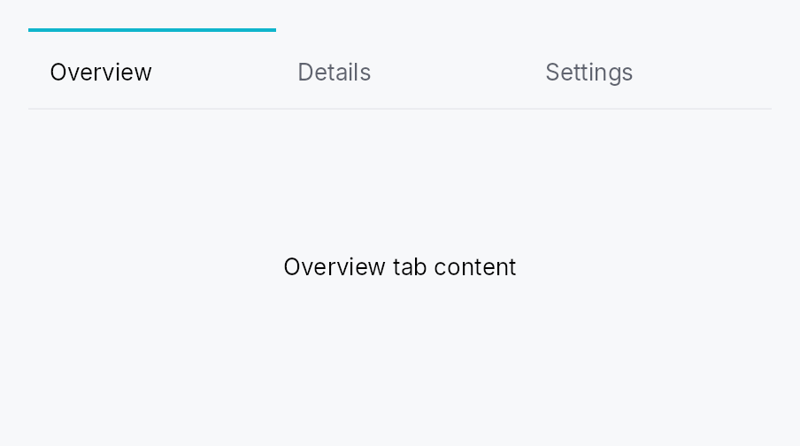

<!-- SPDX-License-Identifier: MPL-2.0 -->
<!-- SPDX-FileCopyrightText: 2026 FernTech -->

# TabWidget



Tabbed-container widgets.

## Public types

| Kind | Name |
| ---: | :--- |
| `type` | [`StaticContentFactory`](#staticcontentfactory) — Closure that builds a static tab's content widget |
| `struct` | [`TabWidget`](#tabwidget) — All-in-one tabbed container |
| `enum` | [`TabBarVisibility`](#tabbarvisibility) — Controls whether a `TabWidget`'s tab strip is shown |
| `type` | [`ContextMenuFactory`](#contextmenufactory) — A reusable widget factory the framework calls every time a context menu opens |
| `enum` | [`TabBarOrientation`](#tabbarorientation) — Bar orientation |
| `enum` | [`TabSizing`](#tabsizing) — How wide each tab is: shared across all unpinned tabs, chosen per-tab from content, or stretched to fill the bar |
| `enum` | [`TabDisplayMode`](#tabdisplaymode) — Bar-level control over what each tab shows — its icon, its label, or both |
| `enum` | [`TabOverflowButton`](#taboverflowbutton) — When the trailing "show all tabs" overflow dropdown button appears |
| `struct` | [`TabDelegate`](#tabdelegate) — Resolves per-tab UI from a model item |
| `const` | [`STATIC_KIND`](#static_kind) — Sentinel `kind` reserved for static tabs accumulated via `TabWidget::static_tab` |
| `struct` | [`TabHandle`](#tabhandle) — One tab's identity, presentation, and state pointer |
| `struct` | [`TabId`](#tabid) — Stable identity of a tab |
| `type` | [`IconFactory`](#iconfactory) — Reusable factory for an `IconWidget` |
| `struct` | [`TabInfo`](#tabinfo) — Per-tab presentation metadata |

## Public functions

### `TabWidget`

| Returns | Function |
| ---: | :--- |
| | **Constructors** |
| `Self` | [`new(selected: Signal<Option<TabId>>)`](#tabwidget-new) |
| | **Builder methods** |
| `Self` | [`enabled(enabled: impl Into<Prop<bool>>)`](#tabwidget-enabled) |
| `Self` | [`bar_visibility(visibility: impl Into<Prop<TabBarVisibility>>)`](#tabwidget-bar_visibility) |
| `Self` | [`tab_bar_height(dp: f32)`](#tabwidget-tab_bar_height) |
| `Self` | [`compact_bar()`](#tabwidget-compact_bar) |
| `Self` | [`vertical()`](#tabwidget-vertical) |
| `Self` | [`horizontal()`](#tabwidget-horizontal) |
| `Self` | [`orientation(orientation: impl Into<Prop<TabBarOrientation>>)`](#tabwidget-orientation) |
| `Self` | [`static_tab(info: TabInfo, content: impl teksilo_core::IntoTeksiChild)`](#tabwidget-static_tab) |
| `Self` | [`static_tabs<W>(tabs: impl IntoIterator<Item = (TabInfo, W)>)`](#tabwidget-static_tabs) |
| `Self` | [`tab(label: impl Into<LocalizedString>, content: impl teksilo_core::IntoTeksiChild)`](#tabwidget-tab) |
| `Self` | [`tabs<L, W>(tabs: impl IntoIterator<Item = (L, W)>)`](#tabwidget-tabs) |
| `Self` | [`tab_ids<L>(tabs: impl IntoIterator<Item = (L, WidgetId)>)`](#tabwidget-tab_ids) |
| `Self` | [`static_tab_factory(info: TabInfo, factory: impl Fn(&TabHandle) -> Box<dyn Widget> + 'static)`](#tabwidget-static_tab_factory) |
| `Self` | [`static_tab_ids(tabs: impl IntoIterator<Item = (TabInfo, WidgetId)>)`](#tabwidget-static_tab_ids) |
| `Self` | [`static_tab_with_id(id: TabId, info: TabInfo, content: impl Widget + 'static)`](#tabwidget-static_tab_with_id) |
| `Self` | [`static_tab_factory_with_id(id: TabId, info: TabInfo, factory: impl Fn(&TabHandle) -> Box<dyn Widget> + 'static)`](#tabwidget-static_tab_factory_with_id) |
| `Self` | [`dynamic_tab<S: Any + 'static>(kind: &'static str, factory: impl Fn(&TabHandle, &S) -> Box<dyn Widget> + 'static)`](#tabwidget-dynamic_tab) |
| `Self` | [`dynamic_model(model: ListModel<TabHandle>)`](#tabwidget-dynamic_model) |
| `Self` | [`tab_sizing(mode: TabSizing)`](#tabwidget-tab_sizing) |
| `Self` | [`sizing(sizing: impl Into<Prop<TabSizing>>)`](#tabwidget-sizing) |
| `Self` | [`tab_display(mode: impl Into<Prop<TabDisplayMode>>)`](#tabwidget-tab_display) |
| `Self` | [`tab_background(color: impl Into<teksilo_core::color_prop::ColorProp>)`](#tabwidget-tab_background) |
| `Self` | [`selected_tab_background(color: impl Into<teksilo_core::color_prop::ColorProp>)`](#tabwidget-selected_tab_background) |
| `Self` | [`hover_tab_background(color: impl Into<teksilo_core::color_prop::ColorProp>)`](#tabwidget-hover_tab_background) |
| `Self` | [`idle_tab_background(color: impl Into<teksilo_core::color_prop::ColorProp>)`](#tabwidget-idle_tab_background) |
| `Self` | [`bar_background(color: impl Into<teksilo_core::color_prop::ColorProp>)`](#tabwidget-bar_background) |
| `Self` | [`tab_dividers()`](#tabwidget-tab_dividers) |
| `Self` | [`tab_divider_color(color: impl Into<teksilo_core::color_prop::ColorProp>)`](#tabwidget-tab_divider_color) |
| `Self` | [`active_indicator(position: teksilo_core::styles::TabIndicatorPosition)`](#tabwidget-active_indicator) |
| `Self` | [`selected_text_role(role: teksilo_tokens::TextRole)`](#tabwidget-selected_text_role) |
| `Self` | [`idle_text_role(role: teksilo_tokens::TextRole)`](#tabwidget-idle_text_role) |
| `Self` | [`min_tab_width(dp: f32)`](#tabwidget-min_tab_width) |
| `Self` | [`max_tab_width(dp: f32)`](#tabwidget-max_tab_width) |
| `Self` | [`pinned_tab_width(dp: f32)`](#tabwidget-pinned_tab_width) |
| `Self` | [`show_scroll_arrows(on: bool)`](#tabwidget-show_scroll_arrows) |
| `Self` | [`overflow_button(mode: TabOverflowButton)`](#tabwidget-overflow_button) |
| `Self` | [`show_overflow_dropdown(on: bool)`](#tabwidget-show_overflow_dropdown) |
| `Self` | [`reorderable(on: bool)`](#tabwidget-reorderable) |
| `Self` | [`on_close(f: impl Fn(TabId, &mut EventContext) + 'static)`](#tabwidget-on_close) |
| `Self` | [`on_reorder(f: impl Fn(TabId, usize, &mut EventContext) + 'static)`](#tabwidget-on_reorder) |
| `Self` | [`on_pin_toggle(f: impl Fn(TabId, bool, &mut EventContext) + 'static)`](#tabwidget-on_pin_toggle) |
| `Self` | [`accept_external_tabs(on: bool)`](#tabwidget-accept_external_tabs) |
| `Self` | [`on_tab_received(f: impl Fn(TabHandle, usize, &mut EventContext) + 'static)`](#tabwidget-on_tab_received) |
| `Self` | [`on_transfer_out(f: impl Fn(TabId, &mut EventContext) + 'static)`](#tabwidget-on_transfer_out) |
| `Self` | [`on_external_drop(f: impl Fn(&DragPayload, usize, &mut EventContext) -> bool + 'static)`](#tabwidget-on_external_drop) |
| `Self` | [`bar_leading_slot(w: impl teksilo_core::IntoTeksiChild)`](#tabwidget-bar_leading_slot) |
| `Self` | [`bar_trailing_slot(w: impl teksilo_core::IntoTeksiChild)`](#tabwidget-bar_trailing_slot) |

### `TabDelegate`

| Returns | Function |
| ---: | :--- |
| | **Constructors** |
| `Self` | [`new(label: impl Fn(usize, &T) -> LocalizedString + 'static)`](#tabdelegate-new) |
| | **Builder methods** |
| `Self` | [`icon(f: impl Fn(usize, &T) -> Option<IconWidget> + 'static)`](#tabdelegate-icon) |
| `Self` | [`leading(f: impl Fn(usize, &T) -> Option<Box<dyn Widget>> + 'static)`](#tabdelegate-leading) |
| `Self` | [`trailing(f: impl Fn(usize, &T) -> Option<Box<dyn Widget>> + 'static)`](#tabdelegate-trailing) |
| `Self` | [`context_menu(f: impl Fn(usize, &T) -> Option<ContextMenuFactory> + 'static)`](#tabdelegate-context_menu) |
| `Self` | [`closable(f: impl Fn(usize, &T) -> bool + 'static)`](#tabdelegate-closable) |
| `Self` | [`pinned(f: impl Fn(usize, &T) -> bool + 'static)`](#tabdelegate-pinned) |
| `Self` | [`enabled(f: impl Fn(usize, &T) -> bool + 'static)`](#tabdelegate-enabled) |
| `Self` | [`tooltip(f: impl Fn(usize, &T) -> Option<LocalizedString> + 'static)`](#tabdelegate-tooltip) |
| `Self` | [`rich_tooltip_key(f: impl Fn(usize, &T) -> Option<String> + 'static)`](#tabdelegate-rich_tooltip_key) |
| `Self` | [`rich_tooltip_content_with(f: impl Fn(usize, &T) -> Option<TooltipContent> + 'static)`](#tabdelegate-rich_tooltip_content_with) |
| `Self` | [`composite_tooltip_with(f: impl Fn(usize, &T) -> Option<Box<dyn Widget>> + 'static)`](#tabdelegate-composite_tooltip_with) |

### `TabHandle`

| Returns | Function |
| ---: | :--- |
| | **Constructors** |
| `Self` | [`dynamic<S: Any + 'static>(id: TabId, kind: &'static str, info: TabInfo, state: S)`](#tabhandle-dynamic) |
| `Self` | [`dynamic_shared(id: TabId, kind: &'static str, info: TabInfo, payload: Rc<dyn Any>)`](#tabhandle-dynamic_shared) |

### `TabId`

| Returns | Function |
| ---: | :--- |
| | **Constructors** |
| `Self` | [`fresh()`](#tabid-fresh) |
| `Self` | [`from_raw(value: NonZeroU64)`](#tabid-from_raw) |
| | **Methods** |
| `NonZeroU64` | [`raw()`](#tabid-raw) |

### `TabInfo`

| Returns | Function |
| ---: | :--- |
| | **Constructors** |
| `Self` | [`new()`](#tabinfo-new) |
| | **Builder methods** |
| `Self` | [`context_menu(f: impl Fn(Point, &mut EventContext) -> Option<Box<dyn Widget>> + 'static)`](#tabinfo-context_menu) |
| `Self` | [`title(t: impl Into<LocalizedString>)`](#tabinfo-title) |
| `Self` | [`no_title()`](#tabinfo-no_title) |
| `Self` | [`icon(factory: impl Fn() -> IconWidget + 'static)`](#tabinfo-icon) |
| `Self` | [`tooltip(t: impl Into<LocalizedString>)`](#tabinfo-tooltip) |
| `Self` | [`rich_tooltip(key: impl Into<String>)`](#tabinfo-rich_tooltip) |
| `Self` | [`rich_tooltip_content(content: crate::tooltip::TooltipContent)`](#tabinfo-rich_tooltip_content) |
| `Self` | [`composite_tooltip<W>(factory: impl Fn() -> W + 'static)`](#tabinfo-composite_tooltip) |
| `Self` | [`closable(b: bool)`](#tabinfo-closable) |
| `Self` | [`pinned(b: bool)`](#tabinfo-pinned) |
| `Self` | [`enabled(enabled: impl Into<teksilo_core::signal::Prop<bool>>)`](#tabinfo-enabled) |
| `Self` | [`focusable_panel(b: bool)`](#tabinfo-focusable_panel) |

## Detailed description

Two public entry points:

- `TabBar<T>` — a header strip driven by a `ListModel<T>` /
  `ListDataSource` and a
  `TabDelegate<T>`. Use it stand-alone when you want only the
  tab strip (e.g., a document tab strip whose content lives in a
  different panel or window).

- `TabWidget` — the all-in-one composition: bar above, content
  `Switcher` below, sharing one selection signal. Two
  construction flavors:
    - `static_tab(info, content)` —
      fixed tabs accumulated at construction.
    - `dynamic_tab::<S>(kind, factory)` +
      `dynamic_model(model)` — apps
      register a content factory per tab `kind` (`"plain-text-doc"`,
      `"image"`, …); the live tab list is a mutable
      `ListModel<TabHandle>` mutated at runtime (open / close /
      reorder).

Static tabs always render first, in declaration order; dynamic
tabs follow. Selection is by stable `TabId` — drag-reorder and
model mutations never silently send the active selection to a
different tab.

#### Activating a tab scrolls it into view

When more tabs are open than the strip can show, activating one
always reveals it — including when the activation is programmatic
(writing the selection signal, the "show all tabs" overflow
dropdown, an assistive-technology click). Pointer and keyboard
activation move focus and would be revealed by the framework's focus
follow anyway; the other paths move no focus, so the bar scrolls the
header in itself, by the minimum needed to bring it fully inside the
viewport.

The reveal is edge-triggered on the selection changing, not an
invariant re-asserted every layout pass: once the reader has scrolled
away from the active tab by hand, a rebuild for an unrelated reason —
a retitled tab, a locale change, a tab opened elsewhere in the strip —
leaves the viewport where they left it.

#### Accessibility

Both `TabWidget` and `TabBar` emit `Role::TabList` on the bar
and `Role::Tab` on each header. ARIA APG ([tabs
pattern](https://www.w3.org/WAI/ARIA/apg/patterns/tabs/))
recommends providing an accessible name for the tab list
whenever a page hosts more than one — call
`.access_label(tr!(editor_tabs()))`
on the widget so screen readers can distinguish "editor tabs"
from "tool tabs":

```ignore
TabWidget::new(selected)
    .static_tab(TabInfo::new().title(tr!(welcome())), welcome_panel)
    // ...
    .access_label(tr!(editor_tabs()))
```

Panels with no focusable descendants (a static text-only "About"
tab, a chart-only metrics tab) are unreachable by Tab key unless
opted in via `TabInfo::focusable_panel(true)`.

## Density

The picture above is the widget at `TargetDensity::Compact`, the mouse-and-keyboard ladder. Below is the same subject on the same canvas with only the ladder changed, so what moves is the density and nothing else — where the subject no longer fits, that is what the denser targets cost it at that size. See `docs/density-and-targets.md`.

**Touch**


## API reference

📖 [Full rustdoc API for this module](https://docs.rs/teksilo-widgets/latest/teksilo_widgets/tab_widget/index.html)

<a id="staticcontentfactory"></a>

## `pub type StaticContentFactory`

Closure that builds a static tab's content widget. Called once
per static tab — on the `TabWidget`'s first build that includes
it. The resulting pane is then memoized: rebuilds caused by
adjacent dynamic-model mutations reuse the same pane WidgetId, so
internal state (focus, scroll, animation progress, …) survives.

```rust
pub type StaticContentFactory = Rc<dyn Fn(&TabHandle) -> Box<dyn Widget>>;
```

<a id="tabwidget"></a>

## `pub struct TabWidget`

All-in-one tabbed container. Builds a `TabBar` above a
`Switcher` of content panes, sharing one selection signal.

```rust
pub struct TabWidget { /* fields */ }
```

### Methods

<a id="tabwidget-new"></a>

#### `pub fn new(selected: Signal<Option<TabId>>) -> Self`

Construct an empty `TabWidget`. Selection is `None` until
the first `static_tab(...)` / `dynamic_model(...)` adds a
tab and the framework activates it.

<a id="tabwidget-enabled"></a>

#### `pub fn enabled(mut self, enabled: impl Into<Prop<bool>>) -> Self`

Enable or disable the whole widget. A disabled `TabWidget` greys out
and stops accepting focus / selection / keyboard input
(arena-gated). Distinct from per-tab `TabInfo::enabled`.

<a id="tabwidget-bar_visibility"></a>

#### `pub fn bar_visibility(mut self, visibility: impl Into<Prop<TabBarVisibility>>) -> Self`

Set the tab-strip visibility policy (default
`TabBarVisibility::Always`). Use `TabBarVisibility::WhenMultiple`
to hide the strip while a single tab is present, or
`TabBarVisibility::Never` when an external selector (e.g. a
docking activity rail) drives selection.

Accepts a plain `TabBarVisibility` or a `Signal<TabBarVisibility>`.
Bound reactively, the strip appears and disappears in place — the
`TabWidget` itself is never torn down, so per-tab content state
(caret, scroll offset, focus) survives the flip. That is the point
of binding rather than swapping two `TabWidget`s in a `Switcher`:
an app-level "hide the chrome" mode must not cost the user their
place in the document.

A derived signal (`.map(..)` / `.zip(..)`) is fine here: binding
resolves through to the mutable roots and never calls `observe`.

<a id="tabwidget-tab_bar_height"></a>

#### `pub fn tab_bar_height(mut self, dp: f32) -> Self`

Override the tab-strip height (its cross-axis extent). `None` /
unset keeps the style's `editor_tab_height` (50 dp). Use for a denser
strip — e.g. dock side panels.

<a id="tabwidget-compact_bar"></a>

#### `pub fn compact_bar(self) -> Self`

Shorthand for a **compact** (38 dp) tab strip — denser than the standard
50 dp editor strip. Equivalent to `self.tab_bar_height(38.0)`.

<a id="tabwidget-vertical"></a>

#### `pub fn vertical(self) -> Self`

Configure the bar to render vertically — pills stacked
top-to-bottom on the leading edge, content fills the trailing
area (sidebar / IDE-perspective convention). Equivalent to
`self.orientation(TabBarOrientation::Vertical)`.

<a id="tabwidget-horizontal"></a>

#### `pub fn horizontal(self) -> Self`

Configure the bar to render horizontally — pills laid out
left-to-right above the content (browser tab convention).
This is the default.

<a id="tabwidget-orientation"></a>

#### `pub fn orientation(mut self, orientation: impl Into<Prop<TabBarOrientation>>) -> Self`

Set the bar orientation, statically or reactively. Passing a
`Signal<TabBarOrientation>` replaces the internal orientation
signal with the external one — lets a parent widget toggle
orientation reactively (e.g. a "View → Vertical Tabs" toolbar
button) without recreating the `TabWidget`.

<a id="tabwidget-static_tab"></a>

#### `pub fn static_tab(mut self, info: TabInfo, content: impl teksilo_core::IntoTeksiChild) -> Self`

Add a static tab — fixed for the widget's lifetime, with a
pre-built content widget. The content is registered in the
arena on the `TabWidget`'s first build and **memoized** —
subsequent rebuilds (caused by adjacent dynamic-model
mutations) reuse the same pane WidgetId, preserving any
internal state the content owns.

<a id="tabwidget-static_tabs"></a>

#### `pub fn static_tabs<W>(self, tabs: impl IntoIterator<Item = (TabInfo, W)>) -> Self where W: teksilo_core::IntoTeksiChild,`

Add several static tabs from an iterator of `(info, content)` pairs.

The loop form of `static_tab`. Reach for it when the
tab set is data-driven and each tab needs more than a title; when a title
is all it needs, `tabs` is shorter.

<a id="tabwidget-tab"></a>

#### `pub fn tab( self, label: impl Into<LocalizedString>, content: impl teksilo_core::IntoTeksiChild, ) -> Self`

Ergonomic shorthand for a title-only static tab:
`tab(label, content)` is `static_tab(TabInfo::new().title(label),
content)`. `label` accepts `tr!(...)` (translated) or `lit!(...)`.
This is the method the `teksu!` `tab:` slot lowers to
(`tab: lit!("Overview"), Card { … }`).

<a id="tabwidget-tabs"></a>

#### `pub fn tabs<L, W>(self, tabs: impl IntoIterator<Item = (L, W)>) -> Self where L: Into<LocalizedString>, W: teksilo_core::IntoTeksiChild,`

Add several title-only static tabs from an iterator of
`(label, content)` pairs.

The loop form of `tab`, and the usual one once the tab set
comes from data rather than being written out tab by tab.

<a id="tabwidget-tab_ids"></a>

#### `pub fn tab_ids<L>(self, tabs: impl IntoIterator<Item = (L, WidgetId)>) -> Self where L: Into<LocalizedString>,`

Several title-only static tabs from an iterator of `(label, id)` pairs.

`tabs` accepts ids too, so this is the spelling that names
the id type rather than a capability the other method lacks. Reach for it
when a loop has already registered its panes and holds the `WidgetId`s.

<a id="tabwidget-static_tab_factory"></a>

#### `pub fn static_tab_factory( mut self, info: TabInfo, factory: impl Fn(&TabHandle) -> Box<dyn Widget> + 'static, ) -> Self`

Add a static tab whose content is constructed by a factory
closure. The factory is called once — on the slot's first
build — and the resulting pane is memoized just like
`static_tab`.

<a id="tabwidget-static_tab_ids"></a>

#### `pub fn static_tab_ids(self, tabs: impl IntoIterator<Item = (TabInfo, WidgetId)>) -> Self`

Add several static tabs from an iterator of `(info, content_id)` pairs.

`static_tabs` accepts ids too; this is the spelling
that names the id type, for panes the caller has already registered.

<a id="tabwidget-static_tab_with_id"></a>

#### `pub fn static_tab_with_id( mut self, id: TabId, info: TabInfo, content: impl Widget + 'static, ) -> Self`

Add a static tab with a caller-provided `TabId` — useful
when external code (an app-event handler, a session-restore
path, a deep link) needs to flip selection to this tab by id.
The pane is memoized like `static_tab`.

<a id="tabwidget-static_tab_factory_with_id"></a>

#### `pub fn static_tab_factory_with_id( mut self, id: TabId, info: TabInfo, factory: impl Fn(&TabHandle) -> Box<dyn Widget> + 'static, ) -> Self`

Factory variant of `static_tab_with_id`.

<a id="tabwidget-dynamic_tab"></a>

#### `pub fn dynamic_tab<S: Any + 'static>( mut self, kind: &'static str, factory: impl Fn(&TabHandle, &S) -> Box<dyn Widget> + 'static, ) -> Self`

Register a dynamic-tab content factory keyed by `kind`. The
`<S>` type parameter pins the payload type — the framework
downcasts `handle.payload` to `S` before calling the
factory and panics with a clear message on kind/payload
mismatch, so `Any` never leaks into app code.

<a id="tabwidget-dynamic_model"></a>

#### `pub fn dynamic_model(mut self, model: ListModel<TabHandle>) -> Self`

Connect the dynamic-tab data source. Mutations rebuild the
dynamic-tab subtree; static tabs are unaffected.

<a id="tabwidget-tab_sizing"></a>

#### `pub fn tab_sizing(mut self, mode: TabSizing) -> Self`

Set the per-tab sizing strategy as a static value. Internally
stores it as a `Signal<TabSizing>` so the widget can be
retrofitted to reactive control via `Self::sizing`
without breaking existing call sites.

<a id="tabwidget-sizing"></a>

#### `pub fn sizing(mut self, sizing: impl Into<Prop<TabSizing>>) -> Self`

Bind the per-tab sizing strategy, statically or reactively —
flipping a bound signal swaps between Shared / Independent / Fill
live, with no rebuild on the parent's part. The signal is bound at
`BindingLevel::Rebuild` inside `build`;
memoized panes survive the rebuild so per-tab state is
preserved.

<a id="tabwidget-tab_display"></a>

#### `pub fn tab_display(mut self, mode: impl Into<Prop<TabDisplayMode>>) -> Self`

Choose what every tab shows — icon, label, or both
(`TabDisplayMode`), statically or reactively. A bound signal can be
flipped to swap icon / text / icon+text live (the bar rebuilds,
memoized panes survive), with no rebuild on the parent's part. Bound
at `BindingLevel::Rebuild`.

<a id="tabwidget-tab_background"></a>

#### `pub fn tab_background(mut self, color: impl Into<teksilo_core::color_prop::ColorProp>) -> Self`

All-states shorthand for the per-tab background — every tab
(selected, idle, hovered) paints this unless a per-state override
is set. Accepts any `Color`, `SurfaceRole`, or `Signal<Color>` (via
`ColorProp`). Default is
transparent. To tint the bar's backdrop instead, use
`bar_background`.

<a id="tabwidget-selected_tab_background"></a>

#### `pub fn selected_tab_background( mut self, color: impl Into<teksilo_core::color_prop::ColorProp>, ) -> Self`

Background for the **selected** tab. Falls back to
`tab_background`, then transparent.

<a id="tabwidget-hover_tab_background"></a>

#### `pub fn hover_tab_background( mut self, color: impl Into<teksilo_core::color_prop::ColorProp>, ) -> Self`

Background for the **hovered** (non-selected) tab. Falls back to
`tab_background`, then transparent.

<a id="tabwidget-idle_tab_background"></a>

#### `pub fn idle_tab_background( mut self, color: impl Into<teksilo_core::color_prop::ColorProp>, ) -> Self`

Background for **idle** tabs (not selected, not hovered). Falls back
to `tab_background`, then transparent.

<a id="tabwidget-bar_background"></a>

#### `pub fn bar_background(mut self, color: impl Into<teksilo_core::color_prop::ColorProp>) -> Self`

Set the bar-strip backdrop fill (behind headers, slots, arrows),
independent of the per-tab backgrounds. Default transparent.

<a id="tabwidget-tab_dividers"></a>

#### `pub fn tab_dividers(mut self) -> Self`

Draw a 1 dp divider between consecutive tabs. Off by default.

<a id="tabwidget-tab_divider_color"></a>

#### `pub fn tab_divider_color( mut self, color: impl Into<teksilo_core::color_prop::ColorProp>, ) -> Self`

Like `tab_dividers` with an explicit colour
(`Color`, `BorderRole`, or
`Signal<Color>`). Implies `tab_dividers()`.

<a id="tabwidget-active_indicator"></a>

#### `pub fn active_indicator( mut self, position: teksilo_core::styles::TabIndicatorPosition, ) -> Self`

Choose which edge the active-tab highlight indicator hugs. Default
`TabIndicatorPosition::OuterEdge`;
`InnerEdge`
puts it below the label (horizontal) / trailing edge (vertical).

<a id="tabwidget-selected_text_role"></a>

#### `pub fn selected_text_role(mut self, role: teksilo_tokens::TextRole) -> Self`

Set the text role used for the label (and matching icon tint)
on the **selected** tab. Default: `teksilo_tokens::TextRole::Primary`
— the Int UI editor-strip convention. Override to e.g.
`teksilo_tokens::TextRole::Accent` when the strip sits over a
tinted surface.

<a id="tabwidget-idle_text_role"></a>

#### `pub fn idle_text_role(mut self, role: teksilo_tokens::TextRole) -> Self`

Set the text role used for the label (and matching icon tint)
on **idle** tabs (not selected, not disabled). Default:
`teksilo_tokens::TextRole::Secondary`. Disabled tabs always read
as `teksilo_tokens::TextRole::Disabled` regardless of this
setting.

<a id="tabwidget-min_tab_width"></a>

#### `pub fn min_tab_width(mut self, dp: f32) -> Self`

Minimum scrollable-tab width in logical pixels. Default
`DEFAULT_MIN_TAB_WIDTH`.

<a id="tabwidget-max_tab_width"></a>

#### `pub fn max_tab_width(mut self, dp: f32) -> Self`

Maximum scrollable-tab width in logical pixels. Default
`DEFAULT_MAX_TAB_WIDTH`.

<a id="tabwidget-pinned_tab_width"></a>

#### `pub fn pinned_tab_width(mut self, dp: f32) -> Self`

Fixed width for pinned (icon-only) tabs in logical pixels. Default
`DEFAULT_PINNED_TAB_WIDTH`.

<a id="tabwidget-show_scroll_arrows"></a>

#### `pub fn show_scroll_arrows(mut self, on: bool) -> Self`

Show or hide the leading/trailing scroll-arrow buttons when tabs overflow.
Default (unset) uses the style's preference.

<a id="tabwidget-overflow_button"></a>

#### `pub fn overflow_button(mut self, mode: TabOverflowButton) -> Self`

When the trailing "show all tabs" overflow dropdown appears. Default
(unset) is `TabOverflowButton::Auto` — shown only when the tab headers
overflow the bar's viewport. See `TabOverflowButton` for
`Always` / `Never`.

<a id="tabwidget-show_overflow_dropdown"></a>

#### `pub fn show_overflow_dropdown(mut self, on: bool) -> Self`

Convenience over `overflow_button`: `true` maps
to `TabOverflowButton::Always`, `false` to `TabOverflowButton::Never`.

<a id="tabwidget-reorderable"></a>

#### `pub fn reorderable(mut self, on: bool) -> Self`

Allow drag-to-reorder of tabs within the bar. Default `false`.
Setting `on_reorder` implies `reorderable(true)`.

<a id="tabwidget-on_close"></a>

#### `pub fn on_close(mut self, f: impl Fn(TabId, &mut EventContext) + 'static) -> Self`

Install a close-tab handler. Receives the `TabId` of the
closed tab (not its index — indices are presentation-only)
and the firing `EventContext`. The latter lets the handler
open a confirmation dialog
(`MessageBox::question(...).present(ctx)`), dispatch an
intent, or otherwise route the close request before mutating
the underlying model. To veto, do nothing in the handler; to
confirm-then-close, only call the model mutator on accept.

If unset, the default behavior is to remove the tab from
`dynamic_model` without a prompt
(static tabs cannot be closed by default).

<a id="tabwidget-on_reorder"></a>

#### `pub fn on_reorder(mut self, f: impl Fn(TabId, usize, &mut EventContext) + 'static) -> Self`

Install a reorder handler. Receives `(moved_tab_id,
destination_index, ctx)` in the unified static-then-dynamic
ordering. The firing `EventContext` lets the handler
confirm or dispatch the reorder via a dialog / intent
before mutating the model. If unset, the default behavior
is to reorder within the dynamic region of
`dynamic_model`. Implies
`reorderable(true)`.

<a id="tabwidget-on_pin_toggle"></a>

#### `pub fn on_pin_toggle(mut self, f: impl Fn(TabId, bool, &mut EventContext) + 'static) -> Self`

Install a pin-toggle handler — receives `(tab_id,
new_pinned_flag, ctx)` when the user drags a tab across the
pinned ↔ unpinned boundary. The firing `EventContext`
lets the handler confirm or dispatch the transition via a
dialog / intent. Apps decide whether to actually mutate the
tab's `info.pinned`.

<a id="tabwidget-accept_external_tabs"></a>

#### `pub fn accept_external_tabs(mut self, on: bool) -> Self`

Opt into cross-`TabWidget` tab transfer (app-internal
drag-and-drop between two tabbed containers). When enabled,
this widget's **dynamic** tabs can be dragged out to any other
accepting `TabWidget`, and it accepts tabs dragged in from one,
painting an insertion-line indicator between its tabs.

The dragged `TabHandle` moves intact — its `Rc<dyn Any>`
payload (the heavy per-tab state) is preserved, not rebuilt —
so the receiving widget must register a content factory for the
tab's `kind` via `dynamic_tab`.

**Static tabs are excluded**: they have no factory on a
receiving widget, so they can never be transferred out (they
still reorder in place if `reorderable`).

By default, accepting a tab inserts it into this widget's
`dynamic_model` and transferring one out
removes it from this widget's model. Override either side with
`on_tab_received` /
`on_transfer_out`. Default: off.

<a id="tabwidget-on_tab_received"></a>

#### `pub fn on_tab_received( mut self, f: impl Fn(TabHandle, usize, &mut EventContext) + 'static, ) -> Self`

Override the target-side behaviour when a foreign tab is
dropped onto this widget. Receives `(handle, insertion_index,
ctx)` where `insertion_index` is within the **dynamic** tab
region. The app inserts the handle into its own model. Implies
`accept_external_tabs(true)`.

If unset, the default inserts the handle into
`dynamic_model` at the drop position.

<a id="tabwidget-on_transfer_out"></a>

#### `pub fn on_transfer_out(mut self, f: impl Fn(TabId, &mut EventContext) + 'static) -> Self`

Override the source-side behaviour after one of this widget's
tabs has been accepted by another `TabWidget`. Receives the
transferred `TabId`; the app removes it from its own model.
Implies `accept_external_tabs(true)`.

If unset, the default removes the tab from
`dynamic_model`.

<a id="tabwidget-on_external_drop"></a>

#### `pub fn on_external_drop( mut self, f: impl Fn(&DragPayload, usize, &mut EventContext) -> bool + 'static, ) -> Self`

Accept **non-tab** drops onto the tab bar — an in-app foreign
drag (e.g. a file dragged from a `TreeView`, carrying app data)
or an OS file/text/URL drop. The bar shows an insertion-line
indicator while such a payload hovers; on drop, `f` runs with
the raw `DragPayload`, the insertion index *within the dynamic
region*, and the firing context. Inspect the payload
(`get_typed::<T>()` / `files()` / `text()` / `uris()`) and, e.g.,
push a new `TabHandle` into your `dynamic_model`;
return `true` if accepted.

This is the "open a dropped file as a tab" hook (VS Code style).
Independent of `accept_external_tabs`.
OS drops also require `TeksiloAppBuilder::install_external_dnd()`.

<a id="tabwidget-bar_leading_slot"></a>

#### `pub fn bar_leading_slot(mut self, w: impl teksilo_core::IntoTeksiChild) -> Self`

Place a widget on the leading edge of the tab strip (before the first
tab). Memoized: registered once on first build, reused on rebuilds.

<a id="tabwidget-bar_trailing_slot"></a>

#### `pub fn bar_trailing_slot(mut self, w: impl teksilo_core::IntoTeksiChild) -> Self`

Place a widget on the trailing edge of the tab strip (after the last
tab and overflow button). Memoized like
`bar_leading_slot`.

<a id="tabbarvisibility"></a>

## `pub enum TabBarVisibility`

Controls whether a `TabWidget`'s tab strip is shown.

The default is `Always` — fully
back-compatible with the historical behaviour. `WhenMultiple` hides the strip while a single tab
is present (the content fills the whole area) and shows it again
once a second tab appears; the evaluation is reactive because a
dynamic-model mutation already rebuilds the `TabWidget`.
`Never` always hides the strip (the
selector lives elsewhere — e.g. a docking activity rail).

```rust
pub enum TabBarVisibility { /* variants */ }
```

### Variants

- **`Always`** — Always render the tab strip (historical default).
- **`WhenMultiple`** — Show the strip only when two or more tabs are present.
- **`Never`** — Never render the strip; the content fills the whole area.

<a id="contextmenufactory"></a>

## `pub type ContextMenuFactory`

A reusable widget factory the framework calls every time a context
menu opens. Returns a fresh widget instance each call (the
framework can't reuse a single widget across multiple openings).

Same shape as the framework's
`teksilo_core::widget_builder::ContextMenuFactory` — receives the
click position (in tab-local coords) and a full
`EventContext`, and returns `Some(menu)` to mount or `None` to
decline. The `Rc` wrapping is a tab-widget convenience: the
delegate clones the factory per-tab without reallocating.

```rust
pub type ContextMenuFactory = Rc<dyn Fn(Point, &mut EventContext) -> Option<Box<dyn Widget>>>;
```

<a id="tabbarorientation"></a>

## `pub enum TabBarOrientation`

Bar orientation. Selects between a horizontal row of tabs (default
for browser-style document tabs) and a vertical column of pills
(sidebar / IDE perspective convention).

```rust
pub enum TabBarOrientation { /* variants */ }
```

### Variants

- **`Horizontal`** — Tabs flow left-to-right in a horizontal row. Scroll axis is horizontal; a vertical wheel maps to horizontal scroll (Firefox / Chrome convention) when `vertical_wheel_scrolls_horizontally` is on.
- **`Vertical`** — Tabs flow top-to-bottom in a vertical column. Scroll axis is vertical; vertical wheel scrolls vertically. Pinned tabs render in a non-scrolling strip at the top of the column.

<a id="tabsizing"></a>

## `pub enum TabSizing`

How wide each tab is: shared across all unpinned tabs, chosen
per-tab from content, or stretched to fill the bar.

`Shared` and `Independent` size the **layout axis** (width in
horizontal bars, height in vertical bars); `Fill` sizes the tab's
**width** in both orientations — see each variant. See the module
docs of `crate::tab_widget` for how this is applied per
orientation. In wrap (multi-line horizontal) mode `Independent` is
forced regardless of this setting — equal-width tabs in a wrapping
row look like a tile grid and lose the bookmark-bar / pill-strip
aesthetic.

```rust
pub enum TabSizing { /* variants */ }
```

### Variants

- **`Shared`** — All non-pinned tabs share the same extent on the layout axis. The available region is divided equally across the unpinned count, then clamped to `[min_tab_extent, max_tab_extent]`. Below the min, content overflows into scroll. Above the max, slack is left as empty space at the trailing edge.  In a **vertical** bar the layout axis is the pill *height*, so this yields uniform pills whose width fits the widest label (clamped to `[min_tab_width, max_tab_width]`).
- **`Independent`** — Each tab sizes to its content (icon + label + slots), clamped to `[min_tab_extent, max_tab_extent]`. Truncation via ellipsis when content hits `max`.
- **`Fill`** — Tabs stretch to the full width the bar is offered — no slack left over, no fit-to-content shrinking. The nav-rail / segmented-control look (VS Code's settings sidebar, a full-bleed tab strip).  - **Horizontal:** the viewport width is divided equally across   the unpinned tabs and `max_tab_width` is *not* applied, so   the strip is filled edge to edge instead of leaving trailing   slack. `min_tab_width` still holds — below it the headers   overflow into scroll rather than squeezing to nothing. - **Vertical:** every pill takes the bar's full proposed width   (the widest-label clamp is bypassed), so the tabs span the   sidebar. Pill height is unchanged (the intrinsic   `editor_tab_height`, or the `tab_bar_height` override).  With no width proposed at all (an unbounded measure — a `Center`, an `HStack` asking for the natural size), there is nothing to fill: a vertical bar falls back to the `Shared` fit-to-widest-label width. Give the bar a bounded width (a `FixedSize`, an `Expand` in a sized parent) for `Fill` to have any effect.

<a id="tabdisplaymode"></a>

## `pub enum TabDisplayMode`

Bar-level control over what each tab shows — its icon, its label, or both.

Each tab still declares both a title and (optionally) an icon; this mode
decides which are painted, so a caller can offer a "tab size" toggle
(VS Code's activity-bar / panel convention) without rebuilding the tabs by
hand. Icon-only tabs size to their icon (they don't pad out to a text
width), and the full title is promoted to the hover tooltip.

```rust
pub enum TabDisplayMode { /* variants */ }
```

### Variants

- **`Auto`** — Render each tab exactly as its `TabInfo` declares — the title if set, the icon if set. The default; preserves per-tab `no_title()` control.
- **`Text`** — Title only — icons are hidden even when present.
- **`Icon`** — Icon only — the title becomes the hover tooltip. A tab with no icon falls back to its title's initial letter so the mode is never blank.
- **`IconText`** — Icon + title.

<a id="taboverflowbutton"></a>

## `pub enum TabOverflowButton`

When the trailing "show all tabs" overflow dropdown button appears.

The dropdown is a chevron-down `PopoverIconButton` whose popover lists every
tab (a jump-to menu for tabs scrolled out of view). This mode governs *when*
the button itself is shown — independent of whether the tabs actually
overflow the viewport (which is what drives the scroll arrows).

```rust
pub enum TabOverflowButton { /* variants */ }
```

### Variants

- **`Auto`** — Show the button **only when the tab headers overflow** the bar's viewport — i.e. exactly when there is something scrolled out of view, the same condition that auto-reveals the scroll arrows. The default: the button stays out of the way until it is useful.
- **`Always`** — Always show the button whenever the bar has at least one tab, even when every tab is already visible (a persistent jump-to affordance).
- **`Never`** — Never show the button.

<a id="tabdelegate"></a>

## `pub struct TabDelegate`

Resolves per-tab UI from a model item.

Required: a `label` callback. Everything else is optional and
defaults to "no leading icon, no slots, no tooltip, not closable,
not pinned, enabled".

```rust
pub struct TabDelegate<T: 'static> { /* fields */ }
```

### Methods

<a id="tabdelegate-new"></a>

#### `pub fn new(label: impl Fn(usize, &T) -> LocalizedString + 'static) -> Self`

Construct from the label callback. Every other field defaults
to its identity behavior.

<a id="tabdelegate-icon"></a>

#### `pub fn icon(mut self, f: impl Fn(usize, &T) -> Option<IconWidget> + 'static) -> Self`

Per-tab leading icon (rendered before the label).

<a id="tabdelegate-leading"></a>

#### `pub fn leading(mut self, f: impl Fn(usize, &T) -> Option<Box<dyn Widget>> + 'static) -> Self`

Per-tab leading slot (between the icon and label, or before
the label when no icon is present).

<a id="tabdelegate-trailing"></a>

#### `pub fn trailing(mut self, f: impl Fn(usize, &T) -> Option<Box<dyn Widget>> + 'static) -> Self`

Per-tab trailing slot (between the label and the close button,
or at the trailing edge when no close button is present).

<a id="tabdelegate-context_menu"></a>

#### `pub fn context_menu( mut self, f: impl Fn(usize, &T) -> Option<ContextMenuFactory> + 'static, ) -> Self`

Per-tab context menu factory. Activated by right-click /
long-press / `accesskit::Action::ShowContextMenu`.

The closure runs once per build and returns an optional
`ContextMenuFactory`. The factory itself is called every
time the menu opens, returning a fresh menu widget each call —
the framework cannot reuse a single widget instance across
multiple openings.

<a id="tabdelegate-closable"></a>

#### `pub fn closable(mut self, f: impl Fn(usize, &T) -> bool + 'static) -> Self`

Per-tab closable flag. When `true`, the tab gets a trailing
close button and middle-click / `Delete` close affordances.
Pinned tabs suppress the close button regardless of this flag
(pinned tabs only close via the context menu — Firefox
convention).

<a id="tabdelegate-pinned"></a>

#### `pub fn pinned(mut self, f: impl Fn(usize, &T) -> bool + 'static) -> Self`

Per-tab pinned flag. Pinned tabs render in a leading
non-scrolling region with a fixed icon-only width.

<a id="tabdelegate-enabled"></a>

#### `pub fn enabled(mut self, f: impl Fn(usize, &T) -> bool + 'static) -> Self`

Per-tab enabled flag. Disabled tabs are visible but not
activatable, skipped by keyboard navigation, and excluded from
the close / pin / context-menu affordances.

<a id="tabdelegate-tooltip"></a>

#### `pub fn tooltip(mut self, f: impl Fn(usize, &T) -> Option<LocalizedString> + 'static) -> Self`

Per-tab tooltip text. Shown on hover via the existing
`WidgetBuilder::tooltip` mechanism.

<a id="tabdelegate-rich_tooltip_key"></a>

#### `pub fn rich_tooltip_key(mut self, f: impl Fn(usize, &T) -> Option<String> + 'static) -> Self`

Per-tab rich-tooltip registry key. Returning `Some(key)` makes
the tab show a rich tooltip resolved against
`TooltipRegistry`.

<a id="tabdelegate-rich_tooltip_content_with"></a>

#### `pub fn rich_tooltip_content_with( mut self, f: impl Fn(usize, &T) -> Option<TooltipContent> + 'static, ) -> Self`

Per-tab inline rich-tooltip content. Skips the registry — useful
for tooltips whose body depends on `T`'s state.

<a id="tabdelegate-composite_tooltip_with"></a>

#### `pub fn composite_tooltip_with( mut self, f: impl Fn(usize, &T) -> Option<Box<dyn Widget>> + 'static, ) -> Self`

Per-tab composite-tooltip body factory. Returning
`Some(boxed_widget)` makes the tab show a composite tooltip
containing that subtree. The closure runs at tab-header build
time (and on every rebuild after data changes), so the body
can carry per-tab dynamic state.

<a id="static_kind"></a>

## `pub const STATIC_KIND`

Sentinel `kind` reserved for static tabs accumulated via
`TabWidget::static_tab`.
Application-level `kind` strings must not collide with this
value — the framework panics with a clear message at registration
if `dynamic_tab` is
called with this name.

```rust
pub const STATIC_KIND: &str = "__static__";
```

<a id="tabhandle"></a>

## `pub struct TabHandle`

One tab's identity, presentation, and state pointer.

`Clone` is cheap: `TabInfo` is shallow (the icon is an
`Rc<dyn Fn() -> IconWidget>` factory) and `payload` is an
`Rc<dyn Any>`.

```rust
pub struct TabHandle { /* fields */ }
```

### Methods

<a id="tabhandle-dynamic"></a>

#### `pub fn dynamic<S: Any + 'static>( id: TabId, kind: &'static str, info: TabInfo, state: S, ) -> Self`

Construct a handle for the dynamic-tab path. The `kind`
must match a
`dynamic_tab::<S>`
registration on the `TabWidget`
where this handle lands; the framework downcasts
`payload` to `S` before calling the registered factory and
panics with a clear message on type mismatch.

<a id="tabhandle-dynamic_shared"></a>

#### `pub fn dynamic_shared( id: TabId, kind: &'static str, info: TabInfo, payload: Rc<dyn Any>, ) -> Self`

Construct a handle for the dynamic-tab path with a
pre-built `Rc<dyn Any>` payload — useful when several
handles share the same underlying state object.

<a id="tabid"></a>

## `pub struct TabId`

Stable identity of a tab. Cheap to copy; persists across model
reorders, rebuilds, and reorders triggered by drag-and-drop.

```rust
pub struct TabId(NonZeroU64);
```

### Methods

<a id="tabid-fresh"></a>

#### `pub fn fresh() -> Self`

Allocate a new, never-before-seen id. Backed by a monotonic
global counter — overflow is theoretically possible after
2^64 calls, at which point the universe has had bigger
problems.

<a id="tabid-from_raw"></a>

#### `pub fn from_raw(value: NonZeroU64) -> Self`

Wrap an externally-allocated key. Use this when the tab's
identity comes from an existing app-side store (document
UUID, file path hash, etc.) — calling `TabId::fresh` would
allocate a *new* id every restart, breaking session restore.

<a id="tabid-raw"></a>

#### `pub fn raw(self) -> NonZeroU64`

The underlying non-zero `u64`. Useful when persisting tabs
across sessions: serialize this, restore via `from_raw`.

<a id="iconfactory"></a>

## `pub type IconFactory`

Reusable factory for an `IconWidget`. Boxed in `Rc` so
`TabInfo` is `Clone` without forcing `IconWidget: Clone`.

```rust
pub type IconFactory = Rc<dyn Fn() -> IconWidget>;
```

<a id="tabinfo"></a>

## `pub struct TabInfo`

Per-tab presentation metadata. Build with `TabInfo::new` and
fluent setters.

```rust
# use teksilo_widgets::tab_widget::TabInfo;
# use teksilo_widgets::primitives::IconWidget;
# use teksilo_i18n::lit;
let _info = TabInfo::new()
    .title(lit!("Welcome"))
    .icon(|| IconWidget::checkmark(16.0))
    .closable(true);
```

```rust
pub struct TabInfo { /* fields */ }
```

### Methods

<a id="tabinfo-new"></a>

#### `pub fn new() -> Self`

Empty defaults: no title, no icon, no tooltip, not closable,
not pinned, enabled.

<a id="tabinfo-context_menu"></a>

#### `pub fn context_menu( mut self, f: impl Fn(Point, &mut EventContext) -> Option<Box<dyn Widget>> + 'static, ) -> Self`

Attach a per-tab context menu (right-click the tab header). The
factory receives the click position (tab-local) and a full
`EventContext`, and returns `Some(menu)` to mount or `None` to
decline (falling through to an ancestor). Cloned per header build.

<a id="tabinfo-title"></a>

#### `pub fn title(mut self, t: impl Into<LocalizedString>) -> Self`

Set the tab's title. Accepts `tr!(...)`, a literal string,
or any value implementing `Into<LocalizedString>`.
`None` means icon-only (the pinned-tab presentation).

<a id="tabinfo-no_title"></a>

#### `pub fn no_title(mut self) -> Self`

Untitled — useful for icon-only tabs even when not pinned.

<a id="tabinfo-icon"></a>

#### `pub fn icon(mut self, factory: impl Fn() -> IconWidget + 'static) -> Self`

Set the leading icon via a factory closure. The closure is
called each time the `TabHeader`
is built — typically once per tab lifetime, plus any rebuild
triggered by data-source mutations.

<a id="tabinfo-tooltip"></a>

#### `pub fn tooltip(mut self, t: impl Into<LocalizedString>) -> Self`

Tooltip text shown on hover. If unset and the tab is
`pinned`, the framework promotes `title`
to the tooltip — pinned tabs render icon-only and otherwise
have no way for the user to identify them.

<a id="tabinfo-rich_tooltip"></a>

#### `pub fn rich_tooltip(mut self, key: impl Into<String>) -> Self`

Attach a rich tooltip resolved from the app-wide tooltip
registry. See `Button::rich_tooltip`.

<a id="tabinfo-rich_tooltip_content"></a>

#### `pub fn rich_tooltip_content(mut self, content: crate::tooltip::TooltipContent) -> Self`

Attach a rich tooltip driven by inline `TooltipContent`.

<a id="tabinfo-composite_tooltip"></a>

#### `pub fn composite_tooltip<W>(mut self, factory: impl Fn() -> W + 'static) -> Self where W: Widget + 'static,`

Attach a composite tooltip — third tier, hosting an arbitrary
widget tree. The `factory` closure is called each time the
tab's header rebuilds, so the body picks up theme / locale
changes naturally without retaining state across rebuilds.

<a id="tabinfo-closable"></a>

#### `pub fn closable(mut self, b: bool) -> Self`

Whether the tab shows a close button + responds to
middle-click. Default: `false`.

<a id="tabinfo-pinned"></a>

#### `pub fn pinned(mut self, b: bool) -> Self`

Whether the tab renders in the leading pinned strip
(icon-only, fixed-width, no close button — Firefox / Chrome
convention). Default: `false`.

<a id="tabinfo-enabled"></a>

#### `pub fn enabled(mut self, enabled: impl Into<teksilo_core::signal::Prop<bool>>) -> Self`

Whether the tab can be activated. Disabled tabs render but
are skipped by keyboard navigation, can't be clicked, and
don't get the close button. Default: `true`.

Forwarded to the arena via `ctx.enabled_when(header_id, false)`
at build time when `false`. Ancestor-driven disable (e.g. a
disabled `TabBar`) ANDs with this flag automatically.

<a id="tabinfo-focusable_panel"></a>

#### `pub fn focusable_panel(mut self, b: bool) -> Self`

Make the tab's content pane itself focusable, so keyboard users
can press `Tab` from the selected tab header and land inside
the panel.

Opt in for panels you know contain no focusable descendants —
a static text-only "About" tab, a chart-only metrics tab.
Panels that already host a `Button`, `TextInput`, `ListView`,
or any other interactive widget don't need this: focus will
flow naturally into the descendant.

ARIA: this implements the `tabindex="0"` requirement that an
empty `tabpanel` must be focusable so its content can be read
by screen readers in browse mode. AccessKit has no `tabindex`
field; the framework advertises `Action::Focus` on the panel
node to signal focusability to AT. Default: `false`.
