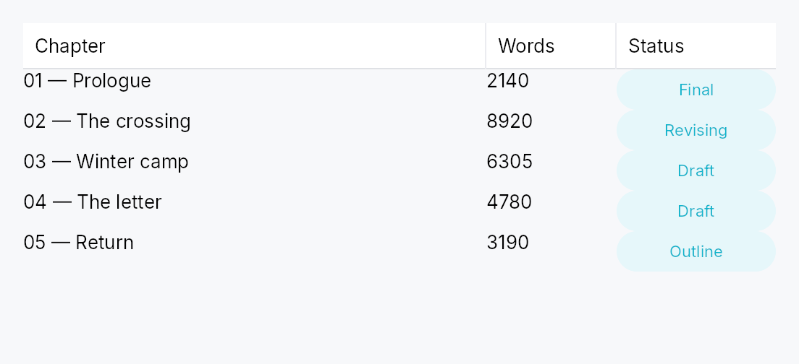

<!-- SPDX-License-Identifier: MPL-2.0 -->
<!-- SPDX-FileCopyrightText: 2026 FernTech -->

# TableView


`TableView<T>` — generic, virtualized, accessible tabular widget.

## Public types

| Kind | Name |
| ---: | :--- |
| `struct` | [`TableView`](#tableview) — Generic, virtualized, accessible table with sortable / filterable / resizable columns |
| `enum` | [`ColumnWidth`](#columnwidth) — How a column's width is determined during layout |
| `enum` | [`PinnedSide`](#pinnedside) — Whether a column is pinned to one side of the table |
| `enum` | [`Alignment`](#alignment) — Horizontal alignment of a cell's content within its column |
| `enum` | [`TruncationPolicy`](#truncationpolicy) — Strategy when a cell's text overflows its column |
| `enum` | [`GridLines`](#gridlines) — Whether the table draws grid lines between rows / columns |
| `enum` | [`ColumnResizePolicy`](#columnresizepolicy) — Whether column resize commits the new width on every drag tick (`Live`) or only on `Ended` (`OnRelease`) |
| `struct` | [`EditTriggers`](#edittriggers) — Which gestures open a cell editor — a **set**, composed with `\|`, after Qt's `QAbstractItemView::EditTriggers` |
| `enum` | [`TabTraversal`](#tabtraversal) — Tab / Shift-Tab traversal policy across cells of a row |
| `struct` | [`CellContext`](#cellcontext) — Per-cell context handed to a column's cell delegate during build |
| `struct` | [`ColumnContext`](#columncontext) — Per-column-header context handed to a column's header delegate |
| `struct` | [`Column`](#column) — Single column declaration |
| `enum` | [`TableSelectionMode`](#tableselectionmode) — Selection mode for a `TableView` or `TreeTableView` |
| `struct` | [`CellSelectionModel`](#cellselectionmodel) — Cell-level selection state for `TableSelectionMode::SingleCell` / `MultiCell` |

## Public functions

### `TableView`

| Returns | Function |
| ---: | :--- |
| | **Constructors** |
| `Self` | [`new(model: ListModel<T>)`](#tableview-new) |
| `Self` | [`from_source<S: ListDataSource<Item = T>>(source: S)`](#tableview-from_source) |
| `Self` | [`from_source_keyed<S: ListDataSource<Item = T>>(source: S, keyed: KeyedSelectionModel<S::Key>)`](#tableview-from_source_keyed) |
| | **Builder methods** |
| `Self` | [`enabled(enabled: impl Into<Prop<bool>>)`](#tableview-enabled) |
| `Self` | [`overscroll_behavior(behavior: OverscrollBehavior)`](#tableview-overscroll_behavior) |
| `Self` | [`smooth_scrolling(enabled: bool)`](#tableview-smooth_scrolling) |
| `Self` | [`type_ahead_label(label: impl Fn(&T) -> String + 'static)`](#tableview-type_ahead_label) |
| `Self` | [`type_ahead_timeout(timeout: Duration)`](#tableview-type_ahead_timeout) |
| `Self` | [`smooth_scroll_duration(duration: Duration)`](#tableview-smooth_scroll_duration) |
| `Self` | [`scroll_bar_style(style: ScrollBarMode)`](#tableview-scroll_bar_style) |
| `Self` | [`add_column(col: Column<T>)`](#tableview-add_column) |
| `Self` | [`columns(cols: impl IntoIterator<Item = Column<T>>)`](#tableview-columns) |
| `Self` | [`row_height(height: f32)`](#tableview-row_height) |
| `Self` | [`row_height_fn(f: impl Fn(usize) -> f32 + 'static)`](#tableview-row_height_fn) |
| `Self` | [`auto_row_height(estimated: f32)`](#tableview-auto_row_height) |
| `Self` | [`header_height(height: f32)`](#tableview-header_height) |
| `Self` | [`show_header(visible: bool)`](#tableview-show_header) |
| `Self` | [`column_resize_policy(policy: ColumnResizePolicy)`](#tableview-column_resize_policy) |
| `Self` | [`tab_traversal(mode: TabTraversal)`](#tableview-tab_traversal) |
| `Self` | [`edit_triggers(trigger: EditTriggers)`](#tableview-edit_triggers) |
| `Self` | [`on_cell_edit_request(f: impl Fn(usize, &str, &mut teksilo_core::widget::EventContext) + 'static)`](#tableview-on_cell_edit_request) |
| `Self` | [`on_cell_edit_dismissed(f: impl Fn(usize, &str, &mut teksilo_core::widget::EventContext) + 'static)`](#tableview-on_cell_edit_dismissed) |
| `Self` | [`on_row_activate(f: impl Fn(usize, &mut teksilo_core::widget::EventContext) + 'static)`](#tableview-on_row_activate) |
| `Self` | [`reorderable(enabled: bool)`](#tableview-reorderable) |
| `Self` | [`reorderable_rows(enabled: bool)`](#tableview-reorderable_rows) |
| `Self` | [`exportable(mode: DragTransferMode)`](#tableview-exportable) |
| `Self` | [`export_external(f: impl Fn(&[T]) -> Vec<(String, Vec<u8>)> + 'static)`](#tableview-export_external) |
| `Self` | [`on_rows_transferred_out(f: impl Fn(&[usize], &mut teksilo_core::widget::EventContext) + 'static)`](#tableview-on_rows_transferred_out) |
| `Self` | [`accept_foreign_rows(accept: bool)`](#tableview-accept_foreign_rows) |
| `Self` | [`on_rows_received(f: impl Fn(Vec<T>, usize, &mut teksilo_core::widget::EventContext) + 'static)`](#tableview-on_rows_received) |
| `Self` | [`activate_on(mode: crate::data_views::ActivateOn)`](#tableview-activate_on) |
| `Self` | [`selection_mode(mode: TableSelectionMode)`](#tableview-selection_mode) |
| `Self` | [`selection(sel: SelectionModel)`](#tableview-selection) |
| `Self` | [`cell_selection(sel: CellSelectionModel)`](#tableview-cell_selection) |
| `Self` | [`alternating_rows(enabled: bool)`](#tableview-alternating_rows) |
| `Self` | [`grid_lines(kind: GridLines)`](#tableview-grid_lines) |
| `Self` | [`stretch_last_column(on: bool)`](#tableview-stretch_last_column) |
| `Self` | [`a11y_label(label: impl Into<LocalizedString>)`](#tableview-a11y_label) |
| `Self` | [`show_internal_scrollbars(show: bool)`](#tableview-show_internal_scrollbars) |
| `Self` | [`empty_view(f: impl Fn() -> Box<dyn Widget> + 'static)`](#tableview-empty_view) |
| | **Methods** |
| `&Signal<f32>` | [`scroll_y_signal()`](#tableview-scroll_y_signal) |
| `&Signal<f32>` | [`max_scroll_y_signal()`](#tableview-max_scroll_y_signal) |
| `&Signal<f32>` | [`viewport_ratio_y_signal()`](#tableview-viewport_ratio_y_signal) |
| `&Signal<f32>` | [`scroll_x_signal()`](#tableview-scroll_x_signal) |
| `&Signal<f32>` | [`max_scroll_x_signal()`](#tableview-max_scroll_x_signal) |
| `&Signal<f32>` | [`viewport_ratio_x_signal()`](#tableview-viewport_ratio_x_signal) |
| `&Signal<Option<(String, SortDirection)>>` | [`sort_signal()`](#tableview-sort_signal) |
| `&Signal<HashMap<String, f32>>` | [`column_widths_signal()`](#tableview-column_widths_signal) |
| `&Signal<Vec<String>>` | [`column_order_signal()`](#tableview-column_order_signal) |
| `&Signal<HashMap<String, PinnedSide>>` | [`column_pinning_signal()`](#tableview-column_pinning_signal) |
| `&Signal<Option<(usize, usize)>>` | [`focused_cell_signal()`](#tableview-focused_cell_signal) |
|  | [`set_focused_cell(row: usize, col: usize)`](#tableview-set_focused_cell) |
|  | [`clear_focused_cell()`](#tableview-clear_focused_cell) |
| `&Signal<Option<(usize, usize)>>` | [`editing_cell_signal()`](#tableview-editing_cell_signal) |
|  | [`begin_edit(row: usize, col_id: &str)`](#tableview-begin_edit) |
|  | [`end_edit()`](#tableview-end_edit) |
| `&Signal<HashMap<String, String>>` | [`filters_signal()`](#tableview-filters_signal) |
|  | [`set_filter(col_id: &str, text: &str)`](#tableview-set_filter) |
|  | [`clear_filters()`](#tableview-clear_filters) |
|  | [`scroll_to_row(row: usize)`](#tableview-scroll_to_row) |
|  | [`set_sort(col_id: Option<&str>, dir: SortDirection)`](#tableview-set_sort) |
|  | [`clear_sort()`](#tableview-clear_sort) |
|  | [`set_column_width(col_id: &str, width: f32)`](#tableview-set_column_width) |
|  | [`set_column_widths(widths: HashMap<String, f32>)`](#tableview-set_column_widths) |
|  | [`set_column_order(order: Vec<String>)`](#tableview-set_column_order) |
|  | [`set_column_pinning(col_id: &str, side: PinnedSide)`](#tableview-set_column_pinning) |
|  | [`ensure_row_visible(row: usize)`](#tableview-ensure_row_visible) |

### `EditTriggers`

| Returns | Function |
| ---: | :--- |
| | **Builder methods** |
| `Self` | [`union(other: Self)`](#edittriggers-union) |
| `Self` | [`intersection(other: Self)`](#edittriggers-intersection) |
| | **Methods** |
| `bool` | [`contains(other: Self)`](#edittriggers-contains) |
| `bool` | [`is_empty()`](#edittriggers-is_empty) |
| | **Constants and types** |
| `Self` | [`NONE`](#edittriggers-none) |
| `Self` | [`F2`](#edittriggers-f2) |
| `Self` | [`ANY_KEY`](#edittriggers-any_key) |
| `Self` | [`SINGLE_CLICK`](#edittriggers-single_click) |
| `Self` | [`DOUBLE_CLICK`](#edittriggers-double_click) |
| `Self` | [`ALL`](#edittriggers-all) |

### `Column`

| Returns | Function |
| ---: | :--- |
| | **Constructors** |
| `Self` | [`new(id: impl Into<String>, header: impl Into<LocalizedString>, cell: impl Fn(&T, &CellContext) -> Box<dyn Widget> + 'static)`](#column-new) |
| | **Builder methods** |
| `Self` | [`width(w: ColumnWidth)`](#column-width) |
| `Self` | [`min_width(px: f32)`](#column-min_width) |
| `Self` | [`max_width(px: f32)`](#column-max_width) |
| `Self` | [`alignment(a: Alignment)`](#column-alignment) |
| `Self` | [`resizable(b: bool)`](#column-resizable) |
| `Self` | [`reorderable(b: bool)`](#column-reorderable) |
| `Self` | [`sortable(b: bool)`](#column-sortable) |
| `Self` | [`filterable(b: bool)`](#column-filterable) |
| `Self` | [`editable(b: bool)`](#column-editable) |
| `Self` | [`edit_triggers(triggers: EditTriggers)`](#column-edit_triggers) |
| `Self` | [`pinned(side: PinnedSide)`](#column-pinned) |
| `Self` | [`truncation(p: TruncationPolicy)`](#column-truncation) |
| `Self` | [`header_override(f: impl Fn(&ColumnContext) -> Box<dyn Widget> + 'static)`](#column-header_override) |
| | **Methods** |
| `EditTriggers` | [`effective_edit_triggers(view: EditTriggers)`](#column-effective_edit_triggers) |
| `&str` | [`id()`](#column-id) |

### `TableSelectionMode`

| Returns | Function |
| ---: | :--- |
| | **Methods** |
| `bool` | [`is_cell_mode()`](#tableselectionmode-is_cell_mode) |
| `bool` | [`is_multi()`](#tableselectionmode-is_multi) |

### `CellSelectionModel`

| Returns | Function |
| ---: | :--- |
| | **Constructors** |
| `Self` | [`new(mode: TableSelectionMode)`](#cellselectionmodel-new) |
| | **Methods** |
| `TableSelectionMode` | [`mode()`](#cellselectionmodel-mode) |
| `Signal<BTreeSet<(usize, usize)>>` | [`selection_signal()`](#cellselectionmodel-selection_signal) |
| `bool` | [`is_selected(row: usize, col: usize)`](#cellselectionmodel-is_selected) |
| `usize` | [`count()`](#cellselectionmodel-count) |
|  | [`select(row: usize, col: usize)`](#cellselectionmodel-select) |
|  | [`toggle(row: usize, col: usize)`](#cellselectionmodel-toggle) |
|  | [`extend_to(row: usize, col: usize)`](#cellselectionmodel-extend_to) |
|  | [`select_cells(cells: impl IntoIterator<Item = (usize, usize)>)`](#cellselectionmodel-select_cells) |
|  | [`select_all(row_count: usize, col_count: usize)`](#cellselectionmodel-select_all) |
|  | [`clear()`](#cellselectionmodel-clear) |
|  | [`adjust_for_row_insert(at_row: usize, count: usize)`](#cellselectionmodel-adjust_for_row_insert) |
|  | [`adjust_for_row_remove(at_row: usize, count: usize)`](#cellselectionmodel-adjust_for_row_remove) |
|  | [`adjust_for_row_move(from: usize, to: usize, count: usize)`](#cellselectionmodel-adjust_for_row_move) |
|  | [`adjust_for_column_insert(at_col: usize, count: usize)`](#cellselectionmodel-adjust_for_column_insert) |
|  | [`adjust_for_column_remove(at_col: usize, count: usize)`](#cellselectionmodel-adjust_for_column_remove) |

## Detailed description

Built atop the `ListModel<T>` /
`ListDataSource` data layer in
`teksilo-data` and the `teksilo-core` `TableStyle`. Mirrors Qt's
`QTableView`, SwiftUI's `Table`, and JavaFX's `TableView`.
The core skeleton: single body pane, row-virtualized with alternating
backgrounds, grid lines, `Role::Table > Role::Row > Role::Cell`
accessibility, multi-row selection, and an empty-state slot. Headers,
sort, filter, resize, reorder, pinning, cell selection, and editing are
also included. Row heights come in three modes: uniform (`row_height`,
the default fast path), exact per-row callback (`row_height_fn`), and
auto-measured (`auto_row_height` — rows grow to their tallest cell,
height-for-width). See docs/table-view.md "Row heights".

```ignore
use teksilo_data::ListModel;
use teksilo_widgets::table_view::{Column, ColumnWidth, TableView};
use teksilo_i18n::lit;

struct Person { name: String, age: u32 }

let model: ListModel<Person> = ListModel::new();
let _table = TableView::new(model)
    .add_column(Column::new("name", ColumnWidth::Flex(1.0))
        .label(lit!("Name"))
        .cell(|p: &Person, _cx| Box::new(
            teksilo_widgets::primitives::TextWidget::new(
                teksilo_i18n::lit!(p.name.clone())
            )
        )))
    .add_column(Column::new("age", ColumnWidth::Fixed(60.0))
        .label(lit!("Age"))
        .cell(|p: &Person, _cx| Box::new(
            teksilo_widgets::primitives::TextWidget::new(
                teksilo_i18n::lit!(p.age.to_string())
            )
        )))
    .alternating_rows(true)
    .row_height(32.0);
```

#### Pan to scroll

The view installs `common::scrollable::ScrollableBehavior`,
which gives it the shared wheel arithmetic, a finger's pan and the
`PanClaim` that puts it on a pan's claimant chain. A pan scrolls it, the
release coasts, and a pan it cannot absorb hands the **whole** event to the
container outside — never a residual. A pan that starts on a row scrolls
rather than activating it or collapsing a multi-selection onto it. Both axes
are claimed. Shift+wheel still
scrolls the columns, and a finger's pan is never remapped by a held Shift:
the remap is a wheel convention, and turning a drag sideways is not what
the hand asked for.

## Density

The picture above is the widget at `TargetDensity::Compact`, the mouse-and-keyboard ladder. Below is the same subject on the same canvas with only the ladder changed, so what moves is the density and nothing else — where the subject no longer fits, that is what the denser targets cost it at that size. See `docs/density-and-targets.md`.

**Touch**



## API reference

📖 [Full rustdoc API for this module](https://docs.rs/teksilo-widgets/latest/teksilo_widgets/table_view/index.html)

<a id="tableview"></a>

## `pub struct TableView`

Generic, virtualized, accessible table with sortable / filterable / resizable columns.

Construct with `TableView::new` (from a `ListModel<T>`)
or `TableView::from_source` (any `ListDataSource`), then chain builder methods
to configure columns, row heights, selection, and so on. See module docs for the full
feature list and row-height modes.

```rust
pub struct TableView<T: 'static> { /* fields */ }
```

### Methods

<a id="tableview-new"></a>

#### `pub fn new(model: ListModel<T>) -> Self`

Wrap a `ListModel<T>`.

<a id="tableview-from_source"></a>

#### `pub fn from_source<S: ListDataSource<Item = T>>(source: S) -> Self`

Wrap any `ListDataSource<Item = T>` (e.g. a
`SortFilterListModel<T>`).

The source owns DnD validation (`can_accept` / `accept_drop`) and
lazy windowing (`row_state` / `request_window` / `fetch_more`); a
read-only source leaves the defaults inert.

<a id="tableview-from_source_keyed"></a>

#### `pub fn from_source_keyed<S: ListDataSource<Item = T>>( source: S, keyed: KeyedSelectionModel<S::Key>, ) -> Self where S::Key: ItemKey,`

Wrap any `ListDataSource<Item = T>` with **keyed** row selection. The
`KeyedSelectionModel<S::Key>` tracks selection by source identity, so it
survives reorders / filters / lazy window-slides and stays consistent
across two views of the same source. The view stays `TableView<T>` — the
index↔key mapping is captured from the concrete source here. Equivalent
to `from_source(..)` plus an identity-based replacement for
`selection`.

<a id="tableview-enabled"></a>

#### `pub fn enabled(mut self, enabled: impl Into<Prop<bool>>) -> Self`

Enable or disable the whole view. A disabled view greys out and stops
accepting focus / selection / keyboard input (arena-gated).

<a id="tableview-overscroll_behavior"></a>

#### `pub fn overscroll_behavior(mut self, behavior: OverscrollBehavior) -> Self`

Set the scroll-chaining behavior at the boundary (default
`OverscrollBehavior::Chain`; `Contain`
disables chaining to an ancestor scrollable).

<a id="tableview-smooth_scrolling"></a>

#### `pub fn smooth_scrolling(mut self, enabled: bool) -> Self`

Enable or disable animated wheel scrolling (enabled by default).
When disabled, wheel events snap immediately to the new offset.

<a id="tableview-type_ahead_label"></a>

#### `pub fn type_ahead_label(mut self, label: impl Fn(&T) -> String + 'static) -> Self`

Enable **type-ahead** ("type to jump"): typing a printable character
while the table has keyboard focus jumps the focused row to the next
row whose label starts with the accumulated search term, wrapping
around (Qt `keyboardSearch` / macOS & Windows type-select).
`label(&item)` yields the searchable text for a row; matching is
ASCII-case-insensitive. A pause longer than the
`type_ahead_timeout` starts a fresh term.

On an editable column whose `EditTriggers` is type-to-edit, typing
starts an edit instead — type-ahead applies on non-editable columns
(or when no type-to-edit trigger is configured).

<a id="tableview-type_ahead_timeout"></a>

#### `pub fn type_ahead_timeout(mut self, timeout: Duration) -> Self`

Reset window between keystrokes before the type-ahead search term
clears (default 500 ms). A zero duration disables type-ahead.

<a id="tableview-smooth_scroll_duration"></a>

#### `pub fn smooth_scroll_duration(mut self, duration: Duration) -> Self`

Duration of the smooth scroll animation (default 150 ms).

<a id="tableview-scroll_bar_style"></a>

#### `pub fn scroll_bar_style(mut self, style: ScrollBarMode) -> Self`

How the scroll bar is displayed (default `Permanent`). `Overlay`
and `Thin` float the bar over the content instead of reserving a
layout column for it, mirroring `ScrollArea::scroll_bar_style`.

<a id="tableview-add_column"></a>

#### `pub fn add_column(mut self, col: Column<T>) -> Self`

Append a single `Column<T>` definition to the table.

<a id="tableview-columns"></a>

#### `pub fn columns(mut self, cols: impl IntoIterator<Item = Column<T>>) -> Self`

Append multiple `Column<T>` definitions from an iterator.

<a id="tableview-row_height"></a>

#### `pub fn row_height(mut self, height: f32) -> Self`

Fixed row height (default: the table style's 28 px) — the
uniform fast path. Mutually exclusive with
`row_height_fn` and
`auto_row_height`; the last mode setter
wins.

<a id="tableview-row_height_fn"></a>

#### `pub fn row_height_fn(mut self, f: impl Fn(usize) -> f32 + 'static) -> Self`

Per-row heights from a callback over the visible row index. The
callback must be pure (same index + same data → same height); it
is re-swept from the first changed index on every model change
(a `SortFilterListModel` source reports that index through
`first_changed_index`, so sort/filter/append keep the valid
prefix). No measurement pass runs.

<a id="tableview-auto_row_height"></a>

#### `pub fn auto_row_height(mut self, estimated: f32) -> Self`

Auto-measured row heights: each realized row reports the height
of its tallest cell measured at the cell's column width
(height-for-width), unrealized rows assume `estimated`. Scroll
anchoring keeps content above the viewport stationary as
estimates are corrected; the scrollbar settles one frame after a
measurement change.

<a id="tableview-header_height"></a>

#### `pub fn header_height(mut self, height: f32) -> Self`

Override the column header row height in logical pixels. Default: the table style's `HEADER_HEIGHT`.

<a id="tableview-show_header"></a>

#### `pub fn show_header(mut self, visible: bool) -> Self`

Show or hide the column header row. Default: visible.

<a id="tableview-column_resize_policy"></a>

#### `pub fn column_resize_policy(mut self, policy: ColumnResizePolicy) -> Self`

Set how column widths are redistributed when columns are
added, resized, or the table's own width changes. See
`ColumnResizePolicy`.

<a id="tableview-tab_traversal"></a>

#### `pub fn tab_traversal(mut self, mode: TabTraversal) -> Self`

Control how Tab / Shift+Tab navigate between cells. See
`TabTraversal`.

<a id="tableview-edit_triggers"></a>

#### `pub fn edit_triggers(mut self, trigger: EditTriggers) -> Self`

Set which user action opens a cell editor. See `EditTriggers`.

<a id="tableview-on_cell_edit_request"></a>

#### `pub fn on_cell_edit_request( mut self, f: impl Fn(usize, &str, &mut teksilo_core::widget::EventContext) + 'static, ) -> Self`

Hook fired by the keyboard handler when an edit trigger fires
on the focused cell. Receives `(row_index, col_id, ctx)`.

<a id="tableview-on_cell_edit_dismissed"></a>

#### `pub fn on_cell_edit_dismissed( mut self, f: impl Fn(usize, &str, &mut teksilo_core::widget::EventContext) + 'static, ) -> Self`

Callback invoked when an **open** cell editor should end because the
pointer went somewhere else: a press that lands on any cell other than
the one being edited. Receives the editing cell's flat row index and
column id, so the owner can commit (or discard) whatever is in its
buffer, then clear its own editing state.

The counterpart of `on_cell_edit_request`,
and the view cannot do it alone: the framework owns *which* cell is being
edited, but only the owner knows what an ended edit means — commit,
discard, or refuse a value that will not parse.

**Why a press and not a focus change.** "The editor lost focus" is the
obvious signal and it cannot be used: a body pane rebuilds constantly —
selection, filtering, scroll, a reload from elsewhere — and every rebuild
destroys and re-creates the open editor, so focus leaves it many times
during an edit the writer never interrupted. A press on another cell is
unambiguous and happens exactly once.

<a id="tableview-on_row_activate"></a>

#### `pub fn on_row_activate( mut self, f: impl Fn(usize, &mut teksilo_core::widget::EventContext) + 'static, ) -> Self`

Callback invoked when a row is activated: a click or a double click per
`activate_on`, or Enter on the focused row.
Receives the flat row index.

The pointer half is a **gesture**, so it arbitrates against a pan and
against the reorder drag through the gesture arena: a click activates,
a drag does not.

<a id="tableview-reorderable"></a>

#### `pub fn reorderable(mut self, enabled: bool) -> Self`

Enable drag-to-reorder of **rows** (pointer drag + keyboard
Alt+ArrowUp/Down). Distinct from
`Column::reorderable`, which reorders
*columns* and defaults to `true`; this defaults to `false`.

The move is routed through the backing source's `accept_drop`: a
`ListModel` reorders in place, an external source routes the move to
its store. Per-hover the source's `can_accept` decides whether the
drop is allowed — a forbidden position shows no insertion line and
the drop is refused. A row may also be forbidden from dragging at
all (the source's `drag` gate). Cross-table / external drops arrive
at `accept_drop` as `DragSource::Foreign`; a bare `ListModel`
rejects them, an external source decides.

<a id="tableview-reorderable_rows"></a>

#### `pub fn reorderable_rows(self, enabled: bool) -> Self`

Renamed to `reorderable`, matching `ListView`,
`GridView`, `TreeView` and `TreeTableView` — this was the only view in
the family spelling it differently.

<a id="tableview-exportable"></a>

#### `pub fn exportable(mut self, mode: DragTransferMode) -> Self where T: Clone,`

Make rows **droppable outside this view** — on a
`DropTarget`, another data view, or the OS.

A dragged row (or the whole selection, when the pressed row is part of a
multi-selection) carries clones of its items in a public
`RowDragData<T>`, so a foreign receiver can pull
them out with `payload.get_typed::<RowDragData<T>>()` /
`DropTarget::on_drop_typed::<RowDragData<T>>()` — no serialization. This
also makes rows a drag source even without `reorderable`.

`mode` chooses what happens to the origin rows once a *foreign* target
accepts them: `DragTransferMode::Move` removes them (via the source's
`on_drag_out`, or `on_rows_transferred_out`),
`DragTransferMode::Copy` leaves them. A same-view reorder is never a
transfer, so `mode` never affects it. Requires `T: Clone`.

<a id="tableview-export_external"></a>

#### `pub fn export_external(mut self, f: impl Fn(&[T]) -> Vec<(String, Vec<u8>)> + 'static) -> Self where T: Clone,`

Additionally advertise the dragged rows as MIME data so they can be
dropped on a `DropZone` or exported to another
application / window via the OS. `f` maps the dragged items to
`(mime_type, bytes)` pairs (e.g. `text/plain`, `text/uri-list`, an
app-specific `application/x-…`). Implies `exportable`
(defaulting to `DragTransferMode::Move` if not already set). Requires
`T: Clone`.

<a id="tableview-on_rows_transferred_out"></a>

#### `pub fn on_rows_transferred_out( mut self, f: impl Fn(&[usize], &mut teksilo_core::widget::EventContext) + 'static, ) -> Self`

Override how rows moved out to a foreign target are removed from this
view. Receives the dragged rows' indices (descending-safe) and the live
context. Without this, an `exportable`
`Move` drag removes them through the source's
`on_drag_out` (works out of the box for a `ListModel`).

<a id="tableview-accept_foreign_rows"></a>

#### `pub fn accept_foreign_rows(mut self, accept: bool) -> Self`

Accept exported rows dropped from a **different** view or source without
writing a custom `ListDataSource`. Pair with
`on_rows_received`, which is handed the dropped
items and the insertion index. (Same-view reorder is
`reorderable`; a custom `ListDataSource` can still
accept foreign drops through its `can_accept`/`accept_drop` instead.)

<a id="tableview-on_rows_received"></a>

#### `pub fn on_rows_received( mut self, f: impl Fn(Vec<T>, usize, &mut teksilo_core::widget::EventContext) + 'static, ) -> Self`

Handler for rows accepted via `accept_foreign_rows`:
`(items, insertion_index, ctx)`. Insert them into your model at the
index.

<a id="tableview-activate_on"></a>

#### `pub fn activate_on(mut self, mode: crate::data_views::ActivateOn) -> Self`

Choose single- vs double-click activation for `on_row_activate` (default
`ActivateOn::DoubleClick`). Enter/Space activates in
either mode.

<a id="tableview-selection_mode"></a>

#### `pub fn selection_mode(mut self, mode: TableSelectionMode) -> Self`

Choose the row-selection granularity (None / Single / Multi).
See `TableSelectionMode`.

<a id="tableview-selection"></a>

#### `pub fn selection(mut self, sel: SelectionModel) -> Self`

Set the index-based row selection model (positions). For identity-based
selection that survives reorder / filter / window-slide, build the view
with `from_source_keyed` instead.

<a id="tableview-cell_selection"></a>

#### `pub fn cell_selection(mut self, sel: CellSelectionModel) -> Self`

Install an independent cell-selection model on top of row selection.
See `CellSelectionModel`.

<a id="tableview-alternating_rows"></a>

#### `pub fn alternating_rows(mut self, enabled: bool) -> Self`

Paint every other row with a tinted background. Default: off.

<a id="tableview-grid_lines"></a>

#### `pub fn grid_lines(mut self, kind: GridLines) -> Self`

Draw horizontal and/or vertical grid lines between cells.
See `GridLines`.

<a id="tableview-stretch_last_column"></a>

#### `pub fn stretch_last_column(mut self, on: bool) -> Self`

Let the **last column in display order** take up whatever width the
other columns leave, so the table never ends in a bare strip at its
trailing edge — Qt's `stretchLastSection`, NSTableView's
`lastColumnOnlyAutoresizingStyle`. Default: off.

Positional, not a property of a column: after a reorder it is the
*new* last column that stretches and the previous one goes back to
its own width. While a column stretches, its declared width is the
floor it grows from, its user-resize override is ignored, and its
trailing grip is disabled (no AccessKit Increment/Decrement either):
any size the user gave it, the stretch would take straight back.
Resizing any *other* column reflows it. Once the other columns
exceed the viewport there is nothing left to stretch into — the
last column sits at its own width and the pane scrolls, as in Qt.

`Flex` columns already share every spare pixel among themselves, so
a table of `Flex` columns looks the same either way: this is for
pixel-sized tables (`Fixed` / `Auto`, or widths the user has set)
that would otherwise end in a gap.

<a id="tableview-a11y_label"></a>

#### `pub fn a11y_label(mut self, label: impl Into<LocalizedString>) -> Self`

Provide an accessible label for the table (`aria-label`). Required
when the page hosts more than one table so screen readers can
distinguish them.

<a id="tableview-show_internal_scrollbars"></a>

#### `pub fn show_internal_scrollbars(mut self, show: bool) -> Self`

Show or hide the built-in vertical and horizontal scroll bars. Default:
visible. Set to `false` when an external scroll bar is wired to
`scroll_y_signal`.

<a id="tableview-empty_view"></a>

#### `pub fn empty_view(mut self, f: impl Fn() -> Box<dyn Widget> + 'static) -> Self`

Widget shown when the source is empty.

<a id="tableview-scroll_y_signal"></a>

#### `pub fn scroll_y_signal(&self) -> &Signal<f32>`

Current vertical scroll offset in logical pixels.

<a id="tableview-max_scroll_y_signal"></a>

#### `pub fn max_scroll_y_signal(&self) -> &Signal<f32>`

Maximum vertical scroll offset — `total_content_height − viewport_height`.

<a id="tableview-viewport_ratio_y_signal"></a>

#### `pub fn viewport_ratio_y_signal(&self) -> &Signal<f32>`

Viewport-to-content height ratio, used by external scroll bar thumbs.

<a id="tableview-scroll_x_signal"></a>

#### `pub fn scroll_x_signal(&self) -> &Signal<f32>`

Current horizontal scroll offset of the Middle (unpinned) pane, in
logical pixels. Leading/Trailing-pinned columns are unaffected —
see `Column::pinned`.

<a id="tableview-max_scroll_x_signal"></a>

#### `pub fn max_scroll_x_signal(&self) -> &Signal<f32>`

Maximum horizontal scroll offset — `middle_content_width −
middle_viewport_width`.

<a id="tableview-viewport_ratio_x_signal"></a>

#### `pub fn viewport_ratio_x_signal(&self) -> &Signal<f32>`

Middle-pane viewport-to-content width ratio, used by external
horizontal scroll bar thumbs.

<a id="tableview-sort_signal"></a>

#### `pub fn sort_signal(&self) -> &Signal<Option<(String, SortDirection)>>`

Active sort: `Some((col_id, dir))` or `None` when unsorted.
Mutated by header clicks (cycle: None → Asc → Desc → None) and by
`set_sort` / `clear_sort`.
Bind a `SortFilterListModel` to
drive a re-sort of the underlying data:

```ignore
let proxy = SortFilterListModel::new(model)
    .with_comparator("name", |a, b| a.name.cmp(&b.name));
proxy.sort_signal(table.sort_signal().clone());
```

<a id="tableview-column_widths_signal"></a>

#### `pub fn column_widths_signal(&self) -> &Signal<HashMap<String, f32>>`

Map of column id → user-overridden width. A column id appears in
this map only after the user resizes that column; missing keys
mean "use the declared width policy".

<a id="tableview-column_order_signal"></a>

#### `pub fn column_order_signal(&self) -> &Signal<Vec<String>>`

Column ids in display order. Updated when the user drags a
header to reorder, or imperatively via
`set_column_order`. When empty, the
declared order applies. Pinned-side groups (Leading / None /
Trailing) are *always* honored — the entries inside this signal
only re-sort within each group.

<a id="tableview-column_pinning_signal"></a>

#### `pub fn column_pinning_signal(&self) -> &Signal<HashMap<String, PinnedSide>>`

Per-id pinning override map. A key here pins the column to that
side; missing keys fall back to the declared `Column::pinned`.
Updated when the user drags a column across a pane boundary.

<a id="tableview-focused_cell_signal"></a>

#### `pub fn focused_cell_signal(&self) -> &Signal<Option<(usize, usize)>>`

Currently keyboard-focused cell, as `(row_index, display_col)`,
or `None` when no cell is focused. Mutated by the keyboard
handler (Arrow keys / Tab / Home / End / PgUp / PgDn /
Ctrl-Home / Ctrl-End / Escape), by direct
`set_focused_cell` /
`clear_focused_cell` calls, and — in a
table whose selection holds one row or cell — by any selection change
that leaves an existing cursor off the selection, which moves the
cursor onto it.

<a id="tableview-set_focused_cell"></a>

#### `pub fn set_focused_cell(&self, row: usize, col: usize)`

Move the focused cell. Out-of-range values are silently clamped
when the next layout runs.

<a id="tableview-clear_focused_cell"></a>

#### `pub fn clear_focused_cell(&self)`

Remove keyboard focus from any cell (equivalent to pressing Escape).

<a id="tableview-editing_cell_signal"></a>

#### `pub fn editing_cell_signal(&self) -> &Signal<Option<(usize, usize)>>`

Cell currently in edit mode, or `None` when no editor is open.
Cell delegates inspect this via `CellContext::is_editing` and
swap in an editor widget when matched.

<a id="tableview-begin_edit"></a>

#### `pub fn begin_edit(&self, row: usize, col_id: &str)`

Begin editing the cell `(row, col_id)`. Silently no-ops if `col_id`
isn't a currently-displayed column, or if `row` is outside the visible
range — an out-of-range target would otherwise strand `editing_cell` on
a row nothing can match.

Callable **before the view is mounted**, which is the only point at
which a consumer can seed a freshly constructed view with an edit
target it already holds. `display_indices` is a cache `build()` fills,
so a pre-mount call finds it empty; the order is recomputed on demand
in that case rather than resolving against nothing and no-opping for a
third, undocumented reason.

<a id="tableview-end_edit"></a>

#### `pub fn end_edit(&self)`

Close the active cell editor without committing (the field's `on_blur` still fires).

<a id="tableview-filters_signal"></a>

#### `pub fn filters_signal(&self) -> &Signal<HashMap<String, String>>`

Per-column filter text. Updated by filter affordances in
header cells and by
`set_filter` / `clear_filters`.
Bind a `SortFilterListModel<T>` to drive the upstream data:

```ignore
let proxy = SortFilterListModel::new(model)
    .with_predicate("name", |t| {
        let needle = t.to_string();
        Box::new(move |r: &Row| r.name.contains(&needle))
    });
proxy.filters_signal(table.filters_signal().clone());
```

<a id="tableview-set_filter"></a>

#### `pub fn set_filter(&self, col_id: &str, text: &str)`

Set or clear the filter text for a single column. An empty `text` removes
the entry for `col_id` (same as clearing the filter for that column).

<a id="tableview-clear_filters"></a>

#### `pub fn clear_filters(&self)`

Remove all active column filters.

<a id="tableview-scroll_to_row"></a>

#### `pub fn scroll_to_row(&self, row: usize)`

Scroll so that `row` is aligned to the top of the viewport. A no-op
before the first layout pass.

<a id="tableview-set_sort"></a>

#### `pub fn set_sort(&self, col_id: Option<&str>, dir: SortDirection)`

Set the active sort imperatively. Equivalent to writing to
`sort_signal` directly, except that an unchanged
value neither writes nor notifies — see
`set_column_widths`.

<a id="tableview-clear_sort"></a>

#### `pub fn clear_sort(&self)`

Clear the active sort.

<a id="tableview-set_column_width"></a>

#### `pub fn set_column_width(&self, col_id: &str, width: f32)`

Set or remove a single column's user-resized width override.
A non-positive `width` removes the entry (the column reverts to
its declared width policy).

<a id="tableview-set_column_widths"></a>

#### `pub fn set_column_widths(&self, widths: HashMap<String, f32>)`

Replace the full width-override map (typically used to restore
a persisted layout).

A no-op when the map is unchanged, so the documented
signal round trip (see docs/table-view.md, "Persistence", which shows
it for the column order) terminates instead of recursing: `Signal::set` has no equality check of
its own, and a live resize writes a width on every pointer move.

<a id="tableview-set_column_order"></a>

#### `pub fn set_column_order(&self, order: Vec<String>)`

Replace the column-order list. Ids not declared on this table
are silently dropped on the next layout pass.

<a id="tableview-set_column_pinning"></a>

#### `pub fn set_column_pinning(&self, col_id: &str, side: PinnedSide)`

Pin or unpin a single column.

<a id="tableview-ensure_row_visible"></a>

#### `pub fn ensure_row_visible(&self, row: usize)`

Scroll the minimum distance needed to make `row` visible. A no-op
before the first layout pass, when the viewport height is not yet known.

<a id="columnwidth"></a>

## `pub enum ColumnWidth`

How a column's width is determined during layout.

```rust
pub enum ColumnWidth { /* variants */ }
```

### Variants

- **`Fixed`** — Exact pixel width. Clamped by `min_width` / `max_width`.
- **`Flex`** — Share of the leftover space proportional to the flex factor — behaves like CSS `flex-grow`. The factor must be `> 0.0`.
- **`Auto`** — Intrinsic content width (currently approximated by the table's `min_column_width_default` token; refined to probe the header label and visible cells).

<a id="pinnedside"></a>

## `pub enum PinnedSide`

Whether a column is pinned to one side of the table.

```rust
pub enum PinnedSide { /* variants */ }
```

### Variants

- **`Leading`** — Pinned against the leading edge — stays visible during horizontal scroll.
- **`None`** — Not pinned — scrolls horizontally with the body.
- **`Trailing`** — Pinned against the trailing edge.

<a id="alignment"></a>

## `pub enum Alignment`

Horizontal alignment of a cell's content within its column.

```rust
pub enum Alignment { /* variants */ }
```

### Variants

- **`Leading`**
- **`Center`**
- **`Trailing`**

<a id="truncationpolicy"></a>

## `pub enum TruncationPolicy`

Strategy when a cell's text overflows its column.

```rust
pub enum TruncationPolicy { /* variants */ }
```

### Variants

- **`Ellipsis`** — `…`-elide the trailing portion. **Default.**
- **`None`** — Don't truncate; let the cell content draw beyond the column edge (the body pane's clip will hide it).
- **`Fade`** — Fade the trailing portion — gradient mask.

<a id="gridlines"></a>

## `pub enum GridLines`

Whether the table draws grid lines between rows / columns.

```rust
pub enum GridLines { /* variants */ }
```

### Variants

- **`None`**
- **`Horizontal`**
- **`Vertical`**
- **`Both`**

<a id="columnresizepolicy"></a>

## `pub enum ColumnResizePolicy`

Whether column resize commits the new width on every drag tick (`Live`)
or only on `Ended` (`OnRelease`).

```rust
pub enum ColumnResizePolicy { /* variants */ }
```

### Variants

- **`Live`**
- **`OnRelease`**

<a id="edittriggers"></a>

## `pub struct EditTriggers`

Which gestures open a cell editor — a **set**, composed with `|`, after
Qt's `QAbstractItemView::EditTriggers`.

A set rather than an enum of named combinations, because the combinations
are the caller's to choose: "one click" and "F2 or one click" are ordinary
requests that a closed enum of `F2 / F2OrType / F2OrTypeOrDoubleClick /
DoubleClick / None` could not express at all.

Set table-wide with `TableView::edit_triggers`
/ `TreeTableView::edit_triggers`, and
per column with `Column::edit_triggers` — the column wins where it sets
one. Only cells of an `editable` column ever open an
editor, whatever the triggers say; the two are the same split Qt makes
between a view's `editTriggers` and an item's `ItemIsEditable`.

**`SINGLE_CLICK` claims the press.** A cell that edits on one click does not
also select its row — the same trade any interactive cell content already
makes, and the reason it is per column: put it on the columns that are
nothing but a value, and leave the row's own column alone.

```rust
pub struct EditTriggers(u8);
```

### Methods

<a id="edittriggers-none"></a>

#### `pub const NONE: Self = Self(0);`

Editing is never opened by the view. Cells of an editable column still
render normally; nothing reaches `on_cell_edit_request`.

<a id="edittriggers-f2"></a>

#### `pub const F2: Self = Self(1 << 0);`

**F2** on the focused cell.

<a id="edittriggers-any_key"></a>

#### `pub const ANY_KEY: Self = Self(1 << 1);`

Any printable character typed on the focused cell. Note that the
keystroke that opens the editor is **not** delivered into it — the
editor does not exist until the next build — so this reads as "F2 with
an extra key", and it shadows type-ahead on every editable column.

<a id="edittriggers-single_click"></a>

#### `pub const SINGLE_CLICK: Self = Self(1 << 2);`

A single click on the cell. Claims the press, so that cell no longer
selects its row.

<a id="edittriggers-double_click"></a>

#### `pub const DOUBLE_CLICK: Self = Self(1 << 3);`

A double click on the cell. It takes the gesture from row activation on
**this column** — a column that edits on double-click must not also open
its row on the same click — while every other column still activates.

<a id="edittriggers-all"></a>

#### `pub const ALL: Self = Self(0b0000_1111);`

Every trigger at once.

<a id="edittriggers-contains"></a>

#### `pub const fn contains(self, other: Self) -> bool`

`true` when every trigger in `other` is present.

<a id="edittriggers-is_empty"></a>

#### `pub const fn is_empty(self) -> bool`

`true` when nothing opens an editor.

<a id="edittriggers-union"></a>

#### `pub const fn union(self, other: Self) -> Self`

<a id="edittriggers-intersection"></a>

#### `pub const fn intersection(self, other: Self) -> Self`

<a id="tabtraversal"></a>

## `pub enum TabTraversal`

Tab / Shift-Tab traversal policy across cells of a row.

Regardless of the policy, **Ctrl+Tab / Ctrl+Shift+Tab always move focus
out of the table** to the next / previous focusable widget — the reliable
escape from `CellsThenRows`, so keyboard focus is never trapped.

```rust
pub enum TabTraversal { /* variants */ }
```

### Variants

- **`CellsThenRows`** — Tab moves to the next cell within the row, then wraps to the first cell of the next row. **Default.** (Ctrl+Tab leaves the table.)
- **`OutOfTable`** — Tab leaves the table once the focused cell is reached at the row boundary; the focus owner is whatever follows the table in tab order.

<a id="cellcontext"></a>

## `pub struct CellContext`

Per-cell context handed to a column's cell delegate during build.

```rust
pub struct CellContext { /* fields */ }
```

<a id="columncontext"></a>

## `pub struct ColumnContext`

Per-column-header context handed to a column's header delegate.

```rust
pub struct ColumnContext { /* fields */ }
```

<a id="column"></a>

## `pub struct Column`

Single column declaration. Column ids must be **stable, unique strings**
— they're the persistence key for sort, filter, width, and ordering.

```rust
pub struct Column<T: 'static> { /* fields */ }
```

### Methods

<a id="column-new"></a>

#### `pub fn new( id: impl Into<String>, header: impl Into<LocalizedString>, cell: impl Fn(&T, &CellContext) -> Box<dyn Widget> + 'static, ) -> Self`

Create a column with a stable id, a localized header label, and a
cell builder that takes `&T` plus a `CellContext` and returns a
boxed widget.

<a id="column-width"></a>

#### `pub fn width(mut self, w: ColumnWidth) -> Self`

<a id="column-min_width"></a>

#### `pub fn min_width(mut self, px: f32) -> Self`

<a id="column-max_width"></a>

#### `pub fn max_width(mut self, px: f32) -> Self`

<a id="column-alignment"></a>

#### `pub fn alignment(mut self, a: Alignment) -> Self`

<a id="column-resizable"></a>

#### `pub fn resizable(mut self, b: bool) -> Self`

<a id="column-reorderable"></a>

#### `pub fn reorderable(mut self, b: bool) -> Self`

<a id="column-sortable"></a>

#### `pub fn sortable(mut self, b: bool) -> Self`

<a id="column-filterable"></a>

#### `pub fn filterable(mut self, b: bool) -> Self`

<a id="column-editable"></a>

#### `pub fn editable(mut self, b: bool) -> Self`

Mark the column as editable. Default `false`. F2 / type-to-edit
only enter edit mode on cells of editable columns; the
`on_cell_edit_request` hook also fires only for these. Cells of
non-editable columns continue to render their static delegate
regardless of `editing_cell`.

<a id="column-edit_triggers"></a>

#### `pub fn edit_triggers(mut self, triggers: EditTriggers) -> Self`

Override the view's `EditTriggers` for this column alone.

The reason the set is not only table-wide: a table's columns rarely
want the same gesture. A tree column has to keep click-to-select and
double-click-to-open, while the plain value columns beside it are
exactly where one click to edit belongs. Unset columns inherit the
view's set.

<a id="column-effective_edit_triggers"></a>

#### `pub fn effective_edit_triggers(&self, view: EditTriggers) -> EditTriggers`

The triggers in force for this column, given the view's set — the
question the body pane and the key handler both ask, and the one an
application's own tests want to ask about their column set.

A non-editable column never opens an editor, whatever either says.

<a id="column-pinned"></a>

#### `pub fn pinned(mut self, side: PinnedSide) -> Self`

<a id="column-truncation"></a>

#### `pub fn truncation(mut self, p: TruncationPolicy) -> Self`

<a id="column-header_override"></a>

#### `pub fn header_override( mut self, f: impl Fn(&ColumnContext) -> Box<dyn Widget> + 'static, ) -> Self`

Override the default header rendering (label + sort/filter
indicators). The closure receives a `ColumnContext` reflecting
the current sort/filter state.

<a id="column-id"></a>

#### `pub fn id(&self) -> &str`

Stable column id (the persistence key for sort, filter, width,
and ordering signals).

<a id="tableselectionmode"></a>

## `pub enum TableSelectionMode`

Selection mode for a `TableView` or `TreeTableView`.

```rust
pub enum TableSelectionMode { /* variants */ }
```

### Variants

- **`None`** — No selection allowed.
- **`SingleRow`** — At most one row selected at a time.
- **`MultiRow`** — Multiple rows selectable; Ctrl-click toggles, Shift-click extends. **Default.**
- **`SingleCell`** — Excel-style: at most one cell selected at a time.
- **`MultiCell`** — Excel-style: rectangular cell selection.

### Methods

<a id="tableselectionmode-is_cell_mode"></a>

#### `pub fn is_cell_mode(self) -> bool`

Whether the mode operates on cells rather than entire rows.

<a id="tableselectionmode-is_multi"></a>

#### `pub fn is_multi(self) -> bool`

Whether the mode allows more than one entry to be selected.

<a id="cellselectionmodel"></a>

## `pub struct CellSelectionModel`

Cell-level selection state for `TableSelectionMode::SingleCell` /
`MultiCell`. Tracks `(row, col)` pairs in visible-index space.

Mirrors `teksilo_data::SelectionModel`'s API surface (signal-backed,
auto-adjustable on data mutations) but keyed by `(row, col)` instead of
`row` alone.

```rust
pub struct CellSelectionModel { /* fields */ }
```

### Methods

<a id="cellselectionmodel-new"></a>

#### `pub fn new(mode: TableSelectionMode) -> Self`

Construct a model. **Panics** if `mode` is not a cell mode —
callers in row mode should use `teksilo_data::SelectionModel`.

<a id="cellselectionmodel-mode"></a>

#### `pub fn mode(&self) -> TableSelectionMode`

<a id="cellselectionmodel-selection_signal"></a>

#### `pub fn selection_signal(&self) -> Signal<BTreeSet<(usize, usize)>>`

<a id="cellselectionmodel-is_selected"></a>

#### `pub fn is_selected(&self, row: usize, col: usize) -> bool`

<a id="cellselectionmodel-count"></a>

#### `pub fn count(&self) -> usize`

<a id="cellselectionmodel-select"></a>

#### `pub fn select(&self, row: usize, col: usize)`

Replace the selection with the single cell `(row, col)` and set
the anchor.

<a id="cellselectionmodel-toggle"></a>

#### `pub fn toggle(&self, row: usize, col: usize)`

Toggle the cell `(row, col)` (Ctrl-click). In `SingleCell` mode
this behaves like `select`.

<a id="cellselectionmodel-extend_to"></a>

#### `pub fn extend_to(&self, row: usize, col: usize)`

Extend the selection to include the rectangular range from the
anchor to `(row, col)`. In `SingleCell` mode this falls back to
`select`.

<a id="cellselectionmodel-select_cells"></a>

#### `pub fn select_cells(&self, cells: impl IntoIterator<Item = (usize, usize)>)`

Replace the selection with an arbitrary set of cells, committing it as
the base a following Shift range extends around.

Backs the two spreadsheet chords a rectangle cannot express: Ctrl+Space
selects a column and Shift+Space a row, neither of which is an
anchor-to-cursor block.
Declines outside `MultiCell` for the reason `select_all`
declines outside a cell mode: a set of cells is not something a
single-selection or row-selection model can hold, and quietly storing
one would break the mode's own invariant.

<a id="cellselectionmodel-select_all"></a>

#### `pub fn select_all(&self, row_count: usize, col_count: usize)`

<a id="cellselectionmodel-clear"></a>

#### `pub fn clear(&self)`

<a id="cellselectionmodel-adjust_for_row_insert"></a>

#### `pub fn adjust_for_row_insert(&self, at_row: usize, count: usize)`

Adjust selection after `count` rows are inserted starting at
`at_row`. Existing selections at indices `>= at_row` shift up.

<a id="cellselectionmodel-adjust_for_row_remove"></a>

#### `pub fn adjust_for_row_remove(&self, at_row: usize, count: usize)`

Adjust selection after `count` rows starting at `at_row` are
removed. Selections within the removed range are dropped; later
rows shift down.

<a id="cellselectionmodel-adjust_for_row_move"></a>

#### `pub fn adjust_for_row_move(&self, from: usize, to: usize, count: usize)`

Adjust selection after a block of `count` rows moved from `from` to
`to` (a post-removal index, matching `ListModel::move_item`). Selected
cells follow their rows; columns are untouched.

<a id="cellselectionmodel-adjust_for_column_insert"></a>

#### `pub fn adjust_for_column_insert(&self, at_col: usize, count: usize)`

Adjust selection after `count` columns are inserted at `at_col`.

Reserved for future dynamic-column support. `TableView`/`TreeTableView`
columns are declared once via `.add_column()`/`.columns()` and are
static for the widget's lifetime — there is no runtime insert/remove
API today, so nothing calls this. A column *reorder* or pin-toggle
permutes positions instead (see `remap_columns`),
which is what the current views actually use. Kept (not removed) as
public API in case a future dynamic-column feature needs the
offset-shift semantics this and `adjust_for_column_remove`
already implement and test.

<a id="cellselectionmodel-adjust_for_column_remove"></a>

#### `pub fn adjust_for_column_remove(&self, at_col: usize, count: usize)`

Adjust selection after `count` columns starting at `at_col` are
removed.

Reserved for future dynamic-column support — see the doc comment on
`adjust_for_column_insert`; nothing
calls this today for the same reason.
