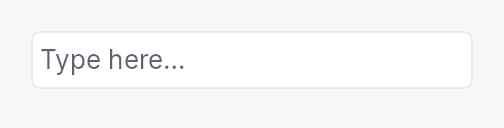

<!-- SPDX-License-Identifier: MPL-2.0 -->
<!-- SPDX-FileCopyrightText: 2026 FernTech -->

# TextInput



`TextInput` — styled single-line text field composite.

Wraps the `TextInputField`
editing primitive in a bordered, padded frame with placeholder
overlay, validation, optional clear button, and leading/trailing
slots. All actual text editing is delegated to the field: every
configuration method here has a direct counterpart on the
primitive.

Most applications want `TextInput`. Choose
`TextInputField` directly
when you're building a composite of your own that already
supplies its frame — `SpinBox` is the canonical in-tree example.

# Example

```ignore
let search = ctx.signal(String::new());
TextInput::new(search.clone())
    .placeholder("Search...")
    .show_clear_button(true)
    .leading_slot(IconWidget::from_svg(SEARCH_ICON))
    .on_submit_fn(|ctx| ctx.send_intent(AppIntent::Search))
```

## Builder methods at a glance

`variant`, `style`, `placeholder`, `label`, `enabled`, `read_only`, `max_length`, `show_clear_button`, `min_width`, `leading_slot`, `trailing_slot`, `on_submit_fn`, `on_blur_fn`, `char_filter`, `suffix`, `input_mask`, `input_purpose`, `active_descendant`, `controls`, `validator`, `caret_position`, `handle`, `caret_setter`, `validation_feedback_signal`, `validation`, `validation_feedback`, `tooltip`, `rich_tooltip_key`, `rich_tooltip`, `rich_tooltip_content`, `composite_tooltip`, `text`

## API reference

📖 [Full rustdoc API for this module](https://docs.rs/teksilo-widgets/latest/teksilo_widgets/text_input/index.html)

## `pub enum ValidationState`

Validation state for the text input field.

Drives the inline feedback strip and border tint of `TextInput`.

```rust
pub enum ValidationState { /* variants */ }
```

### Variants

- **`None`** — No validation message — the field is pristine or valid.
- **`Error`** — The committed value is invalid; `LocalizedString` is shown in red below the field.
- **`Warning`** — The committed value is suspicious but accepted; `LocalizedString` is shown as a warning.
- **`Corrected`** — Last commit was auto-corrected; the field's value has already been replaced with the normalized form. The composite renders the message in secondary text and tints the border accent briefly (decay-managed by the framework's frame loop, not a concern of this enum).

## `pub struct TextInput`

Styled single-line text input composite.

See the `module-level documentation` for usage examples.

```rust
pub struct TextInput { /* fields */ }
```

### Methods

#### `pub fn new(text: Signal<String>) -> Self`

Construct a new text input bound to `text`.

#### `pub fn variant(mut self, variant: TextInputVariant) -> Self`

Pick a Tier-1 design-language variant
(`TextInputVariant::Outlined` / `Filled` / `Underline` / `Bare`).
The IntUI default (`crate::styles::RecipeTextInputStyle`) honours
`Outlined`, `Filled`, and `Bare`; `Underline` falls back to
`Outlined` until per-side stroke recipes land.

#### `pub fn style(mut self, style: impl TextInputStyle) -> Self`

Override the active `TextInputStyle` for this widget instance
only. The widget keeps responsibility for caret blinking, IME
composition, the placeholder layering, the leading / trailing
slots and the validation strip — the style only paints the
frame (border / fill / corner radius).

#### `pub fn placeholder(mut self, text: impl Into<LocalizedString>) -> Self`

Set the placeholder text shown when the field is empty.

#### `pub fn label(mut self, label: impl Into<LocalizedString>) -> Self`

Accessible name for the composite. Propagated to the outer
container's a11y node; the inner `TextInputField` still
carries `Role::TextInput` with the document's value.

#### `pub fn enabled(mut self, enabled: impl Into<Prop<bool>>) -> Self`

Set the enabled state, statically or reactively. Forwarded to the
arena and the inner `TextInputField` at build time.

#### `pub fn read_only(mut self, read_only: bool) -> Self`

Set the field read-only: text is selectable and copyable but not editable.

#### `pub fn max_length(mut self, max_length: usize) -> Self`

Limit the number of Unicode scalar values the field will accept.

#### `pub fn show_clear_button(mut self, show: bool) -> Self`

Show or hide the trailing ✕ button that clears the field text. Default: hidden.

#### `pub fn min_width(mut self, w: f32) -> Self`

Override the frame's intrinsic minimum width (default 65 dp).
Use to express a design width for date / time / phone-number
fields whose content is well-known and whose collapse to the
generic 65 dp floor would look out of place.

#### `pub fn leading_slot(mut self, widget: impl Widget + 'static) -> Self`

Set an arbitrary widget in the leading slot (before the text area).
Typically an `IconButton` or `IconWidget`.

#### `pub fn trailing_slot(mut self, widget: impl Widget + 'static) -> Self`

Set an arbitrary widget in the trailing slot (after the text area).
Typically an `IconButton` or `IconWidget`.

#### `pub fn on_submit_fn(mut self, f: impl Fn(&mut EventContext) + 'static) -> Self`

Closure invoked on Enter. Forwarded to `TextInputField`.

#### `pub fn on_blur_fn(mut self, f: impl Fn(&mut EventContext) + 'static) -> Self`

Closure invoked on focus loss. Forwarded to `TextInputField`.

#### `pub fn char_filter(mut self, f: impl Fn(char) -> bool + 'static) -> Self`

Per-character input-filter predicate. Forwarded to
`TextInputField`.

#### `pub fn suffix(mut self, text: impl Into<String>) -> Self`

Non-editable trailing string (Qt's `QSpinBox::suffix`).
Forwarded to `TextInputField`.

#### `pub fn input_mask(mut self, mask: impl Into<String>) -> Self`

Install an input mask (Qt grammar). Forwarded 1:1 to
`TextInputField::input_mask`. Composing widgets like
`DateEdit` use this to project the date format pattern
onto the editing surface.

#### `pub fn input_purpose( mut self, purpose: crate::primitives::text_input_field::InputPurpose, ) -> Self`

Declare the field's semantic `InputPurpose`
(WCAG 1.3.5), forwarded to the inner `TextInputField` to select a
specialised AT role (e.g. `Role::EmailInput`).

#### `pub fn active_descendant(mut self, active: Signal<Option<WidgetId>>) -> Self`

Publish `active_descendant` on the inner field, pointing at the row a
separate listbox is currently highlighting (the ARIA combobox pattern).
Forwarded 1:1 to `TextInputField::active_descendant`, which is where
it has to land: AT follows the *focused* node's active descendant, and
the inner field is the focusable one.

#### `pub fn controls(mut self, listbox: Signal<Option<WidgetId>>) -> Self`

Publish a `controls` relation to the listbox this input drives.
Forwarded 1:1 to `TextInputField::controls`.

#### `pub fn validator( mut self, f: impl Fn(&str) -> crate::primitives::text_input_field::ValidationOutcome + 'static, ) -> Self`

Install a commit-time validator. Forwarded 1:1 to
`TextInputField::validator`. Pair with
`Self::validation_feedback_signal` (or
`Self::validation_feedback`) to surface the outcome
in the inline strip.

#### `pub fn caret_position(&self) -> Signal<usize>`

Reactive caret position. Mirrors the inner field's
`TextInputField::caret_position` after `build`. Capture
before `ctx.add(text_input)` — used by composing widgets
(`DateEdit` segment-stepping) that need to know which
segment Up/Down should step.

#### `pub fn handle(&self) -> crate::primitives::TextFieldHandle`

A live handle on the inner field — its text-editing commands, for a
host outside the widget.

Mirrors `TextInputField::handle`, and exists for the same reason: an
application that routes Undo, Cut, Copy, Paste and Select All to
"whichever text surface holds the caret" must be able to reach *every*
such surface. A `TextInput` that could not be reached would silently
lose its own Ctrl+Z to whatever the host routed the chord at instead.

Like `caret_setter`, safe to take before `build`:
the handle reaches the field through a slot the widget fills in.

#### `pub fn caret_setter(&self) -> std::rc::Rc<dyn Fn(usize)>`

Programmatic caret setter. Mirrors the inner field's
`TextInputField::caret_setter`. Returns a closure that
is a no-op until `build` runs; afterwards it walks the
inner field's state and moves the document cursor. Capture
before `ctx.add(text_input)`.

#### `pub fn validation_feedback_signal(&self) -> Signal<ValidationFeedback>`

Reactive published validation feedback. Mirrors the inner
field's `TextInputField::validation_feedback_signal`
after `build`. Composing widgets observe this to compose
feedback across multiple fields (range editor's
worse-of-two ladder, etc.).

#### `pub fn validation(mut self, validation: impl Into<Prop<ValidationState>>) -> Self`

Bind an external `ValidationState` signal directly (e.g. when
validation runs server-side), or set a fixed initial value. Use
`validation_feedback`
when wiring a local validator's output.

A bound `Signal` becomes the shared write target used internally
(by the validator-feedback bridge) and externally by the caller —
preserving the two-way channel this method has always offered. A
static value seeds a fresh, unshared signal.

#### `pub fn validation_feedback(mut self, feedback: Signal<ValidationFeedback>) -> Self`

Bridge a `Signal<ValidationFeedback>` (typically from a
validator-equipped widget like `DateEdit::validation_feedback_signal`
or a custom `TextInputField`) into this composite's
`ValidationState`. The feedback is mirrored on every change,
translating outcomes into the composite's display vocabulary:

- `Pristine` / `Valid` → `ValidationState::None`
- `Corrected { message, .. }` → `ValidationState::Corrected(message)`
- `Invalid { message }` → `ValidationState::Error(message)`

#### `pub fn tooltip(mut self, text: impl Into<LocalizedString>) -> Self`

Attach a plain tooltip. Accepts `tr!(...)` or `lit!(...)`.

#### `pub fn rich_tooltip_key(mut self, key: impl Into<String>) -> Self`

Attach a registry-driven rich tooltip by key. Mutually exclusive with
`tooltip` and `composite_tooltip` (last call wins).

#### `pub fn rich_tooltip(mut self, content: tooltip::TooltipContent) -> Self`

Attach an inline rich tooltip from a pre-built `tooltip::TooltipContent`.
Mutually exclusive with `tooltip` and `composite_tooltip` (last call wins).

#### `pub fn rich_tooltip_content(mut self, content: crate::tooltip::TooltipContent) -> Self`

Attach an inline rich tooltip from a pre-built `tooltip::TooltipContent`.
Canonical alias for `Self::rich_tooltip` — matches the name used by
`Button`, `ComboBox`, and other widgets. Mutually exclusive with
`tooltip` and `composite_tooltip` (last call wins).

#### `pub fn composite_tooltip( mut self, content: impl teksilo_core::widget::Widget + 'static, ) -> Self`

Attach a composite tooltip — third tier, hosting an arbitrary
widget tree. See `Button::composite_tooltip`.

#### `pub fn text(&self) -> Signal<String>`

The reactive text content signal.
