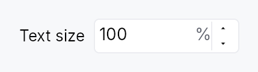

<!-- SPDX-License-Identifier: MPL-2.0 -->
<!-- SPDX-FileCopyrightText: 2026 FernTech -->

# TextScaleControl



`TextScaleControl` — the settings control that grows all text in the app.

Drop this into a preferences/settings window to let low-vision users scale
every piece of text uniformly (the framework multiplies the active theme's
typography by the chosen factor — see
`WidgetTree::set_user_text_scale`).
It is a thin specialization of `SpinBox` that displays a percent
(80 %–200 %, step 10 %) and, on each edit, both **persists** the value and
**applies it app-wide** — so the developer only has to place the widget.

Bind it to the persisted factor signal, typically the settings-backed
`teksilo_settings::TEXT_SCALE_KEY`:

```ignore
use teksilo::prelude::*;
use teksilo::widgets::TextScaleControl;

// inside build():
let scale = ctx.settings().signal_for(&teksilo_settings::TEXT_SCALE_KEY);
ctx.add(TextScaleControl::new(scale).label(tr!(text_size())));
```

Writing the bound signal triggers the `SettingsStore`'s debounced auto-save
(persistence), and the widget's `on_value_changed` calls
`EventContext::set_text_scale`
(immediate app-wide application). At startup `teksilo-app` reads the saved
key and seeds every window, so the chosen size is restored automatically.

## Builder methods at a glance

`label`, `tooltip`, `rich_tooltip`, `rich_tooltip_content`, `composite_tooltip`

## API reference

📖 [Full rustdoc API for this module](../api/teksilo_widgets/text_scale_control/index.html)

## `pub struct TextScaleControl`

A specialized `SpinBox` for the global user text-scale setting.

See the `module docs` for the persistence + app-wide application
contract. Construct with `TextScaleControl::new`, optionally attach a
visible `label`, and place it in a settings view.

```rust
pub struct TextScaleControl { /* fields */ }
```

### Methods

#### `pub fn new(factor_signal: Signal<f32>) -> Self`

Construct bound to `factor_signal` (a scale factor where `1.0` = 100 %).

Pass `ctx.settings().signal_for(&teksilo_settings::TEXT_SCALE_KEY)` to get
automatic persistence; any `Signal<f32>` works for ad-hoc / preview use.

#### `pub fn label(mut self, label: impl Into<LocalizedString>) -> Self`

Attach a visible label placed to the leading side of the spinbox
(e.g. `tr!(text_size())`). Also used as the control's accessible name.

#### `pub fn tooltip(mut self, text: impl Into<LocalizedString>) -> Self`

Attach a plain tooltip that appears after a hover delay.

Clears any previously set rich or composite tooltip (last-call wins).

#### `pub fn rich_tooltip(mut self, key: impl Into<String>) -> Self`

Attach a rich tooltip resolved from the app-wide tooltip registry.

`key` is looked up in the
`TooltipRegistry` at build time.
Clears any previously set plain or composite tooltip (last-call wins).

#### `pub fn rich_tooltip_content(mut self, content: crate::tooltip::TooltipContent) -> Self`

Attach a rich tooltip driven by inline
`TooltipContent`.

Clears any previously set plain or composite tooltip (last-call wins).

#### `pub fn composite_tooltip(mut self, content: impl Widget + 'static) -> Self`

Attach a composite tooltip that hosts an arbitrary widget body.

The `content` widget is rendered inside the tooltip overlay after the
heavy hover delay. Clears any previously set plain or rich tooltip
(last-call wins).
