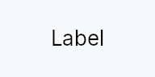

<!-- SPDX-License-Identifier: MPL-2.0 -->
<!-- SPDX-FileCopyrightText: 2026 FernTech -->

# TextWidget



TextWidget — a leaf widget that renders a localized text string.

`TextWidget` is the building block for every visible label in the framework.
It delegates measurement and rasterization to the `TextBackend` and supports
three overflow modes: `TextOverflow::Wrap` (default — grows vertically),
`TextOverflow::Ellipsis` with trailing, middle, or leading truncation, and
a minimal markup subset (``label``, `*italic*`, `**bold**`) with
per-link click/hover dispatch.

Text and color accept either static values or reactive `Signal`/`Prop` bindings.
The default color role is `TextRole::Primary`, resolved against the active
theme at paint time, so theme switches update text color without any explicit
binding or rebuild.

# Accessibility

A `TextWidget` is reviewable by default: it emits AccessKit text runs —
one per visual line, with a position and an advance for every character
— so a screen reader's review cursor can walk it, a braille cell can be
routed to the word under it, and `AXBoundsForRange` and its Windows and
Linux equivalents can answer. Runs are excluded from object navigation
by `accesskit_consumer`'s own filter, so they add no stops to anyone's
traversal and no targets to any hit test.

Geometry is always present: real when a text backend measured the label,
and a zero-width box at its leading edge when none did. Never absent —
`Range::bounding_boxes()` discards every box it has collected on the
first run missing any of bounds, direction, positions or widths, so one
geometry-less run would take the whole label's geometry with it.

A label *inside* a control that owns the same accessible name must call
`a11y_hidden`, or a reader hears the string
twice. Standalone body text should not.

Single-line / ellipsis text opts into shrink by default: an over-constrained
stack compresses the label down to the ellipsis-glyph width before the label
overflows. Call `no_shrink` to restore rigid behavior,
or `min_shrink_width` to set a custom floor.
Wrap-mode text is height-variable and therefore always rigid; opt it into
compression with `Shrinkable`.

```rust
# use teksilo_widgets::primitives::TextWidget;
# use teksilo_i18n::lit;
// Single-line label that truncates with a trailing ellipsis if too narrow:
let _w = TextWidget::new(lit!("Save document")).single_line();
```

## Touch and pen

Inline links are reachable by a plain tap: the handler at `on_tap` follows
the link run under the press with no modifier of any kind. (The touch
inventory recorded this file as Ctrl-gated and therefore unreachable by
touch; that gate is `rich_text/mouse.rs`'s — `modifiers.command() ||
read_only` — and does not exist here.) The hover cursor over a link run is
a mouse and pen affordance and costs a finger nothing.

A link run is text-height and its size is constrained by the line height of
the text around it, which is exactly WCAG 2.2 SC 2.5.8's *inline* exception,
so it is not raised to the 24 dp floor and is not reported as a target
region.

## Builder methods at a glance

`color`, `style`, `overflow`, `single_line`, `min_shrink_width`, `no_shrink`, `max_lines`, `text_backend`, `text`, `resolved_text`, `markup`, `on_link_click`, `on_link_hover`, `a11y_hidden`, `geometry_handle`

## API reference

📖 [Full rustdoc API for this module](https://docs.rs/teksilo-widgets/latest/teksilo_widgets/primitives/text_widget/index.html)

## `pub struct TextWidget`

```rust
pub struct TextWidget { /* fields */ }
```

### Methods

#### `pub fn new(text: impl Into<LocalizedString>) -> Self`

Construct a text widget whose content is a `LocalizedString`. The
text may come from `tr!(...)` (reactive, re-resolves on locale
change) or from `lit!("…")` for genuinely
non-translated strings.

#### `pub fn color(mut self, color: impl Into<ColorProp>) -> Self`

Set the text color. Accepts any `impl Into<ColorProp>`:

- A raw `Color` — a frozen literal.
- A `TextRole` — resolved against the theme at paint time
  (reactive across theme switches).
- A `Signal<Color>` — reactive state (typically interaction-driven).

The default role is `TextRole::Primary`, so `.color(...)` is only
needed when a label wants a non-default theme role (Secondary,
Error, Accent, ...) or a custom color.

#### `pub fn style(mut self, style: impl Into<TextStyleProp>) -> Self`

Set the text style. Accepts a raw `TextStyle`, a
`TextStyleRole`, or any value implementing
`Into<TextStyleProp>`. Using a role resolves at paint/layout time, so
theme typography changes take effect without a rebuild.

#### `pub fn overflow(mut self, overflow: TextOverflow) -> Self`

Set how the widget handles text that doesn't fit in the proposed
width. Default is `TextOverflow::Wrap`.

#### `pub fn single_line(self) -> Self`

Shorthand for `.overflow(TextOverflow::Ellipsis(EllipsisMode::Trailing))`.
Use this on labels inside single-line containers (buttons, menu items,
tab headers, badges, status bar cells, etc.) so long text truncates
with a trailing "…" instead of wrapping onto multiple lines.

#### `pub fn min_shrink_width(mut self, min: f32) -> Self`

Override the compression floor for single-line / ellipsis text — the
narrowest width an over-constrained stack may shrink this label to
before truncating stops. Defaults to the ellipsis-glyph width.

#### `pub fn no_shrink(mut self) -> Self`

Opt this label out of native shrink: it reports a rigid size and
overflows (rather than truncating) when its stack is over-constrained.

#### `pub fn max_lines(mut self, n: usize) -> Self`

Cap the paragraph at `n` lines when wrapping. Only meaningful
in `TextOverflow::Wrap` mode — ignored for ellipsis modes.
Lines beyond the cap are silently dropped.

#### `pub fn text_backend(mut self, backend: Rc<RefCell<dyn teksilo_canvas::TextBackend>>) -> Self`

Override the text backend used for measurement and rasterization.
In normal app code the framework provides the backend automatically;
this method is used by headless tests that inject a `MockTextBackend`.

#### `pub fn text(mut self, state: impl Into<Prop<String>>) -> Self`

Set the text content. Accepts a static `String`/`&str` or a reactive
`Signal<String>` / `Prop<String>` (resolved and re-rendered on change).

#### `pub fn resolved_text(&self) -> String`

Get the current text value (resolves from state if bound).

#### `pub fn markup(mut self, enabled: bool) -> Self`

Enable inline markup parsing. When enabled, the text is parsed
as a minimal markdown subset:
- ``label`` — inline link
- `*italic*`     — italic run
- `**bold**`     — bold run

Links are dispatched via `on_link_click`
and colored using `theme.colors.text_link`.

#### `pub fn on_link_click<F>(mut self, handler: F) -> Self where F: Fn(&str, &mut EventContext) + 'static,`

Called when an inline link is tapped. Enables markup automatically.

#### `pub fn on_link_hover<F>(mut self, handler: F) -> Self where F: Fn(&str, bool, Rect, &mut EventContext) + 'static,`

Called when an inline link is hovered (enter/leave). Receives
the URL, a `bool` indicating whether the pointer entered (`true`)
or left (`false`), and the widget-local rect of the link span
(so anchoring popups next to the link is cheap). Enables markup
automatically.

#### `pub fn a11y_hidden(mut self) -> Self`

Hide this text from the accessibility tree. Use this when the
TextWidget is a visual label fragment inside another control
that already owns its accessible name via `set_name` —
otherwise screen readers announce the same string twice
(once for the control, once for the embedded Label node).

Standalone body text (dialog descriptions, form instructions,
read-only display values) should NOT set this — it stays as a
`Role::Label` node.

#### `pub fn geometry_handle(&self) -> TextGeometryHandle`

A handle onto what this label last measured.

For the controls that own their accessible name but paint their
text through a hidden `TextWidget` — `Badge`, `GroupHeader` — and
so have to emit that text's runs from their *own* node. The handle
is empty until the label has been placed, and the geometry it
carries is in window space, so the borrower reports it as absolute.

The borrower must place the donor rigidly at its own origin: a
move re-places absolute rects by the *borrower's* delta, so a
composite that repositions its donor independently should register
local rects instead.
