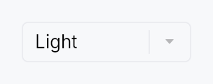

<!-- SPDX-License-Identifier: MPL-2.0 -->
<!-- SPDX-FileCopyrightText: 2026 FernTech -->

# ThemeSwitcher



ThemeSwitcher — a drop-in app-theme picker for settings screens & toolbars.

A thin `ComboBox` preset that switches the application theme. By default
it offers three entries — **Light**, **Dark**, and **System** — where
*System* follows the native OS theme live: it adopts the OS's actual colours
(GNOME / KDE / Cinnamon on Linux) and tracks OS light/dark changes at
runtime, falling back to the built-in light/dark presets on platforms
without OS-colour support.

Zero-config: drop `ThemeSwitcher::new()` into a settings panel or toolbar and
it

- shows the active theme as the current selection (matched by the theme's
  stable `ThemeId`),
- switches the app theme on selection via `EventContext::set_theme` (fixed
  themes) or `EventContext::follow_system_theme` (System),
- and stays in sync if the theme changes elsewhere (a menu, the inspector,
  or an OS light/dark toggle).

```ignore
// In a settings panel or toolbar:
Toolbar::new().child(HStack::new().child(Spacer::new()).child(ThemeSwitcher::new()))
```

Labels are **translated** via the framework Fluent bundle (`tr_widget!`),
with an English literal fallback so a host app that hasn't installed an
`I18nManager` still reads "Light / Dark / System" rather than raw keys.

Custom themes: `.themes([(label, theme), …])` replaces Light/Dark with an
app-supplied set (e.g. the `teksilo-theme-{fluent,macos,material3}` presets);
`.system(false)` drops the System entry.

## Builder methods at a glance

`variant`, `label`, `themes`, `system`, `tooltip`, `rich_tooltip`, `rich_tooltip_content`, `composite_tooltip`

## API reference

📖 [Full rustdoc API for this module](../api/teksilo_widgets/theme_switcher/index.html)

## `pub struct ThemeSwitcher`

A drop-in app-theme picker built on `ComboBox`. See the module docs.

```rust
pub struct ThemeSwitcher { /* fields */ }
```

### Methods

#### `pub fn new() -> Self`

Create a switcher offering Light / Dark / System (the System entry
follows the OS theme live).

#### `pub fn variant(mut self, variant: ComboBoxVariant) -> Self`

Pick the inner ComboBox's design-language variant.

#### `pub fn label(mut self, label: impl Into<LocalizedString>) -> Self`

Set the accessible / control label (defaults to the translated "Theme").

#### `pub fn themes( mut self, themes: impl IntoIterator<Item = (impl Into<LocalizedString>, Theme)>, ) -> Self`

Replace the default Light/Dark fixed-theme list with an app-supplied set
of `(label, theme)` pairs — e.g. the `teksilo-theme-*` presets. The
System (follow-OS) entry is still appended unless `system`
is `false`.

#### `pub fn system(mut self, include: bool) -> Self`

Whether to offer the "System" (follow-OS) entry. Default `true`.

#### `pub fn tooltip(mut self, text: impl Into<LocalizedString>) -> Self`

Attach a plain tooltip, forwarded to the inner `ComboBox`.
Mutually exclusive with the rich / composite variants — last
call wins.

#### `pub fn rich_tooltip(mut self, key: impl Into<String>) -> Self`

Attach a rich tooltip resolved from the app-wide registry,
forwarded to the inner `ComboBox`. Overrides any previously
set tooltip.

#### `pub fn rich_tooltip_content(mut self, content: crate::tooltip::TooltipContent) -> Self`

Attach a rich tooltip driven by inline
`TooltipContent`, forwarded to
the inner `ComboBox`. Overrides any previously set tooltip.

#### `pub fn composite_tooltip(mut self, content: impl Widget + 'static) -> Self`

Attach a composite tooltip hosting an arbitrary widget tree,
forwarded to the inner `ComboBox`. Overrides any previously
set tooltip.
