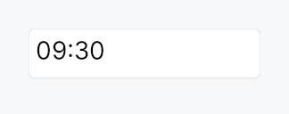
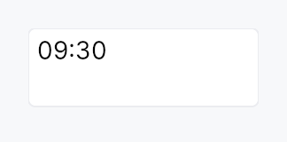

<!-- SPDX-License-Identifier: MPL-2.0 -->
<!-- SPDX-FileCopyrightText: 2026 FernTech -->

# TimeEdit



`TimeEdit` — text input for time-of-day, bound to `Signal<Option<Time>>`.

Single-line editable time field with strftime-pattern parse/format
and optional 12h/24h mode + AM/PM. Same compositional pattern as
`DateEdit` (TextInputField + commit on
Enter/blur + step keys), without a popover (desktop convention is no
graphical time picker).

# Behaviour

- **Value binding**: `Signal<Option<Time>>` — `None` shows the
  placeholder.
- **Pattern**: 24h default `%H:%M`; 12h is `%I:%M %p`. Override
  via `format_pattern`. Add seconds with
  `seconds(SecondsMode::Editable)`.
- **Keyboard** (preview-pass on the wrapper): the step is
  *segment-relative* — it moves the field under the caret (hour,
  minute, second or AM/PM), which is what `QDateTimeEdit` does.
  - Arrow Up / Down → ±1 unit of that segment; Shift+ → ±10.
  - PageUp / PageDown → ±10 units; Shift+ → ±100.
  - Hours wrap within the day and minutes and seconds within the
    hour and minute, so a sweep never rolls the value over.

# Accessibility

- Container — `Role::TimeInput` with `set_value` formatted as
  `HH:MM:SS` and `set_label` from `.label()`.
- Underlying TextInputField keeps `Role::TextInput` so AT knows
  it's editable.

```ignore
use teksilo_core::signal::Signal;
use teksilo_widgets::time_edit::{TimeEdit, TimeFormat, SecondsMode};

let value = Signal::new(None);
let _field = TimeEdit::new(value)
    .format(TimeFormat::Hour24)
    .seconds(SecondsMode::Hidden);
```

## Touch and pen

See `DateEdit`'s "Touch and pen" section: the whole
date/time family carries `focus_within` and `on_key_preview` only, and its
pointer surface is the embedded field, the trigger button and the popover.

## Density

The picture above is the widget at `TargetDensity::Compact`, the mouse-and-keyboard ladder. Below is the same subject on the same canvas with only the ladder changed, so what moves is the density and nothing else — where the subject no longer fits, that is what the denser targets cost it at that size. See `docs/density-and-targets.md`.

**Touch**



## Builder methods at a glance

`style`, `required`, `format`, `seconds`, `format_pattern`, `min_time`, `max_time`, `step_minutes`, `placeholder`, `enabled`, `read_only`, `validation_behavior`, `width_policy`, `validation_feedback_signal`, `label`, `on_value_changed`, `tooltip`, `rich_tooltip`, `rich_tooltip_content`, `composite_tooltip`, `value`

## API reference

📖 [Full rustdoc API for this module](https://docs.rs/teksilo-widgets/latest/teksilo_widgets/time_edit/index.html)

## `pub enum TimeFormat`

12h vs 24h time formatting.

Used with `TimeEdit::format` to lock the clock style independently of the locale default.

```rust
pub enum TimeFormat { /* variants */ }
```

### Variants

- **`Hour24`** — 24-hour clock (default — `%H:%M`).
- **`Hour12`** — 12-hour clock with AM/PM segment (`%I:%M %p`).

## `pub enum SecondsMode`

Whether the seconds segment is shown in `TimeEdit`.

```rust
pub enum SecondsMode { /* variants */ }
```

### Variants

- **`Hidden`** — Hide the seconds segment (default).
- **`Editable`** — Show and edit the seconds segment.

## `pub struct TimeEdit`

Single-line editable time-of-day field.

See the `module documentation` for full behaviour, pattern,
and keyboard details.

```rust
pub struct TimeEdit { /* fields */ }
```

### Methods

#### `pub fn new(value: Signal<Option<Time>>) -> Self`

Construct bound to `value` (`None` = empty field; `Some(t)` = pre-filled time).

#### `pub fn style(mut self, style: impl teksilo_core::styles::DateEditStyle) -> Self`

Per-call DateEditStyle override (shared with DateEdit family).

#### `pub fn required(value: Signal<Time>) -> Self`

Construct with a **required** (non-nullable) `Signal<Time>`. The field
never shows `None`; the signal and the internal `Option` are kept in sync.

#### `pub fn format(mut self, f: TimeFormat) -> Self`

Lock the field to a specific clock (12h or 24h). When this
builder is *not* called, the field defaults to the user's
current locale via `prefers_12_hour_clock` (12h for en-US /
en-CA / en-AU / en-NZ / en-PH / en-IN / en-PK; 24h elsewhere).

#### `pub fn seconds(mut self, mode: SecondsMode) -> Self`

Show or hide the seconds segment. Default: `SecondsMode::Hidden`.

#### `pub fn format_pattern(mut self, p: impl Into<String>) -> Self`

Override the strftime-subset format pattern (e.g. `"%H:%M:%S"`).
Bypasses the locale-derived and `format`-derived defaults entirely.

#### `pub fn min_time(mut self, t: Time) -> Self`

Clamp the accepted value to at or after `t` (inclusive).

#### `pub fn max_time(mut self, t: Time) -> Self`

Clamp the accepted value to at or before `t` (inclusive).

#### `pub fn step_minutes(mut self, n: u32) -> Self`

Set the ArrowUp / ArrowDown step in minutes. Default: 1. Must be ≥ 1.

**Currently inert.** Segment-aware stepping replaced the older
whole-value step, and it moves the field under the caret by one of
*that segment's* units rather than by a fixed number of minutes. The
builder is kept on the public surface so callers that already
configured it still compile, and as the hook a future per-segment
custom step would use; it has no effect today.

#### `pub fn placeholder(mut self, text: impl Into<LocalizedString>) -> Self`

Text shown when the field is empty (value is `None`).

#### `pub fn enabled(mut self, enabled: impl Into<Prop<bool>>) -> Self`

Set the enabled state, statically or reactively. Forwarded to the
arena at build time.

#### `pub fn read_only(mut self, read_only: bool) -> Self`

Allow display-only mode: text is selectable but not editable.

#### `pub fn validation_behavior(mut self, behavior: ValidationBehavior) -> Self`

How parse failures are surfaced. See
`ValidationBehavior`.

#### `pub fn width_policy(mut self, policy: crate::date_edit::WidthPolicy) -> Self`

How the widget claims horizontal space. See
`WidthPolicy`. Default
`Default` (natural mask-derived width).

#### `pub fn validation_feedback_signal(&self) -> Signal<ValidationFeedback>`

Reactive handle on the live validation feedback.

#### `pub fn label(mut self, label: impl Into<LocalizedString>) -> Self`

Set the accessible label for the field (announced by screen readers).

#### `pub fn on_value_changed( mut self, f: impl Fn(Option<Time>, &mut EventContext) + 'static, ) -> Self`

Callback invoked on every committed value change with the new
`Option<Time>` and a live `EventContext`.

#### `pub fn tooltip(mut self, text: impl Into<LocalizedString>) -> Self`

Attach a plain single-line tooltip shown after a hover delay. Clears
any previously set rich or composite tooltip (last call wins).

#### `pub fn rich_tooltip(mut self, key: impl Into<String>) -> Self`

Attach a rich tooltip identified by a registry key. Clears any
previously set plain or composite tooltip (last call wins).

#### `pub fn rich_tooltip_content(mut self, content: crate::tooltip::TooltipContent) -> Self`

Attach an inline rich tooltip from a `crate::tooltip::TooltipContent`
value. Clears any previously set plain or composite tooltip (last call wins).

#### `pub fn composite_tooltip(mut self, content: impl Widget + 'static) -> Self`

Attach a composite tooltip whose body is an arbitrary widget tree.
Clears any previously set plain or rich tooltip (last call wins).

#### `pub fn value(&self) -> Signal<Option<Time>>`

The bound value signal — the same `Signal` passed to `Self::new`.
