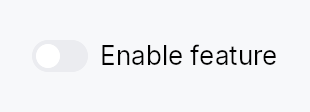

<!-- SPDX-License-Identifier: MPL-2.0 -->
<!-- SPDX-FileCopyrightText: 2026 FernTech -->

# Toggle



Toggle — an animated on/off switch bound to a `Signal<bool>`.

## Public functions

### `Toggle`

| Returns | Function |
| ---: | :--- |
| | **Constructors** |
| `Self` | [`new(on: Signal<bool>)`](#toggle-new) |
| | **Builder methods** |
| `Self` | [`label(label: impl Into<LocalizedString>)`](#toggle-label) |
| `Self` | [`on_change(f: impl Fn(bool, &mut EventContext) + 'static)`](#toggle-on_change) |
| `Self` | [`labelled_externally()`](#toggle-labelled_externally) |
| `Self` | [`enabled(enabled: impl Into<Prop<bool>>)`](#toggle-enabled) |
| `Self` | [`variant(variant: ToggleVariant)`](#toggle-variant) |
| `Self` | [`style(style: impl ToggleStyle)`](#toggle-style) |
| `Self` | [`tooltip(text: impl Into<LocalizedString>)`](#toggle-tooltip) |
| `Self` | [`rich_tooltip(key: impl Into<String>)`](#toggle-rich_tooltip) |
| `Self` | [`rich_tooltip_content(content: crate::tooltip::TooltipContent)`](#toggle-rich_tooltip_content) |
| `Self` | [`composite_tooltip(content: impl Widget + 'static)`](#toggle-composite_tooltip) |

## Detailed description

Renders as a sliding-knob switch (IntUI default) or one of the alternate
`ToggleVariant` shapes. All visual chrome is delegated to a `ToggleStyle`
impl; the widget itself owns only event handling (tap, Space, AccessKit
`Click`). The IntUI recipe
(`crate::styles::RecipeToggleStyle`) ships out of the box; apps install a
custom look per-call with `.style(impl ToggleStyle)` or theme-wide via
`theme.style_slots.toggle = Some(Rc::new(…))`.

#### Accessibility

Emits `Role::Switch` with `toggled` reflecting the signal value. Always pair
with `.label(…)` — the debug build asserts that a label is present, and
screen readers will announce "switch" with no context if it is absent.

#### Example

```rust
# use teksilo_widgets::Toggle;
# use teksilo_core::signal::Signal;
# use teksilo_i18n::lit;
let dark_mode = Signal::new(false);
let _w = Toggle::new(dark_mode)
    .label(lit!("Dark mode"));
```

#### Touch and pen

The pressed state is the framework's (`docs/touch-and-pen.md` §7.1) — a
Material 3 thumb that grows on press must not stay grown after the finger
has slid off the switch, nor grow under a finger that turns out to be
scrolling the list the switch sits in. The flip lands on the release.

## Density

The picture above is the widget at `TargetDensity::Compact`, the mouse-and-keyboard ladder. Below is the same subject on the same canvas with only the ladder changed, so what moves is the density and nothing else — where the subject no longer fits, that is what the denser targets cost it at that size. See `docs/density-and-targets.md`.

**Touch**


## API reference

📖 [Full rustdoc API for this module](https://docs.rs/teksilo-widgets/latest/teksilo_widgets/toggle/index.html)

<a id="toggle"></a>

## `pub struct Toggle`

An animated toggle switch bound to a `Signal<bool>`.

```rust
pub struct Toggle { /* fields */ }
```

### Methods

<a id="toggle-new"></a>

#### `pub fn new(on: Signal<bool>) -> Self`

Create a toggle bound to `on`. The signal is both read (to paint the
current state) and written (flipped on each activation).

See `on_change` when flipping it has to reach the
ambient context rather than only app state.

<a id="toggle-label"></a>

#### `pub fn label(mut self, label: impl Into<LocalizedString>) -> Self`

Accessible label announced by AT and optionally displayed beside the switch.

<a id="toggle-on_change"></a>

#### `pub fn on_change(mut self, f: impl Fn(bool, &mut EventContext) + 'static) -> Self`

Run `f` when the **user** flips this switch, with the value the
activation produced and an `EventContext`, so it can do what a bare
`Signal` write cannot (`ctx.send_intent(...)`, `ctx.set_theme(...)`,
opening a window). Fires for the pointer, for `Space`, and for an
assistive-technology `Click`.

Does **not** fire for programmatic writes to the bound signal — there is
no event in flight to carry. Observe the signal for that. The signal
stays the source of truth either way: it is written first, and `f` sees
the value it now holds.

Spelled the same way on `Checkbox`.

<a id="toggle-labelled_externally"></a>

#### `pub fn labelled_externally(mut self) -> Self`

Declare that this toggle's accessible name comes from a **sibling label
widget**, wired by a container after mount (`FormLayout::line` does this
via `access_labelled_by`).

Without it the debug assertion in `accessibility()` fires even though
the toggle *is* properly labelled: the `labelled_by` relation is pushed
post-mount, so `accessibility()` cannot see it and every form-hosted
toggle looks nameless. Setting `.label(..)` instead would satisfy the
assert but render the text a second time, beside a label column that
already has it.

<a id="toggle-enabled"></a>

#### `pub fn enabled(mut self, enabled: impl Into<Prop<bool>>) -> Self`

Set the enabled state, statically or reactively. Forwarded to the
arena via `ctx.enabled_when(self_id, self.enabled.clone())` at
build time.

<a id="toggle-variant"></a>

#### `pub fn variant(mut self, variant: ToggleVariant) -> Self`

Pick a Tier-1 design-language variant
(`ToggleVariant::Switch` / `Pill` / `Square` / `Inset`). The
active `ToggleStyle` decides what to do with the hint —
IntUI's default impl honours all four; a custom impl might
ignore the variant entirely.

<a id="toggle-style"></a>

#### `pub fn style(mut self, style: impl ToggleStyle) -> Self`

Override the active `ToggleStyle` for this widget instance
only. Useful for one-off custom-painted toggles in a single
view.

<a id="toggle-tooltip"></a>

#### `pub fn tooltip(mut self, text: impl Into<LocalizedString>) -> Self`

Attach a plain single-line tooltip shown after a hover delay.

Mutually exclusive with `rich_tooltip`,
`rich_tooltip_content`, and
`composite_tooltip` — the last setter
called wins and clears the others.

<a id="toggle-rich_tooltip"></a>

#### `pub fn rich_tooltip(mut self, key: impl Into<String>) -> Self`

Attach a rich tooltip looked up by registry `key`.

Mutually exclusive with the other tooltip setters — the last
setter called wins and clears the others.

<a id="toggle-rich_tooltip_content"></a>

#### `pub fn rich_tooltip_content(mut self, content: crate::tooltip::TooltipContent) -> Self`

Attach a rich tooltip from an inline `crate::tooltip::TooltipContent`
value rather than a registry key.

Mutually exclusive with the other tooltip setters — the last
setter called wins and clears the others.

<a id="toggle-composite_tooltip"></a>

#### `pub fn composite_tooltip(mut self, content: impl Widget + 'static) -> Self`

Attach a composite tooltip whose body is an arbitrary widget tree.

Mutually exclusive with the other tooltip setters — the last
setter called wins and clears the others.
