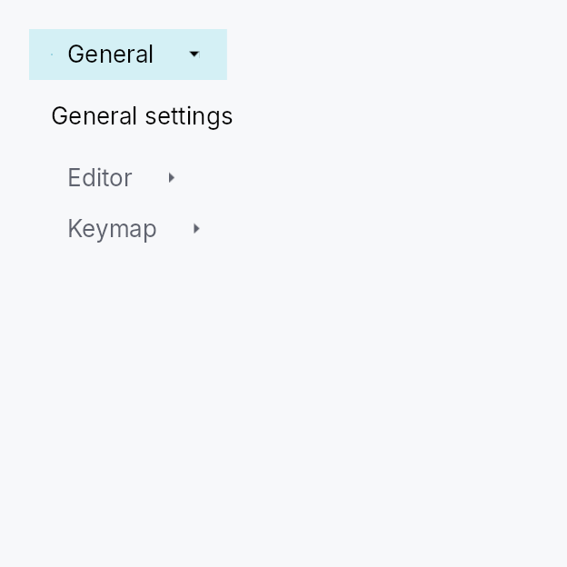

<!-- SPDX-License-Identifier: MPL-2.0 -->
<!-- SPDX-FileCopyrightText: 2026 FernTech -->

# ToolBox



ToolBox — a vertical stack of collapsible sections, exactly one expanded
at a time.

Semantic cousin of Qt's `QToolBox` and the collapsible groups in
IntelliJ's Settings dialog. Differs from `Accordion`
(single-item independent disclosure) and `TabWidget`
(horizontal tab bar with dormant panes) by combining vertical layout,
always-visible headers, and exclusive expansion in one widget.

Int UI visual language:
- flat, borderless headers (no corner radius)
- 1 dp accent indicator bar on the leading edge of the active header
- color-only emphasis (selected / hover / pressed surface roles)
- border IS the focus ring: 1 dp accent border appears on the focused
  header, no separate ring primitive
- content swaps are **instant** — Int UI's house rule is to avoid
  decorative animation for inline transitions; see
  `MotionTokens`. Matches the existing
  `TabWidget` precedent where pane swaps have no
  transition.

```ignore
let selected = ctx.signal(0_usize);
ToolBox::new(selected.clone())
    .item("Outline",    outline_widget)
    .item("Properties", properties_widget)
    .add(ToolBoxItem::new("Build", build_widget).enabled(false))
```

## Builder methods at a glance

`orientation`, `fill`, `collapsible`, `horizontal`, `on_header_drag`, `item`, `item_id`, `add`, `items`, `show_dividers`

## API reference

📖 [Full rustdoc API for this module](../api/teksilo_widgets/tool_box/index.html)

## `pub enum ToolBoxOrientation`

Orientation of a [`ToolBox`]: how its collapsible sections are arranged.

`Vertical` (the default) stacks sections
top-to-bottom with horizontal headers and an up/down chevron — the
classic `QToolBox`. `Horizontal` lays
sections left-to-right; each header becomes a narrow **vertical strip**
with its label rotated 90° and a left/right chevron. The horizontal form
is used by side-docks anchored to the top/bottom edges (where the wide,
short region calls for vertical header strips).

```rust
pub enum ToolBoxOrientation { /* variants */ }
```

### Variants

- **`Vertical`** — Sections stacked top-to-bottom; horizontal headers (default).
- **`Horizontal`** — Sections arranged left-to-right; vertical header strips with rotated labels and left/right chevrons.

## `pub struct ToolBoxItem`

One section of a `ToolBox`. Construct with `ToolBoxItem::new` and pass
to `ToolBox::add`, or use the convenience `ToolBox::item` /
`ToolBox::item_id` builders directly when leading / trailing slots
and tooltip are not needed.

Layout of the header row:

```text
[indicator] [leading?] [label] [spacer] [trailing?] [chevron]
```

Both `leading` and `trailing` accept any `impl Widget` — typical uses
are a small `IconWidget`, a `Checkbox` (checkable section), a
`Badge` (count), or a `Button` (per-row action).

```rust
pub struct ToolBoxItem { /* fields */ }
```

### Methods

#### `pub fn new(label: impl Into<LocalizedString>, content: impl Widget + 'static) -> Self`

Build an item with an inline content widget. The label may come from
`tr!(...)` (translated) or `lit!(...)`.

#### `pub fn new_id(label: impl Into<LocalizedString>, content_id: WidgetId) -> Self`

Build an item whose content is a pre-registered widget id.

#### `pub fn leading(mut self, widget: impl Widget + 'static) -> Self`

Attach a leading-slot widget rendered before the label (after
the selection indicator bar). Use for a small `IconWidget`, a
`Checkbox` for checkable sections, a `Badge`, or any other
label-sized widget. The slot widget owns its own events — a
`Checkbox` inside the leading slot toggles independently of
the header's own tap.

#### `pub fn trailing(mut self, widget: impl Widget + 'static) -> Self`

Attach a trailing-slot widget rendered between the row's flexible
spacer and the chevron. Use for per-row actions — a dismiss
button, a badge, a secondary `Toggle`. The slot widget owns its
own events: tapping a `Button` inside the trailing slot fires the
button's action; gesture recognisers on the trailing widget stop
the header's own tap from firing, so a close-button click does
not also select the section.

#### `pub fn tooltip(mut self, text: impl Into<LocalizedString>) -> Self`

Attach a plain-text tooltip shown after a hover delay on the header
row. The text may come from `tr!(...)` (translated, locale-reactive)
or `lit!(...)`. Mirrors `.tooltip(...)` on Button / IconButton /
MenuItem. Clears any previously set rich or composite tooltip (the
last tooltip setter called wins).

#### `pub fn rich_tooltip(mut self, key: impl Into<String>) -> Self`

Attach a rich tooltip resolved from the app-wide
`TooltipRegistry` by key.
Clears any previously set plain or composite tooltip (the last
tooltip setter called wins).

#### `pub fn rich_tooltip_content(mut self, content: TooltipContent) -> Self`

Attach a rich tooltip driven by inline `TooltipContent` — for
one-offs that don't belong in the registry. Clears any previously
set plain or composite tooltip (the last tooltip setter called wins).

#### `pub fn composite_tooltip(mut self, content: impl Widget + 'static) -> Self`

Attach a composite tooltip — an arbitrary `impl Widget` body shown
in a larger, scrollable overlay after a longer hover delay. Use for
rich on-demand previews: charts, property tables, image thumbnails.
Clears any previously set plain or rich tooltip (the last tooltip
setter called wins).

#### `pub fn enabled(mut self, enabled: impl Into<Prop<bool>>) -> Self`

Disable the item: its header renders in the disabled text role,
click and keyboard activation are ignored, and arrow navigation
skips it. Accepts a static bool or a reactive `Signal<bool>`.

Forwarded to the arena via
`ctx.enabled_when(header_id, self.enabled.clone())` at build time;
the arena is then the single source of truth and ANDs with
ancestors — disabling the surrounding `ToolBox` (or any ancestor)
disables every item regardless of this flag.

## `pub const TOOL_BOX_HEADER_MIN_HEIGHT`

ToolBox design tokens.

```rust
pub const TOOL_BOX_HEADER_MIN_HEIGHT: f32 = 28.0;
```

## `pub const TOOL_BOX_HEADER_PADDING_HORIZONTAL`

```rust
pub const TOOL_BOX_HEADER_PADDING_HORIZONTAL: f32 = 12.0;
```

## `pub const TOOL_BOX_ICON_TEXT_SPACING`

```rust
pub const TOOL_BOX_ICON_TEXT_SPACING: f32 = 8.0;
```

## `pub const TOOL_BOX_CHEVRON_SIZE`

```rust
pub const TOOL_BOX_CHEVRON_SIZE: f32 = 12.0;
```

## `pub const TOOL_BOX_INDICATOR_THICKNESS`

```rust
pub const TOOL_BOX_INDICATOR_THICKNESS: f32 = 1.0;
```

## `pub struct ToolBox`

A vertical container of collapsible sections with exactly one expanded
at a time — the Int UI / `QToolBox` pattern.

The active section is driven by a caller-owned `Signal<usize>`; mirrors
`TabWidget::new` so persistence, synchronised
windows, and programmatic activation work identically.

```rust
pub struct ToolBox { /* fields */ }
```

### Methods

#### `pub fn new(selected: Signal<usize>) -> Self`

Create a ToolBox driven by `selected` (visible section index). Set the
signal to `0` to open the first section by default; modify it
programmatically or share it across windows for synchronized state.

#### `pub fn orientation(mut self, orientation: ToolBoxOrientation) -> Self`

Set the section arrangement orientation (default
`ToolBoxOrientation::Vertical`).

#### `pub fn fill(mut self, fill: bool) -> Self`

Make the active section's panel **fill** the ToolBox's allotted space
rather than size to its content's natural extent.

With `fill` on, the active panel stretches to the full cross axis and
flexes / shrinks (and clips) along the main axis, so a ToolBox placed
in a bounded region lays its content out at *exactly* the available
size — the `QToolBox` convention. A panel whose content carries a
trailing `Spacer` therefore pins a bottom toolbar to the visible
bottom edge instead of overflowing past it.

Default `false` (the panel keeps its content's natural size — the
historical behaviour, appropriate when the ToolBox itself lives inside
a scroll area).

#### `pub fn collapsible(mut self, collapsible: bool) -> Self`

Allow **collapsing** the active section: clicking (or Enter/Space on, or
the AT `Collapse` action of) the already-expanded header closes it, so
*all* sections can be collapsed at once. A subsequent click re-expands.

Default `false` — the classic "exactly one section open" behaviour. This
is what makes a **single-section** ToolBox a plain collapsible panel
(header toggles its content), e.g. a dock panel.

#### `pub fn horizontal(mut self) -> Self`

Shorthand for `ToolBox::orientation``(``ToolBoxOrientation::Horizontal``)`.

#### `pub fn on_header_drag(mut self, f: impl Fn(usize, &mut EventContext) + 'static) -> Self`

Make each section header a drag source. `f` is invoked (with the
section index) when a drag gesture *starts* on a header; it should
begin a drag (e.g. `ctx.start_drag(source, payload)`). Tapping a
header still selects it — the gesture arena tells a tap from a drag.

#### `pub fn item(self, label: impl Into<LocalizedString>, content: impl Widget + 'static) -> Self`

Append an item with an inline content widget. Convenience wrapper
around `ToolBox::add` that skips the `ToolBoxItem` builder for
the common label-plus-content case.

#### `pub fn item_id(self, label: impl Into<LocalizedString>, content_id: WidgetId) -> Self`

Append an item whose content is a pre-registered widget id.

#### `pub fn add(mut self, item: ToolBoxItem) -> Self`

Append a fully-built `ToolBoxItem` — required when an icon,
tooltip, or disabled flag is needed.

#### `pub fn items<I>(mut self, items: I) -> Self where I: IntoIterator<Item = ToolBoxItem>,`

Append multiple items from an iterator.

#### `pub fn show_dividers(mut self, show: bool) -> Self`

Show a 1 dp `BorderRole::Divider` line between consecutive header /
panel rows. Default: `false` — IntelliJ Settings-style collapsibles
stack without explicit dividers, letting the flat background roles
delineate the rows.
