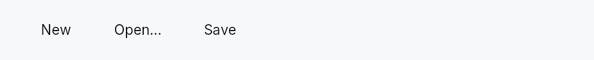
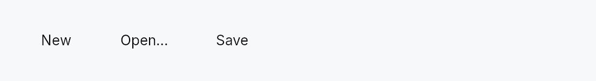

<!-- SPDX-License-Identifier: MPL-2.0 -->
<!-- SPDX-FileCopyrightText: 2026 FernTech -->

# Toolbar



`Toolbar` — a command bar with automatic **overflow**.

Excess actions collapse into a trailing chevron (`⌄`) that opens a popover
menu, mirroring Qt's `QToolBar` extension button, macOS `NSToolbar`'s
overflow menu, and WinUI `CommandBar`. Synthesized API:

- **Actions** (`ToolbarAction`) — a command with a **label + icon** (both
  required), an optional tooltip, enabled state, optional toggle (checkable)
  or dropdown `menu`, an **overflow priority**
  (NSToolbar: lowest priority collapses first), and an **`always_overflow`**
  flag (WinUI secondary commands). Each action has a toolbar form (an
  `IconButton`, or a `PopoverIconButton` when it carries a menu) and a
  menu form (a `MenuItem`, or a submenu), so it renders correctly whether
  inline or in the overflow menu.
- **Pinned widgets** (`ToolbarItem::custom`) — arbitrary widgets (a search
  field, a `SegmentedControl`) that never collapse.
- **Collapsible widgets** — an arbitrary widget that *does* overflow, by
  supplying an overflow representation (NSToolbar `menuFormRepresentation` /
  Qt `QWidgetAction`): a **menu row** (`ToolbarAction`) via
  `ToolbarItem::custom(w).overflow_as(action)`
  (or `ToolbarOverflow` + `ToolbarItem::collapsible`; an icon-only
  control reuses its icon as the menu glyph), or a **live embedded widget**
  via `ToolbarItem::custom(w).overflow_widget(f)`
  (the factory rebuilds the control — e.g. a `ComboBox` bound to the same
  signal — inside the menu so it stays usable while collapsed). When the bar
  is tight the inline widget is hidden and its overflow form appears in the
  menu.
- **Separators** and **flexible space** (NSToolbar `flexibleSpace`).
- Toolbar-wide **`button_size`** (default
  `Compact`), **`button_style`**
  (a shared `IconButtonStyle` for every action), and **orientation**.

Overflow is computed every layout pass from each item's intrinsic size
(measured even while collapsed, via
`LayoutContext::measure_intrinsic`),
so items reappear correctly as the bar widens — no stale-width glitches.

The chevron's drop-down is a real `MenuList` whose rows are gated by
`MenuList::item_when`,
so it sizes compactly to the currently-collapsed rows, carries standard
menu chrome, takes focus when opened, and supports arrow / `Home` / `End` /
`Enter` keyboard navigation (skipping the hidden rows).

**Accessibility (ARIA toolbar pattern).** The bar emits `Role::Toolbar`
with its orientation and name. It is a single Tab stop with **roving
tab-index**: arrow keys move focus among the visible controls (and the
chevron), `Home`/`End` jump to the ends. The chevron announces
`HasPopup::Menu` and its expanded state; overflowed actions are dormant
(absent from the AT tree), represented instead by their menu items — so no
action is announced twice. Toggle actions carry `Toggled`.

```ignore
// on_activate requires an EventContext — use ignore.
use teksilo_widgets::toolbar::{Toolbar, ToolbarAction, ToolbarItem};
use teksilo_i18n::lit;
let _bar = Toolbar::new()
    .action(ToolbarAction::new(lit!("Save"), save_icon).on_activate(|ctx| { /* ... */ }))
    .action(ToolbarAction::new(lit!("Undo"), undo_icon).priority(-1))
    .item(ToolbarItem::flexible_space());
```

## Touch and pen

Nothing to do here, and it is worth recording why: every command on the bar
is an `IconButton` or a `PopoverIconButton`, so each one inherits the
framework press, release activation and slide-off abort from the button
family, and each is already 24 dp at Compact
(`IconButtonSize::Compact`/`Default`). The bar itself carries only roving
keyboard navigation and takes no press of its own. The overflow chevron is
gated on the layout-derived `is_overflowing` signal, not on hover, so it is
reachable by a finger without any reveal policy.

## Density

The picture above is the widget at `TargetDensity::Compact`, the mouse-and-keyboard ladder. Below is the same subject on the same canvas with only the ladder changed, so what moves is the density and nothing else — where the subject no longer fits, that is what the denser targets cost it at that size. See `docs/density-and-targets.md`.

**Touch**



## Builder methods at a glance

`item`, `items`, `action`, `actions`, `child`, `children`, `child_opt`, `orientation`, `button_size`, `button_style`, `spacing`, `label`, `compact`, `is_overflowing`

## API reference

📖 [Full rustdoc API for this module](https://docs.rs/teksilo-widgets/latest/teksilo_widgets/toolbar/index.html)

## `pub const TOOLBAR_HEIGHT_DEFAULT`

Toolbar design tokens.

```rust
pub const TOOLBAR_HEIGHT_DEFAULT: f32 = 40.0;
```

## `pub fn toolbar_height_default(...)`

`TOOLBAR_HEIGHT_DEFAULT` raised to the density's `target_size`
(24 / 32 / 44 dp). The identity at Compact.

```rust
pub fn toolbar_height_default(tokens: &InputTokens) -> f32;
```

## `pub const TOOLBAR_SPACING`

```rust
pub const TOOLBAR_SPACING: f32 = 4.0;
```

## `pub fn toolbar_spacing(...)`

`TOOLBAR_SPACING` scaled by the density's `spacing_factor`
(1.00 / 1.15 / 1.30).

```rust
pub fn toolbar_spacing(tokens: &InputTokens) -> f32;
```

## `pub enum ToolbarOrientation`

Layout axis of the toolbar.

```rust
pub enum ToolbarOrientation { /* variants */ }
```

### Variants

- **`Horizontal`** — Items flow left-to-right (default).
- **`Vertical`** — Items flow top-to-bottom.

## `pub struct ToolbarAction`

A toolbar command: a **label + an icon** (both required), plus optional
tooltip/toggle, an activation handler, an overflow priority, and an
`always_overflow` flag. Renders as an icon-only `IconButton` inline (the
label is its tooltip + accessible name) and as a labelled `MenuItem` in the
overflow menu.

```rust
pub struct ToolbarAction { /* fields */ }
```

### Methods

#### `pub fn new(label: impl Into<LocalizedString>, icon: impl Fn() -> IconWidget + 'static) -> Self`

A new action with the given (translatable) `label` and `icon` factory,
and a no-op handler. The label is the inline button's tooltip +
accessible name (the button is icon-only); the icon factory builds the
glyph for both the inline `IconButton` and the overflow menu row
(`IconWidget` isn't `Clone`, so it is a factory).

#### `pub fn menu(mut self, factory: impl Fn() -> MenuList + 'static) -> Self`

Turn this action into a **dropdown**: its inline control becomes a
`PopoverIconButton` that opens the `MenuList` built by `factory`
(instead of a plain button that runs `on_activate`), and in the overflow
it becomes a submenu. `MenuList` isn't `Clone`, so pass a factory that
builds a fresh one. Mutually exclusive with `on_activate` / `toggle`
(the menu owns the interaction).

#### `pub fn tooltip(mut self, text: impl Into<LocalizedString>) -> Self`

Plain-text tooltip shown after a hover delay (the inline button is
icon-only; with none set, the label is used). Overrides any previously
set rich tooltip — every setter clears the other so last-call wins.

#### `pub fn rich_tooltip(mut self, key: impl Into<String>) -> Self`

Attach a rich tooltip resolved from the app-wide tooltip registry.
The `key` is looked up via
`TooltipRegistry` at build
time; the resolved body text supports inline markup
(``label``, `*italic*`, `**bold**`) and the entry's
shortcut / "more" fields are rendered automatically.

Overrides any previously set plain `.tooltip(...)` — every setter
clears the other so last-call wins.

#### `pub fn rich_tooltip_content(mut self, content: crate::tooltip::TooltipContent) -> Self`

Attach a rich tooltip driven by inline
`TooltipContent` — for
one-off tooltips that aren't worth registering in the central
catalog. Overrides any previously set plain `.tooltip(...)`.

#### `pub fn composite_tooltip(mut self, factory: impl Fn() -> Box<dyn Widget> + 'static) -> Self`

Attach a composite tooltip whose body is built by `factory` — an
arbitrary widget tree (tabbed sections, charts, conditional rows).
Because `ToolbarAction` is `Clone`, the body is supplied as a
factory closure (not a `Box<dyn Widget>` instance, which is not
`Clone`); the closure is invoked to produce a fresh body for the
inline button. Overrides any previously set tooltip — every setter
clears the others so last-call wins.

#### `pub fn enabled(mut self, enabled: impl Into<Prop<bool>>) -> Self`

Enabled state, static or reactive.

#### `pub fn on_activate(mut self, f: impl Fn(&mut EventContext) + 'static) -> Self`

Activation handler (tap / Enter / Space / AT click / menu activate).

#### `pub fn toggle(mut self, state: Signal<bool>) -> Self`

Make this a checkable (toggle) action bound to `state`. Inline it reads
as a pressed toggle button; in overflow as a checkmark menu item.

#### `pub fn priority(mut self, priority: i32) -> Self`

Overflow priority — actions with the **lowest** priority collapse into
the menu first (NSToolbar semantics). Default `0`.

#### `pub fn always_overflow(mut self) -> Self`

Always live in the overflow menu, never inline (WinUI secondary command).

## `pub struct ToolbarItem`

One slot in a `Toolbar`.

```rust
pub struct ToolbarItem { /* fields */ }
```

### Methods

#### `pub fn action(action: ToolbarAction) -> Self`

A collapsible command.

#### `pub fn custom(widget: impl Widget + 'static) -> Self`

A pinned arbitrary widget (never collapses) — e.g. a search field. Make
it collapsible with `overflow_as`.

#### `pub fn custom_id(id: WidgetId) -> Self`

A pinned arbitrary widget by pre-registered id.

#### `pub fn collapsible(widget: impl Widget + ToolbarOverflow + 'static) -> Self`

A collapsible widget that supplies its own menu form via
`ToolbarOverflow`. When the bar is too narrow, the widget is hidden
and its `toolbar_menu_form()` appears in the overflow menu.

#### `pub fn overflow_as(mut self, menu_form: ToolbarAction) -> Self`

Make a `custom` widget collapsible with an explicit menu
**row** — the `ToolbarAction` shown when it overflows (NSToolbar
`menuFormRepresentation`). Best for controls whose menu form is a
single command; an icon-only inline control reuses its icon here as the
menu item's leading glyph (pass it to `ToolbarAction::new`).

#### `pub fn overflow_widget(mut self, factory: impl Fn() -> Box<dyn Widget> + 'static) -> Self`

Make a `custom` widget collapsible by embedding a **live
widget** in the overflow menu — the factory rebuilds the control (e.g.
a `ComboBox` bound to the same signal) so it stays fully interactive
while collapsed, instead of degrading to a one-shot menu row. Best for
stateful inputs (combo boxes, sliders) that have no meaningful single
"command" representation.

#### `pub fn separator() -> Self`

A separator line between groups.

#### `pub fn flexible_space() -> Self`

Flexible space that pushes the following items to the trailing edge
(NSToolbar `flexibleSpace`). Collapses to nothing when over-constrained.

## `pub struct Toolbar`

A command bar with automatic overflow. See the `module docs`.

```rust
pub struct Toolbar { /* fields */ }
```

### Methods

#### `pub fn new() -> Self`

Create an empty toolbar with the default orientation (horizontal) and
`Compact`, ghost icon buttons. Add commands with `action`
or layout items with `item`.

#### `pub fn item(mut self, item: ToolbarItem) -> Self`

Add an item (action, pinned widget, separator, flexible space).

#### `pub fn items(self, items: impl IntoIterator<Item = ToolbarItem>) -> Self`

Add several items from an iterator, in order.

The loop form of `item`: reach for it when the command set
is data-driven rather than written out call by call.

#### `pub fn action(self, action: ToolbarAction) -> Self`

Sugar for `.item(ToolbarItem::action(a))`.

#### `pub fn actions(self, actions: impl IntoIterator<Item = ToolbarAction>) -> Self`

Add several collapsible commands from an iterator.

The loop form of `action`, for a command set built from
data rather than spelled out one call at a time.

#### `pub fn child(self, widget: impl teksilo_core::IntoTeksiChild) -> Self`

Add a pinned inline child widget (sugar for
`.item(ToolbarItem::custom(widget))`). Pinned widgets never collapse
into the overflow menu — use `action` for collapsible
commands.

#### `pub fn children( self, iter: impl IntoIterator<Item = impl teksilo_core::IntoTeksiChild>, ) -> Self`

Add several pinned inline children from an iterator.

The loop form of `child`. Like `child`, every widget added
this way is pinned and never collapses into the overflow menu.

#### `pub fn child_opt(self, widget: Option<impl teksilo_core::IntoTeksiChild>) -> Self`

Attach `widget` when it is `Some`, and do nothing when it is `None`.

The conditional-child form. `teksu!`'s `if` without an `else` lowers to
this, and it is what `cond.then(|| w)` is for in a builder chain. `None`
adds no arena node, so nothing is laid out, painted, or published to the
accessibility tree, and a stack applies no spacing around it.

#### `pub fn orientation(mut self, orientation: ToolbarOrientation) -> Self`

Set the layout axis (default `ToolbarOrientation::Horizontal`).

#### `pub fn button_size(mut self, size: IconButtonSize) -> Self`

Size variant applied to every action's inline `IconButton` and the
overflow chevron (default `IconButtonSize::Compact`).

#### `pub fn button_style(mut self, style: impl IconButtonStyle) -> Self`

A toolbar-wide `IconButtonStyle` applied to every action button and the
overflow chevron — one shared style for the whole bar (the icon-button
analogue of `theme.style_slots`). Default: the theme's flat / ghost
icon-button style.

#### `pub fn spacing(mut self, spacing: f32) -> Self`

#### `pub fn label(mut self, label: impl Into<LocalizedString>) -> Self`

Override the accessible name (default: the localized "Toolbar").

#### `pub fn compact(mut self, compact: bool) -> Self`

**Compact** (shrink-to-fit) sizing. By default a toolbar *fills* the main
extent it is offered (it is meant to span a full command bar). In compact
mode it instead reports its **natural content** extent as the wanted size
and is *shrinkable* down to its collapsed minimum (the pinned items plus
the overflow chevron) — so it sits as a tight cluster when there is room,
composes next to other widgets (e.g. a title and a `Spacer`) without
claiming their space, and still collapses excess actions into the `⌄`
menu when the slot is genuinely too narrow. Use it to embed a toolbar in a
constrained header rather than a full-width bar.

#### `pub fn is_overflowing(&self) -> Signal<bool>`

Reactive signal that is `true` whenever any action is collapsed into the
overflow menu (WinUI `IsOverflowOpen`-adjacent introspection).
