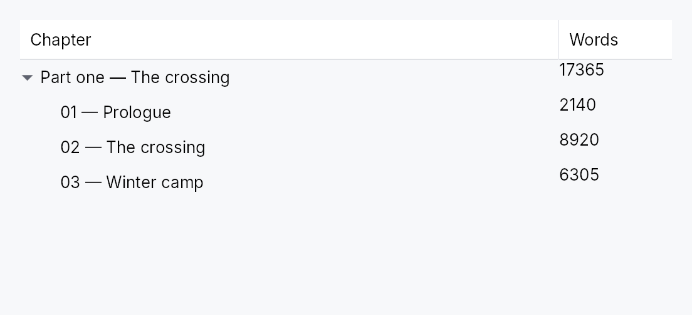

<!-- SPDX-License-Identifier: MPL-2.0 -->
<!-- SPDX-FileCopyrightText: 2026 FernTech -->

# TreeTableView



`TreeTableView<T>` — hierarchical multi-column data table with expand/collapse.

Sibling of `TableView` for tree-shaped data. Each row carries
a depth level; one designated column (the *tree column*, defaulting to the first)
shows a twist (chevron) and an indent gutter that toggles the row's children.
Backed by a `SortFilterTreeModel<T>` so sort, filter, and expand state compose
without extra bookkeeping. Shares the header, column, keyboard, and selection
modules with `TableView`.

Rows live in a `TreeBodyPane` — a sibling of the scrollbar — so buffer-exit /
selection / expand rebuilds are never deferred mid-thumb-drag. Three row-height
modes: uniform (`row_height`, fast path), exact per-flat-index callback
(`row_height_fn`), and auto-measured (`auto_row_height` — grows to tallest cell).

## Common patterns

**A checkbox column.** Selection and "checked" are different things — a
checkbox column wants its own state, with parent/child propagation. Build it
from `TreeCheckedModel` over the same tree
the view projects.

A cell delegate receives `(&T, &CellContext)` and **`CellContext` carries no
node identity** — only `row_index`. So
capture the projection and resolve the row's `NodeId` through it:

```ignore
let proxy = SortFilterTreeModel::new(tree);
let checks = TreeCheckedModel::new(proxy.tree());
let for_cells = proxy.clone();
let col = Column::new("done", lit!("Done"), move |_item, cx: &CellContext| {
    match for_cells.visible_node_id(cx.row_index) {
        Some(node) => Box::new(Checkbox::new(checks.check_state(node))) as Box<dyn Widget>,
        None => Box::new(Spacer::new()),
    }
});
```

For a tree whose identity is a domain key rather than a `NodeId`, use
`KeyedTreeCheckedModel` instead — it
survives a full re-source, which a `NodeId`-keyed set cannot.

## Accessibility

Root emits `Role::TreeGrid`; rows carry `set_level` + `set_expanded`.
ArrowLeft / ArrowRight on the tree column collapse / expand.

```ignore
// Column delegates capture closures — use ignore.
use teksilo_widgets::TreeTableView;
use teksilo_data::TreeModel;
# struct File { name: String }
# let model: TreeModel<File> = TreeModel::new();
let _view = TreeTableView::new(model).row_height(28.0);
```

## Builder methods at a glance

`from_projection`, `from_source`, `from_source_keyed`, `enabled`, `overscroll_behavior`, `smooth_scrolling`, `type_ahead_label`, `type_ahead_timeout`, `smooth_scroll_duration`, `scroll_bar_style`, `add_column`, `reorderable`, `exportable`, `export_external`, `on_rows_transferred_out`, `accept_foreign_rows`, `on_rows_received`, `on_foreign_drop`, `activate_on`, `columns`, `tree_column`, `indent_per_level`, `row_height`, `row_height_fn`, `auto_row_height`, `header_height`, `show_header`, `selection_mode`, `selection`, `keyed_selection`, `cell_selection`, `alternating_rows`, `grid_lines`, `a11y_label`, `show_internal_scrollbars`, `column_resize_policy`, `tab_traversal`, `edit_triggers`, `on_cell_edit_request`, `on_cell_edit_dismissed`, `on_row_activate`, `filter_mode`, `scroll_y_signal`, `max_scroll_y_signal`, `viewport_ratio_y_signal`, `scroll_x_signal`, `max_scroll_x_signal`, `viewport_ratio_x_signal`, `sort_signal`, `filters_signal`, `column_widths_signal`, `column_order_signal`, `focused_cell_signal`, `editing_cell_signal`, `projection`, `expand`, `collapse`, `toggle`, `expand_all`, `collapse_all`, `set_focused_cell`, `clear_focused_cell`, `set_sort`, `set_filter`, `clear_filters`, `empty_view`, `clear_sort`, `scroll_to_row`, `ensure_row_visible`, `set_column_width`, `set_column_widths`, `set_column_order`, `column_pinning_signal`, `set_column_pinning`, `begin_edit`, `end_edit`

## API reference

📖 [Full rustdoc API for this module](https://docs.rs/teksilo-widgets/latest/teksilo_widgets/tree_table_view/index.html)

## `pub struct TreeTableView`

Hierarchical multi-column widget. See module documentation.

```rust
pub struct TreeTableView<T: 'static> { /* fields */ }
```

### Methods

#### `pub fn from_projection(proxy: SortFilterTreeModel<T>) -> Self`

Wrap a `SortFilterTreeModel<T>`.
Wrap a `SortFilterTreeModel<T>`.

#### `pub fn from_source<S: TreeDataSource<Item = T> + 'static>(source: S) -> Self`

Build a tree table over any `TreeDataSource` — an external source of
truth (a Qleany entity store, a database, a virtual filesystem) carrying
its own `Key`, so it needs no `TreeModel` mirror.

This is the tree-table sibling of
`TreeView::from_source`. Because the
source owns identity, its expand state (and a keyed selection) survive a
full re-source — which a `TreeModel` mirror cannot guarantee, since
`NodeId`s are reassigned on rebuild.

The `NodeId`-typed methods (`expand`,
`projection`, `keyed_selection`)
do not apply here and no-op; drive expansion through the source itself.

Row drag-reorder **is** wired on this path: a drop routes through the source's
own `drag` / `can_accept` / `accept_drop`, exactly as
`TreeView` does — so the
source owns both the cycle guard and the commit. Note that
`TreeDataSlice::drag` defaults to `NoDrag`: an
external source must opt its rows in before anything can be dragged.

#### `pub fn from_source_keyed<S: TreeDataSource<Item = T> + 'static>( source: S, keyed: KeyedSelectionModel<S::Key>, ) -> Self where S::Key: teksilo_data::ItemKey,`

Like `from_source` but with **keyed** selection:
the `KeyedSelectionModel<S::Key>` tracks rows by source identity, so it
survives expand / collapse, sort / filter and a full re-source. Pruning
consults the source's `contains_key`, so a collapsed-but-present row
keeps its selection. The view stays `TreeTableView<T>` — the `Key` is
captured here.

#### `pub fn new(model: TreeModel<T>) -> Self`

Wrap a raw `TreeModel<T>` — convenience for callers that don't
need sort/filter. Internally builds an identity
`SortFilterTreeModel`.

#### `pub fn enabled(mut self, enabled: impl Into<Prop<bool>>) -> Self`

Enable or disable the whole view. A disabled view greys out and stops
accepting focus / selection / keyboard input (arena-gated).

#### `pub fn overscroll_behavior(mut self, behavior: OverscrollBehavior) -> Self`

Set the scroll-chaining behavior at the boundary (default
`OverscrollBehavior::Chain`; `Contain`
disables chaining to an ancestor scrollable).

#### `pub fn smooth_scrolling(mut self, enabled: bool) -> Self`

Enable or disable animated wheel scrolling (enabled by default).
When disabled, wheel events snap immediately to the new offset.

#### `pub fn type_ahead_label(mut self, label: impl Fn(&T) -> String + 'static) -> Self`

Enable **type-ahead** ("type to jump"): typing a printable character
while the tree-table has keyboard focus jumps the focused row to the
next *visible* row whose label starts with the accumulated search term,
wrapping around (Qt `keyboardSearch` / macOS & Windows type-select).
`label(&item)` yields the searchable text; matching is
ASCII-case-insensitive. A pause longer than the
`type_ahead_timeout` starts a fresh term.

#### `pub fn type_ahead_timeout(mut self, timeout: Duration) -> Self`

Reset window between keystrokes before the type-ahead search term
clears (default 500 ms). A zero duration disables type-ahead.

#### `pub fn smooth_scroll_duration(mut self, duration: Duration) -> Self`

Duration of the smooth scroll animation (default 150 ms).

#### `pub fn scroll_bar_style(mut self, style: ScrollBarMode) -> Self`

How the scroll bar is displayed (default `Permanent`). `Overlay`
and `Thin` float the bar over the content instead of reserving a
layout column for it, mirroring `ScrollArea::scroll_bar_style`.

#### `pub fn add_column(mut self, col: Column<T>) -> Self`

Append a column definition. Columns are displayed in declaration order unless
reordered by the user.

#### `pub fn reorderable(mut self, enabled: bool) -> Self`

Enable drag-to-reorder of **rows** (pointer drag + keyboard
Alt+ArrowUp/Down). Distinct from
`Column::reorderable`, which reorders
*columns* and defaults to `true`; this defaults to `false`.

A drop reparents/reorders the dragged node in the underlying
`TreeModel` (top third of a row = Before, middle = Into / make-child,
bottom = After). The move is cycle-guarded — dropping a node onto
itself or into its own subtree is refused (no insertion line). Reorder
is **suppressed while a sort is active**: with the visible order driven
by the sort, a manual reorder would have no visible effect.

#### `pub fn exportable(mut self, mode: DragTransferMode) -> Self where T: Clone,`

Make rows **droppable outside this view** — on a
`DropTarget`, another data view, or the OS.

A dragged row (or the whole selection, when the pressed row is part of a
multi-selection) carries clones of its items in a public
`RowDragData<T>`, so a foreign receiver can pull
them out with `payload.get_typed::<RowDragData<T>>()` /
`DropTarget::on_drop_typed::<RowDragData<T>>()` — no serialization. This
also makes rows a drag source even without `reorderable`.

`mode` chooses what happens to the origin rows once a *foreign* target
accepts them: `DragTransferMode::Move` removes them — by default,
directly from the underlying `TreeModel` (any dragged node that is a
descendant of another dragged node is skipped, since removing the
ancestor already removes it); override via
`on_rows_transferred_out`.
`DragTransferMode::Copy` leaves them. A same-view reorder is never a
transfer, so `mode` never affects it. Requires `T: Clone`.

#### `pub fn export_external(mut self, f: impl Fn(&[T]) -> Vec<(String, Vec<u8>)> + 'static) -> Self where T: Clone,`

Additionally advertise the dragged rows as MIME data so they can be
dropped on a `DropZone` or exported to another
application / window via the OS. `f` maps the dragged items to
`(mime_type, bytes)` pairs (e.g. `text/plain`, `text/uri-list`, an
app-specific `application/x-…`). Implies `exportable`
(defaulting to `DragTransferMode::Move` if not already set). Requires
`T: Clone`.

#### `pub fn on_rows_transferred_out( mut self, f: impl Fn(&[usize], &mut EventContext) + 'static, ) -> Self`

Override how rows moved out to a foreign target are removed from this
view. Receives the dragged rows' flat visible indices (as captured at
drag-start) and the live context. Without this, an
`exportable` `Move` drag
removes the dragged nodes directly from the underlying `TreeModel`
(leaf-first / descending — a dragged node that is a descendant of
another dragged node is skipped, since removing the ancestor already
removes its whole subtree).

#### `pub fn accept_foreign_rows(mut self, accept: bool) -> Self`

Accept exported rows dropped from a **different** view or source
without writing a custom source. Pair with
`on_rows_received`, which is handed the
dropped items and the target flat row index. (Same-view reorder is
`reorderable`.)

#### `pub fn on_rows_received( mut self, f: impl Fn(Vec<T>, usize, &mut EventContext) + 'static, ) -> Self`

Handler for rows accepted via
`accept_foreign_rows`: `(items, target
flat row index, ctx)`. Insert them into your tree at/near the index.

#### `pub fn on_foreign_drop( mut self, f: impl Fn(&DragPayload, NodeId, DropPosition, &mut EventContext) -> bool + 'static, ) -> Self`

Raw escape hatch for a foreign drop.

**Projection path only.** This hook is `NodeId`-typed and predates
`from_source`; over an external source there is no
`NodeId` to hand it, so it never fires. Prefer
`accept_foreign_rows` +
`on_rows_received`, which are source-agnostic. Unlike `ListView` / `TableView`,
`TreeTableView` is backed by a concrete `SortFilterTreeModel<T>` rather
than a pluggable source, so it cannot express foreign-accept purely
through source capability closures (`can_accept` / `accept_drop`).
This fires for **any** payload NOT recognized as this view's own row
drag — a different view's `RowDragData<T>`, or a
completely different payload type — dropped on a node: `(payload,
target node, drop position, ctx) -> accepted`. Tried after
`on_rows_received`, so the typed sugar wins
when both are set and the payload happens to carry an exportable
`RowDragData<T>`.

#### `pub fn activate_on(mut self, mode: crate::data_views::ActivateOn) -> Self`

Choose single- vs double-click activation for `on_row_activate` (default
`ActivateOn::DoubleClick`). Enter/Space activates in
either mode.

#### `pub fn columns(mut self, cols: impl IntoIterator<Item = Column<T>>) -> Self`

Append multiple columns from an iterator.

#### `pub fn tree_column(mut self, col_id: impl Into<String>) -> Self`

Designate which column hosts the twist + indent. Default: the
first column.

#### `pub fn indent_per_level(mut self, px: f32) -> Self`

Override the per-depth indent in the tree column in logical pixels (default
comes from the active `TableStyle`).

#### `pub fn row_height(mut self, height: f32) -> Self`

Fixed row height (default: the table style's 28 px) — the
uniform fast path. Mutually exclusive with
`row_height_fn` and
`auto_row_height`; the last mode setter
wins.

#### `pub fn row_height_fn(mut self, f: impl Fn(usize) -> f32 + 'static) -> Self`

Per-row heights from a callback over the flat (visible) row
index. The callback must be pure (same index + same data → same
height); it is re-swept from the first changed flat index on
every projection rebuild (expand/collapse/sort/filter/mutation).
No measurement pass runs.

#### `pub fn auto_row_height(mut self, estimated: f32) -> Self`

Auto-measured row heights: each realized row reports the height
of its tallest cell measured at the cell's column width
(height-for-width), unrealized rows assume `estimated`. Scroll
anchoring keeps content above the viewport stationary; measured
heights above a toggled row survive expand/collapse
(divergence-driven invalidation). The scrollbar settles one
frame after a measurement change.

#### `pub fn header_height(mut self, height: f32) -> Self`

Override the header row height in logical pixels.

#### `pub fn show_header(mut self, visible: bool) -> Self`

Show or hide the column header row (default `true`).

#### `pub fn selection_mode(mut self, mode: TableSelectionMode) -> Self`

Set the row/cell selection mode (default
`TableSelectionMode::MultiRow`).

#### `pub fn selection(mut self, sel: SelectionModel) -> Self`

Set the index-based row selection model (visible positions). For
identity-based selection that survives expand / collapse / sort /
filter / structural edits, use `keyed_selection`
instead.

#### `pub fn keyed_selection(mut self, keyed: KeyedSelectionModel<NodeId>) -> Self`

Set a keyed row selection model (by `NodeId`). Selection is tracked by
node identity, so it survives expand / collapse, sort / filter, and node
moves — and stays consistent if two views share the projection. Pruned
of deleted nodes on each projection change. Mutually exclusive with
`selection` (last one set wins).
Only meaningful on the `from_projection` /
`new` paths, whose identity *is* `NodeId`; a no-op over an
external source, which carries its own key — use
`from_source_keyed` there.

#### `pub fn cell_selection(mut self, sel: CellSelectionModel) -> Self`

Attach a cell-level selection model (row and column axes tracked
independently).

#### `pub fn alternating_rows(mut self, enabled: bool) -> Self`

Paint odd-indexed rows with the `SurfaceRole::AlternatingRow` tint
(default `false`).

#### `pub fn grid_lines(mut self, kind: GridLines) -> Self`

Paint horizontal and/or vertical dividers between cells.

#### `pub fn a11y_label(mut self, label: impl Into<LocalizedString>) -> Self`

Accessible label for the whole tree table, announced by AT as the
table's name.

#### `pub fn show_internal_scrollbars(mut self, show: bool) -> Self`

Show or hide the widget's internal vertical and horizontal scroll bars
(default `true`). Set to `false` when the table lives inside an external
`ScrollArea`.

#### `pub fn column_resize_policy(mut self, policy: ColumnResizePolicy) -> Self`

Control how column widths are distributed when the table is resized
(default `Proportional`).

#### `pub fn tab_traversal(mut self, mode: TabTraversal) -> Self`

Set the keyboard Tab traversal direction inside the table (default `Cells`).

#### `pub fn edit_triggers(mut self, trigger: EditTriggers) -> Self`

Set which user gesture starts an in-place cell edit (default
`DoubleClick`).

#### `pub fn on_cell_edit_request( mut self, f: impl Fn(usize, &str, &mut EventContext) + 'static, ) -> Self`

Callback invoked when the user requests an in-place cell edit (e.g.
double-click when `edit_triggers` is `DoubleClick`). Receives the flat row
index, the column id, and a mutable `EventContext`.

#### `pub fn on_cell_edit_dismissed( mut self, f: impl Fn(usize, &str, &mut EventContext) + 'static, ) -> Self`

Callback invoked when an **open** cell editor should end because the
pointer went somewhere else: a press that lands on any cell other than
the one being edited. Receives the editing cell's flat row index and
column id, so the owner can commit (or discard) whatever is in its
buffer, then clear its own editing state.

The counterpart of `on_cell_edit_request`,
and the view cannot do it alone: the framework owns *which* cell is being
edited, but only the owner knows what an ended edit means — commit,
discard, or refuse a value that will not parse.

**Why a press and not a focus change.** "The editor lost focus" is the
obvious signal and it cannot be used: a body pane rebuilds constantly —
selection, filtering, scroll, a reload from elsewhere — and every rebuild
destroys and re-creates the open editor, so focus leaves it many times
during an edit the writer never interrupted. A press on another cell is
unambiguous and happens exactly once.

#### `pub fn on_row_activate(mut self, f: impl Fn(usize, &mut EventContext) + 'static) -> Self`

Callback invoked when a row is activated (double-click or Enter, per
`activate_on`). Receives the flat row index.

#### `pub fn filter_mode(self, mode: TreeFilterMode) -> Self`

Forward `mode` to the underlying projection. The proxy holds its
state behind `Rc<RefCell>`, so calling `.filter_mode()` on a
clone mutates the shared inner — effectively persisting the
choice on `self.proxy`.

#### `pub fn scroll_y_signal(&self) -> &Signal<f32>`

Current vertical scroll offset in logical pixels.

#### `pub fn max_scroll_y_signal(&self) -> &Signal<f32>`

Maximum vertical scroll offset (content height − viewport height).

#### `pub fn viewport_ratio_y_signal(&self) -> &Signal<f32>`

Viewport-to-content height ratio — drives the scrollbar thumb size.

#### `pub fn scroll_x_signal(&self) -> &Signal<f32>`

Current horizontal scroll offset of the Middle (unpinned) pane, in
logical pixels. Leading/Trailing-pinned columns are unaffected.

#### `pub fn max_scroll_x_signal(&self) -> &Signal<f32>`

Maximum horizontal scroll offset — `middle_content_width −
middle_viewport_width`.

#### `pub fn viewport_ratio_x_signal(&self) -> &Signal<f32>`

Middle-pane viewport-to-content width ratio.

#### `pub fn sort_signal(&self) -> &Signal<Option<(String, SortDirection)>>`

Active sort state: `Some((col_id, direction))` or `None` for unsorted.

**This is the header's state, not the data's.** Clicking a sort header
writes here; nothing reorders rows until you bind this onto the backing
projection yourself:

```ignore
let proxy = SortFilterTreeModel::new(tree)
    .with_comparator("name", |a: &Row, b: &Row| a.name.cmp(&b.name));
proxy.sort_signal(view.sort_signal().clone());
```

The binding is deliberately not automatic: a projection may already
carry preset comparators, predicates, and a filter mode, and adopting
the view's empty signal at construction would clobber them.

#### `pub fn filters_signal(&self) -> &Signal<HashMap<String, String>>`

Active per-column filters keyed by column id.

Like `sort_signal`, this holds the header's state
only — bind it onto the projection to actually filter rows:

```ignore
let proxy = SortFilterTreeModel::new(tree)
    .with_predicate("name", |t| {
        let needle = t.to_string();
        Box::new(move |r: &Row| r.name.contains(&needle))
    });
proxy.filters_signal(view.filters_signal().clone());
```

#### `pub fn column_widths_signal(&self) -> &Signal<HashMap<String, f32>>`

Current column widths in logical pixels, keyed by column id.

#### `pub fn column_order_signal(&self) -> &Signal<Vec<String>>`

Current column display order as a list of column ids.

#### `pub fn focused_cell_signal(&self) -> &Signal<Option<(usize, usize)>>`

Keyboard-focused cell as `(row, display_column_index)`, or `None`.

#### `pub fn editing_cell_signal(&self) -> &Signal<Option<(usize, usize)>>`

Cell currently being edited as `(row, display_column_index)`, or `None`.

#### `pub fn projection(&self) -> Option<&SortFilterTreeModel<T>>`

Access the underlying `SortFilterTreeModel` (for programmatic sort /
filter / expand outside of the builder API).
`None` when the view was built from an external
`teksilo_data::TreeDataSource` via
`from_source` — there is no `TreeModel`-backed
projection to hand back in that case.

#### `pub fn expand(&self, node: NodeId)`

Expand the subtree rooted at `node`.

#### `pub fn collapse(&self, node: NodeId)`

Collapse the subtree rooted at `node`.

#### `pub fn toggle(&self, node: NodeId)`

Toggle the expand/collapse state of `node`.

#### `pub fn expand_all(&self)`

Expand all nodes in the tree.

#### `pub fn collapse_all(&self)`

Collapse all nodes in the tree.

#### `pub fn set_focused_cell(&self, row: usize, col: usize)`

Move keyboard focus to the cell at `(row, col)`.

#### `pub fn clear_focused_cell(&self)`

Clear the keyboard-focused cell.

#### `pub fn set_sort(&self, col_id: Option<&str>, dir: SortDirection)`

Programmatically sort by `col_id` (pass `None` to clear the sort).

Equality-guarded, like every persisted-layout setter here — see
`set_column_widths`.

#### `pub fn set_filter(&self, col_id: &str, text: &str)`

Set or clear the filter text for a single column.

#### `pub fn clear_filters(&self)`

#### `pub fn empty_view(mut self, f: impl Fn() -> Box<dyn Widget> + 'static) -> Self`

Widget shown when no rows are visible — an empty tree, or a filter
that matched nothing. Without one, the body region is simply blank.

#### `pub fn clear_sort(&self)`

Clear the active sort.

#### `pub fn scroll_to_row(&self, row: usize)`

Scroll so that `row` is aligned to the top of the viewport. A no-op
before the first layout pass.

#### `pub fn ensure_row_visible(&self, row: usize)`

Scroll the minimum distance needed to make `row` visible. A no-op
before the first layout pass, when the viewport height is not yet known.

#### `pub fn set_column_width(&self, col_id: &str, width: f32)`

Set or remove a single column's user-resized width override.
A non-positive `width` removes the entry (the column reverts to
its declared width policy).

#### `pub fn set_column_widths(&self, widths: HashMap<String, f32>)`

Replace the full width-override map (typically used to restore
a persisted layout).

Equality-guarded for the same reason as
`TableView::set_column_widths`:
the documented settings round-trip would otherwise recurse without
bound on the first tick of a live resize drag.

#### `pub fn set_column_order(&self, order: Vec<String>)`

Replace the column-order list. Ids not declared on this table
are silently dropped on the next layout pass.

#### `pub fn column_pinning_signal(&self) -> &Signal<HashMap<String, PinnedSide>>`

Current column pinning overrides, keyed by column id. Wins over
each column's declared `Column::pinned`.

#### `pub fn set_column_pinning(&self, col_id: &str, side: PinnedSide)`

Pin or unpin a single column. `PinnedSide::None` removes the
override, reverting the column to its declared pinning.

#### `pub fn begin_edit(&self, row: usize, col_id: &str)`

Begin editing the cell `(row, col_id)`. Silently no-ops if `col_id`
isn't a currently-displayed column, or if `row` is outside the visible
range — an out-of-range target would otherwise strand `editing_cell` on
a row nothing can match.

Callable **before the view is mounted**, which is the only point at
which a consumer can seed a freshly constructed view with an edit
target it already holds. `display_indices` is a cache `build()` fills,
so a pre-mount call finds it empty; the order is recomputed on demand
in that case rather than resolving against nothing and no-opping for a
third, undocumented reason.

#### `pub fn end_edit(&self)`

Close the active cell editor without committing (the field's `on_blur` still fires).
