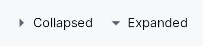

<!-- SPDX-License-Identifier: MPL-2.0 -->
<!-- SPDX-FileCopyrightText: 2026 FernTech -->

# TwistArrow



TwistArrow — a small chevron that indicates and toggles a tree node's expansion.

Renders a right-pointing arrow when collapsed and a down-pointing arrow when
expanded; a leaf node (where `has_children` is false) paints nothing but
reserves its slot so the indent column stays aligned across all rows.
The glyph flips direction under right-to-left layout.
Accessibility-decorative: the chevron hides itself from the AT tree and
the parent row's node owns `set_expanded`.

```ignore
// TwistArrow is typically instantiated by TreeView row delegates and requires
// an EventContext to wire the tap callback. The snippet below shows the
// construction pattern used inside a custom tree-row build().
let arrow = TwistArrow::new(16.0, true, false)
    .on_click(|ctx| ctx.send_intent(teksilo_core::Intent::new("tree.toggle")));
```

## Touch and pen

A 12 dp chevron is half the 24 dp target floor and cannot grow — the indent
column is the tree's own geometry. It declares a `Widget::hit_outset`
instead, which is the one mechanism that can win here: the chevron's
neighbour is the row, the row takes presses, and a point inside the row is
at distance zero from it, so the miss-only slop pass could never reach the
chevron. Zero for a leaf chevron and for a decorative one, which take no
press.

## Density

The picture above is the widget at `TargetDensity::Compact`, the mouse-and-keyboard ladder. Below is the same subject on the same canvas with only the ladder changed, so what moves is the density and nothing else — where the subject no longer fits, that is what the denser targets cost it at that size. See `docs/density-and-targets.md`.

**Touch**


## Builder methods at a glance

`color`, `on_click`

## API reference

📖 [Full rustdoc API for this module](https://docs.rs/teksilo-widgets/latest/teksilo_widgets/primitives/twist_arrow/index.html)

## `pub struct TwistArrow`

Small interactive chevron rendered in the leading indent column of a tree row.

```rust
pub struct TwistArrow { /* fields */ }
```

### Methods

#### `pub fn new(size: f32, has_children: bool, expanded: bool) -> Self`

Construct a chevron. `size` is the square side length in logical pixels;
`has_children` determines whether the glyph is painted; `expanded`
determines the glyph direction (down = expanded, right/left = collapsed).

#### `pub fn color(mut self, color: impl Into<ColorProp>) -> Self`

Override the glyph colour. Accepts a `Color`, a `TextRole`, or a
`Signal` of either.

The default `TextRole::Secondary` is a muted grey, which is right on
every row that is not filled. It is *not* right on one that is: a
design language whose selected row is a solid accent capsule flips
its label to `TextRole::OnAccent` through
`StandardItemStyle::selected_label_role`, and a chevron left behind
at `Secondary` then sits on that capsule at roughly 2.5:1 — under
WCAG SC 1.4.11's 3:1 floor, and visibly wrong beside a white label.
`StandardTreeItem` passes the row's own label role here so the two
always move together.

#### `pub fn on_click(mut self, f: impl Fn(&mut EventContext) + 'static) -> Self`

Install a tap handler. Receives the firing `EventContext`
so consumers can dispatch intents (e.g. lazy-load children on
expand) or open dialogs from the chevron toggle.
