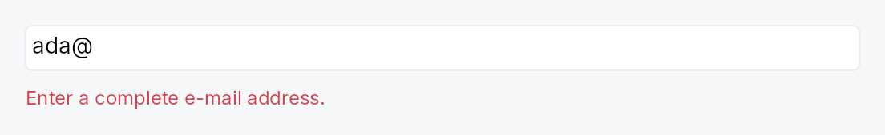
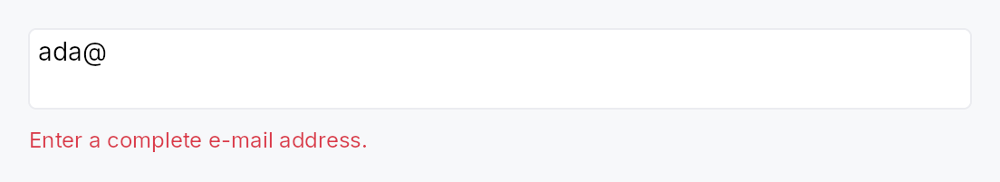

<!-- SPDX-License-Identifier: MPL-2.0 -->
<!-- SPDX-FileCopyrightText: 2026 FernTech -->

# ValidationStrip



ValidationStrip — a small inline message shown below a text field to
surface a validation outcome.

Bound to a `Signal<ValidationFeedback>` produced by a
`TextInputField`.  The strip
renders nothing when the feedback is `Pristine` or `Valid`, and shows a
single-line message in the appropriate role when `Invalid` (error colour,
`Live::Assertive`) or `Corrected` (secondary text, `Live::Polite`).
The strip is layout-stable: in the hidden state it reports zero height so
the surrounding layout does not reflow on every commit.
It carries `Role::Status` so screen readers announce the message through
the appropriate live region without any composite-side wiring.

```ignore
// ValidationStrip is constructed with a `Signal<ValidationFeedback>`
// obtained from a live `TextInputField` — it needs BuildContext to wire up.
// Typical usage inside a composing widget's build():
let (field_id, fb_signal) = build_text_input_field(ctx, ...);
let strip = ctx.add(ValidationStrip::new(fb_signal));
```

## Density

The picture above is the widget at `TargetDensity::Compact`, the mouse-and-keyboard ladder. Below is the same subject on the same canvas with only the ladder changed, so what moves is the density and nothing else — where the subject no longer fits, that is what the denser targets cost it at that size. See `docs/density-and-targets.md`.

**Touch**



## API reference

📖 [Full rustdoc API for this module](https://docs.rs/teksilo-widgets/latest/teksilo_widgets/primitives/validation_strip/index.html)

## `pub struct ValidationStrip`

Inline validation-feedback strip. See module docs.

```rust
pub struct ValidationStrip { /* fields */ }
```

### Methods

#### `pub fn new(feedback: Signal<ValidationFeedback>) -> Self`

Construct a strip bound to a feedback signal — typically
`field.validation_feedback_signal()` from the same widget.
