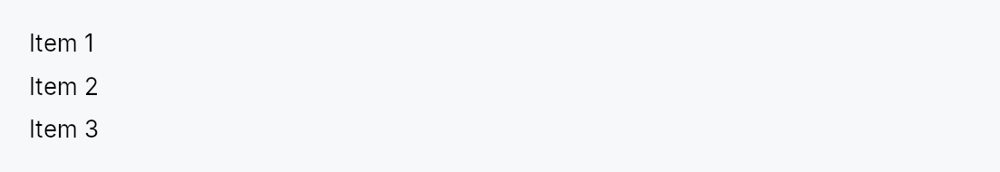

<!-- SPDX-License-Identifier: MPL-2.0 -->
<!-- SPDX-FileCopyrightText: 2026 FernTech -->

# VStack



VStack — a vertical layout container that distributes children top-to-bottom.

Each child is offered the full container width and its intrinsic preferred
height.  Positive slack (container height minus the sum of children heights
minus spacing) is distributed among children that declare a non-zero `flex`
weight (e.g. `Expand`).  Over-constraint
deficits are absorbed by children with a non-zero `shrink` weight.
Cross-axis (horizontal) alignment defaults to `Leading` and can be
overridden per container with `VStack::alignment` or per child via
`WidgetTree::set_alignment`.

Use `VStack` when children should be stacked vertically with a configurable
gap; use `HStack` for the horizontal
counterpart.

```rust
# use teksilo_widgets::primitives::{VStack, TextWidget};
# use teksilo_i18n::lit;
let _col = VStack::new()
    .spacing(8.0)
    .child(TextWidget::new(lit!("Heading")))
    .child(TextWidget::new(lit!("Body text")));
```

## Builder methods at a glance

`spacing`, `alignment`, `add_child`, `child`, `children`, `child_opt`

## API reference

📖 [Full rustdoc API for this module](../api/teksilo_widgets/primitives/vstack/index.html)

## `pub struct VStack`

Vertical layout container that distributes children top-to-bottom
based on their intrinsic sizes. Cross-axis alignment is controlled
by `HAlignment` (default: `Leading`).

```rust
pub struct VStack { /* fields */ }
```

### Methods

#### `pub fn new() -> Self`

Create an empty vertical stack with `Leading` alignment and zero spacing.

#### `pub fn spacing(mut self, spacing: impl Into<Prop<f32>>) -> Self`

Set inter-child spacing. Accepts a static `f32` or a reactive
`Signal<f32>`.

#### `pub fn alignment(mut self, alignment: HAlignment) -> Self`

Set the cross-axis (horizontal) alignment applied to every child that
does not have a per-child override set via `WidgetTree::set_alignment`.

#### `pub fn add_child(mut self, id: WidgetId) -> Self`

Add a pre-registered child by ID.

#### `pub fn child(mut self, widget: impl Widget + 'static) -> Self`

Add an inline child widget (deferred insertion).

#### `pub fn children(mut self, iter: impl IntoIterator<Item = impl Widget + 'static>) -> Self`

Add multiple inline children from an iterator.

#### `pub fn child_opt(mut self, widget: Option<impl Widget + 'static>) -> Self`

Conditionally add a child. No-op if None.
