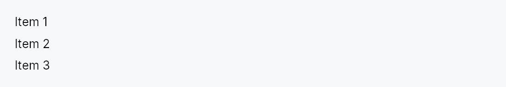

<!-- SPDX-License-Identifier: MPL-2.0 -->
<!-- SPDX-FileCopyrightText: 2026 FernTech -->

# VStack


VStack — a vertical layout container that distributes children top-to-bottom.

## Public functions

### `VStack`

| Returns | Function |
| ---: | :--- |
| | **Constructors** |
| `Self` | [`new()`](#vstack-new) |
| | **Builder methods** |
| `Self` | [`spacing(spacing: impl Into<Prop<f32>>)`](#vstack-spacing) |
| `Self` | [`alignment(alignment: HAlignment)`](#vstack-alignment) |
| `Self` | [`child(widget: impl teksilo_core::IntoTeksiChild)`](#vstack-child) |
| `Self` | [`children(iter: impl IntoIterator<Item = impl teksilo_core::IntoTeksiChild>)`](#vstack-children) |
| `Self` | [`child_opt(widget: Option<impl Widget + 'static>)`](#vstack-child_opt) |

## Detailed description

Each child is offered the full container width and its intrinsic preferred
height.  Positive slack (container height minus the sum of children heights
minus spacing) is distributed among children that declare a non-zero `flex`
weight (e.g. `Expand`).  Over-constraint
deficits are absorbed by children with a non-zero `shrink` weight.
Cross-axis (horizontal) alignment defaults to `Leading` and can be
overridden per container with `VStack::alignment` or per child via
`WidgetTree::set_alignment`.

Use `VStack` when children should be stacked vertically with a configurable
gap; use `HStack` for the horizontal
counterpart.

```rust
# use teksilo_widgets::primitives::{VStack, TextWidget};
# use teksilo_i18n::lit;
let _col = VStack::new()
    .spacing(8.0)
    .child(TextWidget::new(lit!("Heading")))
    .child(TextWidget::new(lit!("Body text")));
```

## Density

The picture above is the widget at `TargetDensity::Compact`, the mouse-and-keyboard ladder. Below is the same subject on the same canvas with only the ladder changed, so what moves is the density and nothing else — where the subject no longer fits, that is what the denser targets cost it at that size. See `docs/density-and-targets.md`.

**Touch**



## API reference

📖 [Full rustdoc API for this module](https://docs.rs/teksilo-widgets/latest/teksilo_widgets/primitives/vstack/index.html)

<a id="vstack"></a>

## `pub struct VStack`

Vertical layout container that distributes children top-to-bottom
based on their intrinsic sizes. Cross-axis alignment is controlled
by `HAlignment` (default: `Leading`).

```rust
pub struct VStack { /* fields */ }
```

### Methods

<a id="vstack-new"></a>

#### `pub fn new() -> Self`

Create an empty vertical stack with `Leading` alignment and zero spacing.

<a id="vstack-spacing"></a>

#### `pub fn spacing(mut self, spacing: impl Into<Prop<f32>>) -> Self`

Set inter-child spacing. Accepts a static `f32` or a reactive
`Signal<f32>`.

<a id="vstack-alignment"></a>

#### `pub fn alignment(mut self, alignment: HAlignment) -> Self`

Set the cross-axis (horizontal) alignment applied to every child that
does not have a per-child override set via `WidgetTree::set_alignment`.

<a id="vstack-child"></a>

#### `pub fn child(mut self, widget: impl teksilo_core::IntoTeksiChild) -> Self`

Add an inline child widget (deferred insertion).

<a id="vstack-children"></a>

#### `pub fn children( mut self, iter: impl IntoIterator<Item = impl teksilo_core::IntoTeksiChild>, ) -> Self`

Add multiple inline children from an iterator.

<a id="vstack-child_opt"></a>

#### `pub fn child_opt(mut self, widget: Option<impl Widget + 'static>) -> Self`

Conditionally add a child. No-op if None.
