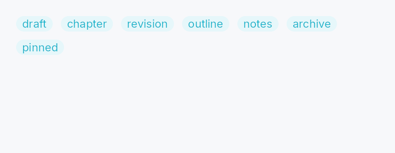
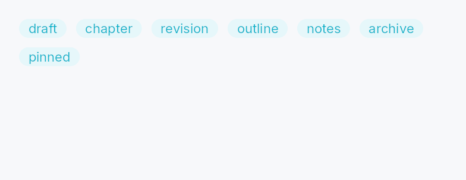

<!-- SPDX-License-Identifier: MPL-2.0 -->
<!-- SPDX-FileCopyrightText: 2026 FernTech -->

# Wrap



Wrap — a horizontal flow layout that wraps children to the next line when
they exceed the available width.

Children are placed left-to-right (or right-to-left under RTL layout) and
wrapped to the next line when the next item would exceed the container
width.  Each line's height is the tallest child on that line.  Use
`spacing` for the horizontal gap between items and
`line_spacing` for the vertical gap between lines.

`Wrap` is the right choice for chip rows, badge lists, and any collection
whose items vary in width and should reflow as the container resizes.  For
a fixed grid use `crate::primitives::Grid` instead.

```rust
# use teksilo_widgets::primitives::{Wrap, TextWidget};
# use teksilo_i18n::lit;
let _chips = Wrap::new()
    .spacing(8.0)
    .line_spacing(6.0)
    .child(TextWidget::new(lit!("Rust")))
    .child(TextWidget::new(lit!("GUI")))
    .child(TextWidget::new(lit!("Desktop")));
```

## Density

The picture above is the widget at `TargetDensity::Compact`, the mouse-and-keyboard ladder. Below is the same subject on the same canvas with only the ladder changed, so what moves is the density and nothing else — where the subject no longer fits, that is what the denser targets cost it at that size. See `docs/density-and-targets.md`.

**Touch**



## Builder methods at a glance

`spacing`, `line_spacing`, `add_child`, `add_children`, `child`, `children`, `child_opt`

## API reference

📖 [Full rustdoc API for this module](https://docs.rs/teksilo-widgets/latest/teksilo_widgets/primitives/wrap/index.html)

## `pub struct Wrap`

A horizontal flow layout that wraps children to the next line.

```rust
pub struct Wrap { /* fields */ }
```

### Methods

#### `pub fn new() -> Self`

Create an empty `Wrap` container with zero spacing.

#### `pub fn spacing(mut self, spacing: impl Into<Prop<f32>>) -> Self`

Horizontal spacing between items on the same line. Accepts a static
`f32` or a reactive `Signal<f32>`.

#### `pub fn line_spacing(mut self, spacing: impl Into<Prop<f32>>) -> Self`

Vertical spacing between lines. Accepts a static `f32` or a
reactive `Signal<f32>`.

#### `pub fn add_child(mut self, id: WidgetId) -> Self`

Add a pre-registered child by ID.

#### `pub fn add_children(self, ids: impl IntoIterator<Item = WidgetId>) -> Self`

Add several pre-registered children by ID, in iterator order.

The id-carrying twin of `children`. Reach for it when a
loop has already registered its widgets and holds the `WidgetId`s.

#### `pub fn child(mut self, widget: impl Widget + 'static) -> Self`

Add an inline child widget (deferred insertion).

#### `pub fn children(mut self, iter: impl IntoIterator<Item = impl Widget + 'static>) -> Self`

Add multiple inline children from an iterator.

#### `pub fn child_opt(mut self, widget: Option<impl Widget + 'static>) -> Self`

Conditionally add a child. No-op if `None`.
